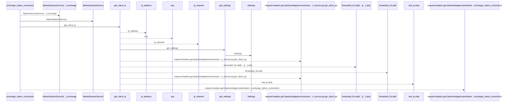
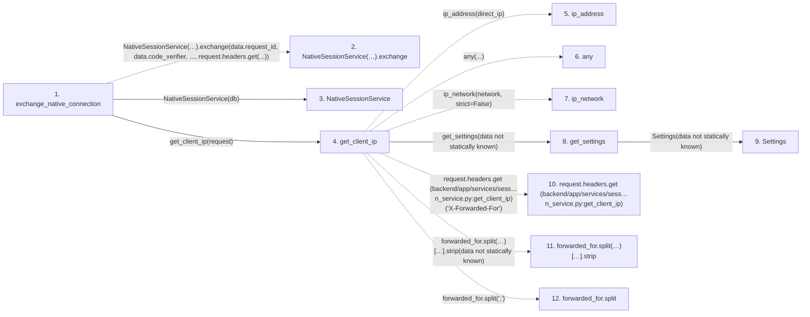

# exchange_native_connection

**Entry point:** `exchange_native_connection` (`http`)
**Source:** [routers_identity](../modules/routers_identity.md)
**Modules touched:** [config](../modules/config.md), [native_session_service](../modules/native_session_service.md), [routers_identity](../modules/routers_identity.md), [session_service](../modules/session_service.md)

## Call sequence

<!-- Auto-generated from static call edges. Dashed arrows are external or unresolved calls. Reviewed runtime conditions and side effects belong in Behavior. -->

## Data flow

<!-- Auto-generated static analysis. Treat values and boundaries as best-effort hints, not runtime proof. -->

### Step data

| Step | Inputs | Reads | Writes | Returns |
|---|---|---|---|---|
| `exchange_native_connection` | `data: NativeConnectionExchange`, `request: Request`, `response: Response`, `db: Database` | - | `response.headers[...]` | `...` |
| `NativeSessionService(…).exchange` | - | - | - | - |
| `NativeSessionService` | - | - | - | - |
| `get_client_ip` | `request: Request` | - | - | `...`, `real_ip.strip(...)`, `direct_ip` |
| `ip_address` | - | - | - | - |
| `any` | - | - | - | - |
| `ip_network` | - | - | - | - |
| `get_settings` | - | - | - | `Settings(...)` |
| `Settings` | - | - | - | - |
| `request.headers.get (backend/app/services/sess…n_service.py:get_client_ip)` | - | - | - | - |
| `forwarded_for.split(…)[…].strip` | - | - | - | - |
| `forwarded_for.split` | - | - | - | - |

### Call data

| From | To | Line | Call |
|---|---|---:|---|
| exchange_native_connection | NativeSessionService(…).exchange | 86 | `NativeSessionService(db).exchange(data.request_id, data.code_verifier, ..., request.headers.get(...))` |
| exchange_native_connection | NativeSessionService | 86 | `NativeSessionService(db)` |
| exchange_native_connection | get_client_ip | 87 | `get_client_ip(request)` |
| get_client_ip | ip_address | 52 | `ip_address(direct_ip)` |
| get_client_ip | any | 53 | `any(...)` |
| get_client_ip | ip_network | 54 | `ip_network(network, strict=False)` |
| get_client_ip | get_settings | 55 | `get_settings(data not statically known)` |
| get_settings | Settings | 480 | `Settings(data not statically known)` |
| get_client_ip | request.headers.get (backend/app/services/sess…n_service.py:get_client_ip) | 60 | `request.headers.get('X-Forwarded-For')` |
| get_client_ip | forwarded_for.split(…)[…].strip | 62 | `forwarded_for.split(',')[0].strip(data not statically known)` |
| get_client_ip | forwarded_for.split | 62 | `forwarded_for.split(',')` |

### Boundary effects

*No boundary effects detected.*

### Static analysis gaps

| Kind | Step | Target | Line |
|---|---|---|---:|
| unresolved_call | `exchange_native_connection` | `NativeSessionService(db).exchange` | 86 |
| external_call | `get_client_ip` | `ip_address` | 52 |
| external_call | `get_client_ip` | `any` | 53 |
| external_call | `get_client_ip` | `ip_network` | 54 |
| unresolved_call | `get_client_ip` | `request.headers.get` | 60 |
| unresolved_call | `get_client_ip` | `forwarded_for.split(',')[0].strip` | 62 |
| unresolved_call | `get_client_ip` | `forwarded_for.split` | 62 |
| step_limit | `exchange_native_connection` | `first 12 steps` | 0 |

## Behavior

Checks the device verifier against the S256 challenge before revealing connection state. Pending consent produces a pending response. Approved exchange locks principal then session, rechecks enabled human identity and valid browser approval, and conditionally consumes the request in the same transaction as native session issuance. Replay or expiry fails explicitly.
