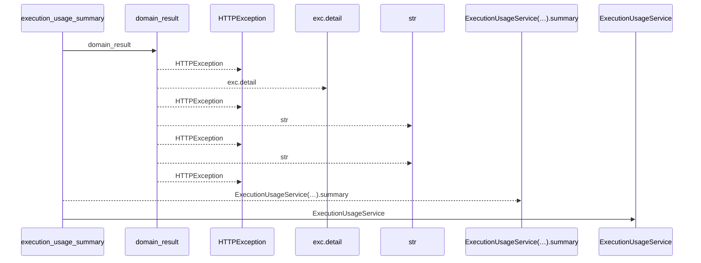
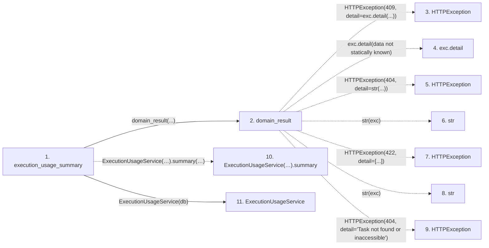

# execution_usage_summary

**Entry point:** `execution_usage_summary` (`http`)
**Source:** [routers_task_domain](../modules/routers_task_domain.md)
**Modules touched:** [execution_usage_service](../modules/execution_usage_service.md), [routers_task_domain](../modules/routers_task_domain.md)

## Call sequence

<!-- Auto-generated from static call edges. Dashed arrows are external or unresolved calls. Reviewed runtime conditions and side effects belong in Behavior. -->

## Data flow

<!-- Auto-generated static analysis. Treat values and boundaries as best-effort hints, not runtime proof. -->

### Step data

| Step | Inputs | Reads | Writes | Returns |
|---|---|---|---|---|
| `execution_usage_summary` | `db: DB`, `project_id: int \| None`, `iteration_id: int \| None`, `lookback_days: int`, `budget_amount: Decimal \| None`, `budget_currency: str \| None` | - | - | `...` |
| `domain_result` | `awaitable` | `TaskVersionConflictError` | - | `result` |
| `HTTPException` | - | - | - | - |
| `exc.detail` | - | - | - | - |
| `HTTPException` | - | - | - | - |
| `str` | - | - | - | - |
| `HTTPException` | - | - | - | - |
| `str` | - | - | - | - |
| `HTTPException` | - | - | - | - |
| `ExecutionUsageService(…).summary` | - | - | - | - |
| `ExecutionUsageService` | - | - | - | - |

### Call data

| From | To | Line | Call |
|---|---|---:|---|
| execution_usage_summary | domain_result | 57 | `domain_result(...)` |
| domain_result | HTTPException | 29 | `HTTPException(409, detail=exc.detail(...))` |
| domain_result | exc.detail | 29 | `exc.detail(data not statically known)` |
| domain_result | HTTPException | 31 | `HTTPException(404, detail=str(...))` |
| domain_result | str | 31 | `str(exc)` |
| domain_result | HTTPException | 33 | `HTTPException(422, detail=[...])` |
| domain_result | str | 33 | `str(exc)` |
| domain_result | HTTPException | 35 | `HTTPException(404, detail='Task not found or inaccessible')` |
| execution_usage_summary | ExecutionUsageService(…).summary | 57 | `ExecutionUsageService(db).summary(project_id=project_id, iteration_id=iteration_id, lookback_days=lookback_days, budget_amount=budget_amount, budget_currency=budget_currency)` |
| execution_usage_summary | ExecutionUsageService | 57 | `ExecutionUsageService(db)` |

### Boundary effects

*No boundary effects detected.*

### Static analysis gaps

| Kind | Step | Target | Line |
|---|---|---|---:|
| external_call | `domain_result` | `HTTPException` | 29 |
| unresolved_call | `domain_result` | `exc.detail` | 29 |
| external_call | `domain_result` | `HTTPException` | 31 |
| external_call | `domain_result` | `HTTPException` | 33 |
| external_call | `domain_result` | `HTTPException` | 35 |
| unresolved_call | `execution_usage_summary` | `ExecutionUsageService(db).summary` | 57 |

## Behavior

This flow starts at `execution_usage_summary` and is classified as `http`. The generated call and data-flow sections are bounded static projections; runtime conditions and side effects require source-level confirmation.
