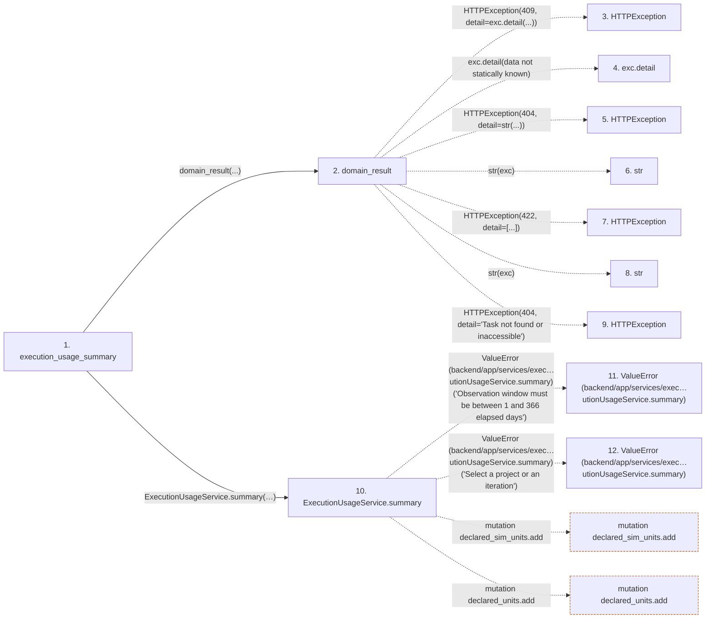

# execution_usage_summary

**Entry point:** `execution_usage_summary` (`http`)
**Source:** [routers_task_domain](../modules/routers_task_domain.md)
**Modules touched:** [authority](../modules/authority.md), [config](../modules/config.md), [delivery_metrics](../modules/delivery_metrics.md), [delivery_metrics_service](../modules/delivery_metrics_service.md), and 5 more

**Complete modules touched:**

- [authority](../modules/authority.md)
- [config](../modules/config.md)
- [delivery_metrics](../modules/delivery_metrics.md)
- [delivery_metrics_service](../modules/delivery_metrics_service.md)
- [execution_usage_service](../modules/execution_usage_service.md)
- [query_limits](../modules/query_limits.md)
- [routers_task_domain](../modules/routers_task_domain.md)
- [schemas_execution_usage](../modules/schemas_execution_usage.md)
- [time](../modules/time.md)

## Call sequence

> Static overview in presentation order, not runtime execution order. Arrows retain captured callers; representative internal continuations and boundary examples precede repeated helper detail.

<!-- Auto-generated from static call edges. Dashed arrows are external or unresolved calls. Reviewed runtime conditions and side effects belong in Behavior. -->

```mermaid
sequenceDiagram
    participant p0 as execution_usage_summary
    participant p1 as ExecutionUsageService.summary
    participant p2 as domain_result
    participant p3 as ExecutionUsageService
    participant p4 as require_project
    participant p5 as run_identity
    participant p6 as DeliveryMetricsService.report
    participant p7 as get_settings
    participant p8 as DeliveryMetricsService._window_observations
    participant p9 as summarize_observations
    participant p10 as _samples
    participant p11 as utc_now
    participant p12 as CollectionLimitExceededError
    participant p13 as add_exact
    participant p14 as estimate_cost
    participant p15 as DeliveryMetricsService
    participant p16 as ExecutionUsageSummary
    participant p17 as AuthorityError
    participant p18 as as_utc
    participant p19 as internal_authority
    participant p20 as DeliveryQueueItem
    participant p21 as DeliveryMetricsResponse
    participant p22 as Settings
    participant p23 as DurationSamples
    participant p24 as HTTPException
    participant p25 as exc.detail
    participant p26 as ValueError (backend/app/services/exec…utionUsageService.summary)
    participant p27 as str
    participant p28 as self.db.get (backend/app/services/exec…utionUsageService.summary)
    p0->>p1: ExecutionUsageService.summary
    p0->>p2: domain_result
    p0->>p3: ExecutionUsageService
    p1->>p4: require_project
    p1->>p5: run_identity
    p1->>p6: DeliveryMetricsService.report
    p4->>p7: get_settings
    p6->>p8: DeliveryMetricsService._window_observations
    p6->>p9: summarize_observations
    p9->>p10: _samples
    p1->>p11: utc_now
    p1->>p12: CollectionLimitExceededError
    p1->>p13: add_exact
    p1->>p14: estimate_cost
    p1->>p15: DeliveryMetricsService
    p1->>p16: ExecutionUsageSummary
    p4->>p17: AuthorityError
    p5->>p18: as_utc
    p6->>p19: internal_authority
    p6->>p20: DeliveryQueueItem
    p6->>p21: DeliveryMetricsResponse
    p7->>p22: Settings
    p10->>p23: DurationSamples
    p2-->>p24: HTTPException(409, detail=exc.detail(...))
    p2-->>p25: exc.detail
    p1-->>p26: ValueError (backend/app/services/exec…utionUsageService.summary)('Observation window must be between 1 and 366 elapsed days')
    p1-->>p26: ValueError (backend/app/services/exec…utionUsageService.summary)('Select a project or an iteration')
    p2-->>p24: HTTPException(404, detail=str(...))
    p2-->>p27: str(exc)
    p1-->>p28: self.db.get (backend/app/services/exec…utionUsageService.summary)(Project, project_id)
```

> Call sequence diagram shows 30 of 283 interactions; 253 omitted to keep the visualization within the 30-interaction and generated-diagram limits, with uncertain identities omitted rather than inferred.

> Captured boundary calls: external 5 of 110 (105 omitted); unresolved 2 of 123 (121 omitted). These counts cover the captured static trace.

Omitted captured detail, grouped by actual caller occurrence and target module:

| Caller | Parent step | Target module | Kind | Omitted interactions |
| --- | --- | --- | --- | --- |
| `backend/app/routers/task_domain.py:domain_result` | 2 | - | external | 3 |
| `backend/app/authority.py:require_project` | 13 | - | unresolved | 2 |
| `backend/app/authority.py:require_project` | 13 | [backend/app/authority.py](../modules/authority.md) | internal | 1 |
| `backend/app/services/execution_usage_service.py:ExecutionUsageService.summary` | 10 | - | external | 41 |
| `backend/app/services/execution_usage_service.py:ExecutionUsageService.summary` | 10 | - | unresolved | 37 |
| `backend/app/utils/time.py:utc_now` | 24 | - | external | 1 |
| `backend/app/services/execution_usage_service.py:run_identity` | 59 | - | unresolved | 3 |
| `backend/app/services/execution_usage_service.py:run_identity` | 59 | - | external | 2 |
> Omission summary shows 8 of 28 groups; 20 further groups are not expanded here. Counts above include all omitted interactions.
> Detailed flow queries retain their own coverage and limits; omitted paths may execute at runtime.

## Data flow

<!-- Auto-generated static analysis. Treat values and boundaries as best-effort hints, not runtime proof. -->

### Analysis coverage

**Effect analysis partially available.** Flow assembly and source effect analysis are separate; empty observations do not prove an empty handler body.

Source steps: 51; effect analysis evaluated: 34, partial: 2, unavailable: 15. Counts include steps omitted from the displayed trace.

Collector observations for 36 source steps with known totals: observed: 206, emitted: 188, omitted: 18. Unavailable totals are excluded.

- Callable record unavailable for one or more source steps; those steps have no represented callable body.
- Effect collector omitted observations before flow assembly; displayed effects are partial.
- Effect collector totals unavailable; observed counts cover captured records only.

| Step | Callable record | Effect analysis | Collector totals | Observed | Emitted | Omitted |
|---|---|---|---|---:|---:|---:|
| `execution_usage_summary` | `available` | `evaluated` | `available` | `7` | `7` | `0` |
| `domain_result` | `available` | `evaluated` | `available` | `3` | `3` | `0` |
| `HTTPException` | `not_applicable` | `not_applicable` | `not_applicable` | — | — | — |
| `exc.detail` | `not_applicable` | `not_applicable` | `not_applicable` | — | — | — |
| `HTTPException` | `not_applicable` | `not_applicable` | `not_applicable` | — | — | — |
| `str` | `not_applicable` | `not_applicable` | `not_applicable` | — | — | — |
| `HTTPException` | `not_applicable` | `not_applicable` | `not_applicable` | — | — | — |
| `str` | `not_applicable` | `not_applicable` | `not_applicable` | — | — | — |
| `HTTPException` | `not_applicable` | `not_applicable` | `not_applicable` | — | — | — |
| `ExecutionUsageService.summary` | `available` | `partial` | `available` | `28` | `20` | `8` |
| `ValueError (backend/app/services/exec…utionUsageService.summary)` | `not_applicable` | `not_applicable` | `not_applicable` | — | — | — |
| `ValueError (backend/app/services/exec…utionUsageService.summary)` | `not_applicable` | `not_applicable` | `not_applicable` | — | — | — |

```mermaid
flowchart LR
    s1["1. execution_usage_summary"]
    s2["2. domain_result"]
    s3["3. HTTPException"]
    s4["4. exc.detail"]
    s5["5. HTTPException"]
    s6["6. str"]
    s7["7. HTTPException"]
    s8["8. str"]
    s9["9. HTTPException"]
    s10["10. ExecutionUsageService.summary"]
    s11["11. ValueError (backend/app/services/exec…utionUsageService.summary)"]
    s12["12. ValueError (backend/app/services/exec…utionUsageService.summary)"]
    s1 -->|"domain_result(...)"| s2
    s2 -. "HTTPException(409, detail=exc.detail(...))" .-> s3
    s2 -. "exc.detail(data not statically known)" .-> s4
    s2 -. "HTTPException(404, detail=str(...))" .-> s5
    s2 -. "str(exc)" .-> s6
    s2 -. "HTTPException(422, detail=[...])" .-> s7
    s2 -. "str(exc)" .-> s8
    s2 -. "HTTPException(404, detail='Task not found or inaccessible')" .-> s9
    s1 -->|"ExecutionUsageService.summary(…)"| s10
    s10 -. "ValueError (backend/app/services/exec…utionUsageService.summary)('Observation window must be between 1 and 366 elapsed days')" .-> s11
    s10 -. "ValueError (backend/app/services/exec…utionUsageService.summary)('Select a project or an iteration')" .-> s12
    b0["mutation declared_sim_units.add"]
    s10 -. "mutation declared_sim_units.add" .-> b0
    b1["mutation declared_units.add"]
    s10 -. "mutation declared_units.add" .-> b1
    click s1 "../modules/routers_task_domain.md"
    click s2 "../modules/routers_task_domain.md"
    click s10 "../modules/execution_usage_service.md"
    classDef boundary stroke:#b45309,stroke-dasharray: 4 2
    class b0 boundary
    class b1 boundary
```

### Step data

| Step | Inputs | Reads | Writes | Returns |
|---|---|---|---|---|
| `execution_usage_summary` | `db: DB`, `project_id: int \| None`, `iteration_id: int \| None`, `lookback_days: int`, `budget_amount: Decimal \| None`, `budget_currency: str \| None` | - | - | `...` |
| `domain_result` | `awaitable` | `TaskVersionConflictError` | - | `result` |
| `HTTPException` | - | - | - | - |
| `exc.detail` | - | - | - | - |
| `HTTPException` | - | - | - | - |
| `str` | - | - | - | - |
| `HTTPException` | - | - | - | - |
| `str` | - | - | - | - |
| `HTTPException` | - | - | - | - |
| `ExecutionUsageService.summary` | `project_id`, `iteration_id`, `lookback_days`, `budget_amount`, `budget_currency` | `self.db`, `Project`, `Iteration`, `ExecutionUsageRecord`, `AgentRun`, `DeliveryObservation`, `ExecutionUsageRecord`, `Task` | `heads[...]`, `sim_counts[...]`, `costs[...]`, `unit_counts[...]` | `ExecutionUsageSummary(...)` |
| `ValueError (backend/app/services/exec…utionUsageService.summary)` | - | - | - | - |
| `ValueError (backend/app/services/exec…utionUsageService.summary)` | - | - | - | - |

### Call data

| From | To | Line | Call |
|---|---|---:|---|
| execution_usage_summary | domain_result | 79 | `domain_result(...)` |
| domain_result | HTTPException | 51 | `HTTPException(409, detail=exc.detail(...))` |
| domain_result | exc.detail | 51 | `exc.detail(data not statically known)` |
| domain_result | HTTPException | 53 | `HTTPException(404, detail=str(...))` |
| domain_result | str | 53 | `str(exc)` |
| domain_result | HTTPException | 55 | `HTTPException(422, detail=[...])` |
| domain_result | str | 55 | `str(exc)` |
| domain_result | HTTPException | 57 | `HTTPException(404, detail='Task not found or inaccessible')` |
| execution_usage_summary | ExecutionUsageService.summary | 79 | `ExecutionUsageService(db).summary(project_id=project_id, iteration_id=iteration_id, lookback_days=lookback_days, budget_amount=budget_amount, budget_currency=budget_currency)` |
| ExecutionUsageService.summary | ValueError (backend/app/services/exec…utionUsageService.summary) | 157 | `ValueError('Observation window must be between 1 and 366 elapsed days')` |
| ExecutionUsageService.summary | ValueError (backend/app/services/exec…utionUsageService.summary) | 159 | `ValueError('Select a project or an iteration')` |

### Boundary effects

| Kind | Target | Step | Line |
|---|---|---|---:|
| mutation | `declared_sim_units.add` | `ExecutionUsageService.summary` | 210 |
| mutation | `declared_units.add` | `ExecutionUsageService.summary` | 225 |

### Static analysis gaps

| Kind | Step | Target | Line |
|---|---|---|---:|
| external_call | `domain_result` | `HTTPException` | 51 |
| unresolved_call | `domain_result` | `exc.detail` | 51 |
| external_call | `domain_result` | `HTTPException` | 53 |
| external_call | `domain_result` | `HTTPException` | 55 |
| external_call | `domain_result` | `HTTPException` | 57 |
| external_call | `ExecutionUsageService.summary` | `ValueError` | 157 |
| external_call | `ExecutionUsageService.summary` | `ValueError` | 159 |
| step_limit | `execution_usage_summary` | `first 12 steps` | 0 |

## Behavior

This flow starts at `execution_usage_summary` and is classified as `http`. The generated call and data-flow sections are bounded static projections; runtime conditions and side effects require source-level confirmation.
