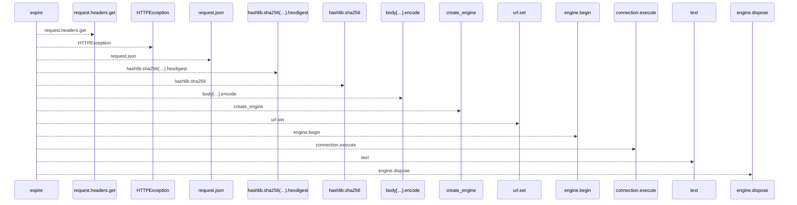
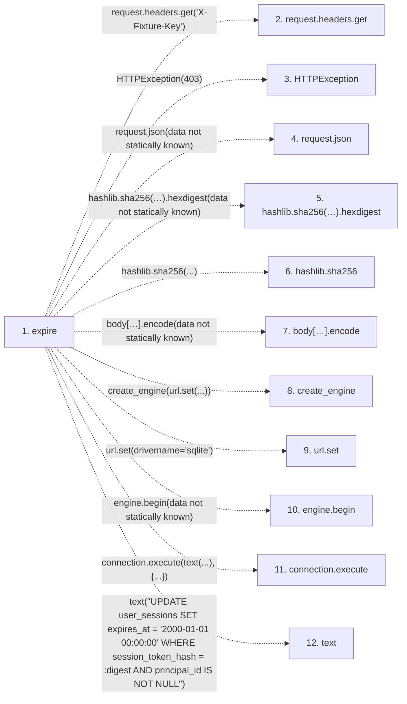

# expire

**Entry point:** `expire` (`http`)
**Source:** [serve_disposable_oidc](../modules/serve_disposable_oidc.md)
**Modules touched:** [serve_disposable_oidc](../modules/serve_disposable_oidc.md)

## Call sequence

<!-- Auto-generated from static call edges. Dashed arrows are external or unresolved calls. Reviewed runtime conditions and side effects belong in Behavior. -->

## Data flow

<!-- Auto-generated static analysis. Treat values and boundaries as best-effort hints, not runtime proof. -->

### Step data

| Step | Inputs | Reads | Writes | Returns |
|---|---|---|---|---|
| `expire` | `request: Request` | - | - | `{...}` |
| `request.headers.get` | - | - | - | - |
| `HTTPException` | - | - | - | - |
| `request.json` | - | - | - | - |
| `hashlib.sha256(…).hexdigest` | - | - | - | - |
| `hashlib.sha256` | - | - | - | - |
| `body[…].encode` | - | - | - | - |
| `create_engine` | - | - | - | - |
| `url.set` | - | - | - | - |
| `engine.begin` | - | - | - | - |
| `connection.execute` | - | - | - | - |
| `text` | - | - | - | - |

### Call data

| From | To | Line | Call |
|---|---|---:|---|
| expire | request.headers.get | 77 | `request.headers.get('X-Fixture-Key')` |
| expire | HTTPException | 78 | `HTTPException(403)` |
| expire | request.json | 79 | `request.json(data not statically known)` |
| expire | hashlib.sha256(…).hexdigest | 80 | `hashlib.sha256(body['token'].encode()).hexdigest(data not statically known)` |
| expire | hashlib.sha256 | 80 | `hashlib.sha256(...)` |
| expire | body[…].encode | 80 | `body['token'].encode(data not statically known)` |
| expire | create_engine | 81 | `create_engine(url.set(...))` |
| expire | url.set | 81 | `url.set(drivername='sqlite')` |
| expire | engine.begin | 83 | `engine.begin(data not statically known)` |
| expire | connection.execute | 84 | `connection.execute(text(...), {...})` |
| expire | text | 84 | `text("UPDATE user_sessions SET expires_at = '2000-01-01 00:00:00' WHERE session_token_hash = :digest AND principal_id IS NOT NULL")` |

### Boundary effects

*No boundary effects detected.*

### Static analysis gaps

| Kind | Step | Target | Line |
|---|---|---|---:|
| unresolved_call | `expire` | `request.headers.get` | 77 |
| external_call | `expire` | `HTTPException` | 78 |
| unresolved_call | `expire` | `request.json` | 79 |
| unresolved_call | `expire` | `hashlib.sha256(body['token'].encode()).hexdigest` | 80 |
| external_call | `expire` | `hashlib.sha256` | 80 |
| unresolved_call | `expire` | `body['token'].encode` | 80 |
| external_call | `expire` | `create_engine` | 81 |
| unresolved_call | `expire` | `engine.begin` | 83 |
| unresolved_call | `expire` | `connection.execute` | 84 |
| external_call | `expire` | `text` | 84 |
| step_limit | `expire` | `first 12 steps` | 0 |

## Behavior

This flow starts at `expire` and is classified as `http`. The generated call and data-flow sections are bounded static projections; runtime conditions and side effects require source-level confirmation.
