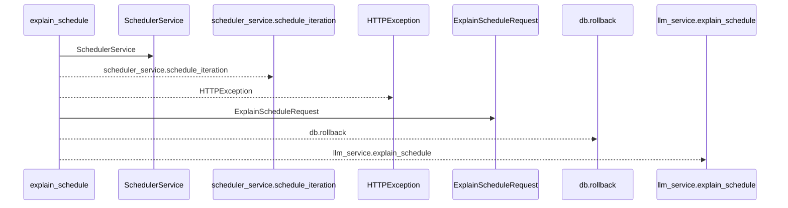
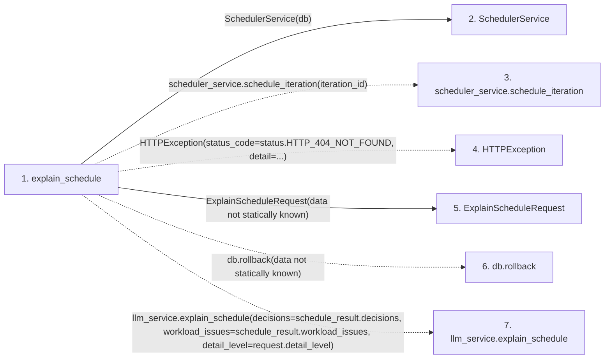

# explain_schedule

**Entry point:** `explain_schedule` (`http`)
**Source:** [routers_llm](../modules/routers_llm.md)
**Modules touched:** [routers_llm](../modules/routers_llm.md), [scheduler_service](../modules/scheduler_service.md), [schemas_llm](../modules/schemas_llm.md)

## Call sequence

<!-- Auto-generated from static call edges. Dashed arrows are external or unresolved calls. Reviewed runtime conditions and side effects belong in Behavior. -->

## Data flow

<!-- Auto-generated static analysis. Treat values and boundaries as best-effort hints, not runtime proof. -->

### Step data

| Step | Inputs | Reads | Writes | Returns |
|---|---|---|---|---|
| `explain_schedule` | `iteration_id: int`, `db: Annotated[AsyncSession, Depends(get_db)]`, `llm_service: Annotated[LLMService, Depends(get_llm_service)]`, `data: Annotated[ExplainScheduleRequest \| None, Body()]` | `status` | - | `...` |
| `SchedulerService` | - | - | - | - |
| `scheduler_service.schedule_iteration` | - | - | - | - |
| `HTTPException` | - | - | - | - |
| `ExplainScheduleRequest` | - | - | - | - |
| `db.rollback` | - | - | - | - |
| `llm_service.explain_schedule` | - | - | - | - |

### Call data

| From | To | Line | Call |
|---|---|---:|---|
| explain_schedule | SchedulerService | 251 | `SchedulerService(db)` |
| explain_schedule | scheduler_service.schedule_iteration | 252 | `scheduler_service.schedule_iteration(iteration_id)` |
| explain_schedule | HTTPException | 255 | `HTTPException(status_code=status.HTTP_404_NOT_FOUND, detail=...)` |
| explain_schedule | ExplainScheduleRequest | 260 | `ExplainScheduleRequest(data not statically known)` |
| explain_schedule | db.rollback | 261 | `db.rollback(data not statically known)` |
| explain_schedule | llm_service.explain_schedule | 262 | `llm_service.explain_schedule(decisions=schedule_result.decisions, workload_issues=schedule_result.workload_issues, detail_level=request.detail_level)` |

### Boundary effects

*No boundary effects detected.*

### Static analysis gaps

| Kind | Step | Target | Line |
|---|---|---|---:|
| unresolved_call | `explain_schedule` | `scheduler_service.schedule_iteration` | 252 |
| external_call | `explain_schedule` | `HTTPException` | 255 |
| unresolved_call | `explain_schedule` | `db.rollback` | 261 |
| unresolved_call | `explain_schedule` | `llm_service.explain_schedule` | 262 |

## Behavior

This flow starts at `explain_schedule` and is classified as `http`. The generated call and data-flow sections are bounded static projections; runtime conditions and side effects require source-level confirmation.
