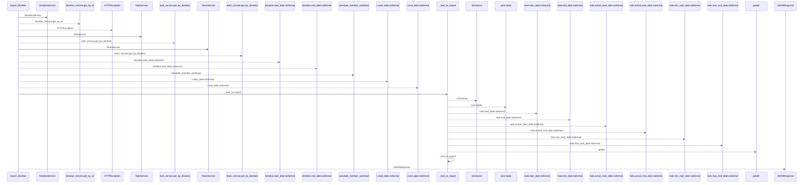
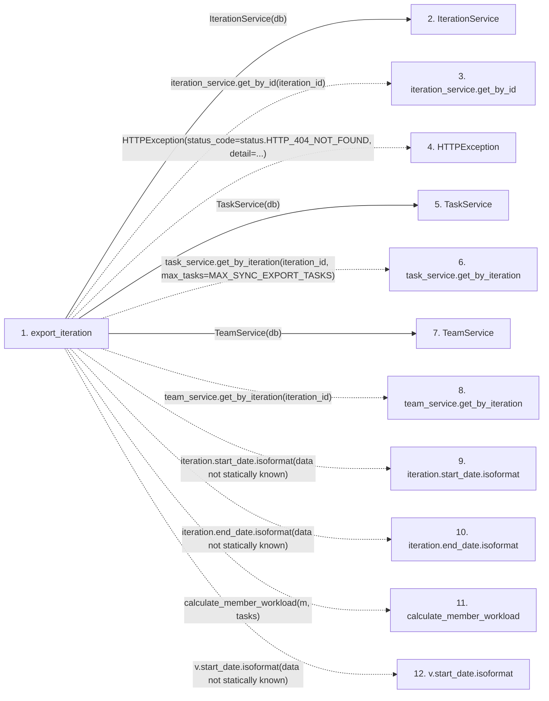

# export_iteration

**Entry point:** `export_iteration` (`http`)
**Source:** [export](../modules/export.md)
**Modules touched:** [export](../modules/export.md), [iteration_service](../modules/iteration_service.md), [task_service](../modules/task_service.md), [team_service](../modules/team_service.md)

## Call sequence

<!-- Auto-generated from static call edges. Dashed arrows are external or unresolved calls. Reviewed runtime conditions and side effects belong in Behavior. -->

## Data flow

<!-- Auto-generated static analysis. Treat values and boundaries as best-effort hints, not runtime proof. -->

### Step data

| Step | Inputs | Reads | Writes | Returns |
|---|---|---|---|---|
| `export_iteration` | `iteration_id: int`, `db: Annotated[AsyncSession, Depends(get_db)]` | `status`, `MAX_SYNC_EXPORT_TASKS` | - | `JSONResponse(...)` |
| `IterationService` | - | - | - | - |
| `iteration_service.get_by_id` | - | - | - | - |
| `HTTPException` | - | - | - | - |
| `TaskService` | - | - | - | - |
| `task_service.get_by_iteration` | - | - | - | - |
| `TeamService` | - | - | - | - |
| `team_service.get_by_iteration` | - | - | - | - |
| `iteration.start_date.isoformat` | - | - | - | - |
| `iteration.end_date.isoformat` | - | - | - | - |
| `calculate_member_workload` | - | - | - | - |
| `v.start_date.isoformat` | - | - | - | - |

### Call data

| From | To | Line | Call |
|---|---|---:|---|
| export_iteration | IterationService | 79 | `IterationService(db)` |
| export_iteration | iteration_service.get_by_id | 80 | `iteration_service.get_by_id(iteration_id)` |
| export_iteration | HTTPException | 83 | `HTTPException(status_code=status.HTTP_404_NOT_FOUND, detail=...)` |
| export_iteration | TaskService | 88 | `TaskService(db)` |
| export_iteration | task_service.get_by_iteration | 89 | `task_service.get_by_iteration(iteration_id, max_tasks=MAX_SYNC_EXPORT_TASKS)` |
| export_iteration | TeamService | 94 | `TeamService(db)` |
| export_iteration | team_service.get_by_iteration | 95 | `team_service.get_by_iteration(iteration_id)` |
| export_iteration | iteration.start_date.isoformat | 128 | `iteration.start_date.isoformat(data not statically known)` |
| export_iteration | iteration.end_date.isoformat | 129 | `iteration.end_date.isoformat(data not statically known)` |
| export_iteration | calculate_member_workload | 140 | `calculate_member_workload(m, tasks)` |
| export_iteration | v.start_date.isoformat | 143 | `v.start_date.isoformat(data not statically known)` |

### Boundary effects

*No boundary effects detected.*

### Static analysis gaps

| Kind | Step | Target | Line |
|---|---|---|---:|
| unresolved_call | `export_iteration` | `iteration_service.get_by_id` | 80 |
| external_call | `export_iteration` | `HTTPException` | 83 |
| unresolved_call | `export_iteration` | `task_service.get_by_iteration` | 89 |
| unresolved_call | `export_iteration` | `team_service.get_by_iteration` | 95 |
| unresolved_call | `export_iteration` | `iteration.start_date.isoformat` | 128 |
| unresolved_call | `export_iteration` | `iteration.end_date.isoformat` | 129 |
| unresolved_call | `export_iteration` | `calculate_member_workload` | 140 |
| unresolved_call | `export_iteration` | `v.start_date.isoformat` | 143 |
| step_limit | `export_iteration` | `first 12 steps` | 0 |

## Behavior

This flow starts at `export_iteration` and is classified as `http`. The generated call and data-flow sections are bounded static projections; runtime conditions and side effects require source-level confirmation.
