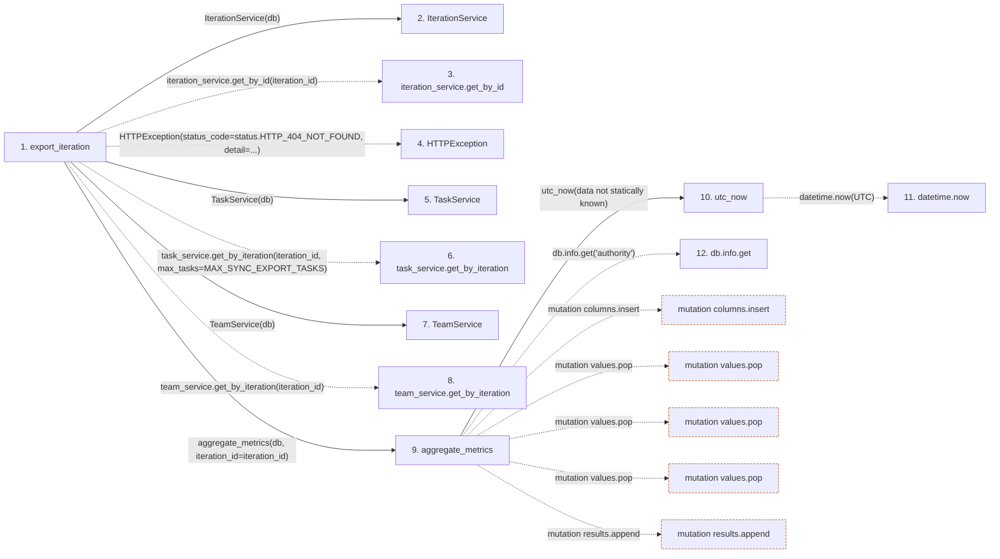

# export_iteration

**Entry point:** `export_iteration` (`http`)
**Source:** [export](../modules/export.md)
**Modules touched:** [authority](../modules/authority.md), [commands](../modules/commands.md), [export](../modules/export.md), [iteration_service](../modules/iteration_service.md), and 4 more

**Complete modules touched:**

- [authority](../modules/authority.md)
- [commands](../modules/commands.md)
- [export](../modules/export.md)
- [iteration_service](../modules/iteration_service.md)
- [services_work_metrics](../modules/services_work_metrics.md)
- [task_service](../modules/task_service.md)
- [team_service](../modules/team_service.md)
- [time](../modules/time.md)

## Call sequence

```mermaid
sequenceDiagram
    participant p0 as export_iteration
    participant p1 as IterationService
    participant p2 as iteration_service.get_by_id
    participant p3 as HTTPException
    participant p4 as TaskService
    participant p5 as task_service.get_by_iteration
    participant p6 as TeamService
    participant p7 as team_service.get_by_iteration
    participant p8 as aggregate_metrics
    participant p9 as utc_now
    participant p10 as datetime.now
    participant p11 as db.info.get
    participant p12 as _scope_conditions(…).get
    participant p13 as _scope_conditions
    participant p14 as tuple
    participant p15 as authority.allows
    participant p16 as iterations.c.project_id.in_
    participant p17 as or_ (backend/app/authority.py:_scope_conditions)
    participant p18 as iterations.c.project_id.is_
    participant p19 as select(…).where (backend/app/authority.py:_scope_conditions, 1)
    participant p20 as select (backend/app/authority.py:_scope_conditions)
    participant p21 as and_ (backend/app/authority.py:_scope_conditions)
    participant p22 as task.c.iteration_id.in_
    participant p23 as task.c.iteration_id.is_
    participant p24 as task.c.project_id.in_
    participant p25 as task.c.project_id.is_
    participant p26 as select(…).where (backend/app/authority.py:_scope_conditions, 3)
    p0->>p1: IterationService
    p0-->>p2: iteration_service.get_by_id
    p0-->>p3: HTTPException
    p0->>p4: TaskService
    p0-->>p5: task_service.get_by_iteration
    p0->>p6: TeamService
    p0-->>p7: team_service.get_by_iteration
    p0->>p8: aggregate_metrics
    p8->>p9: utc_now
    p9-->>p10: datetime.now
    p8-->>p11: db.info.get
    p8-->>p12: _scope_conditions(…).get
    p8->>p13: _scope_conditions
    p13-->>p14: tuple
    p13-->>p15: authority.allows
    p13-->>p16: iterations.c.project_id.in_
    p13-->>p17: or_ (backend/app/authority.py:_scope_conditions)
    p13-->>p18: iterations.c.project_id.is_
    p13-->>p19: select(…).where (backend/app/authority.py:_scope_conditions, 1)
    p13-->>p20: select (backend/app/authority.py:_scope_conditions)
    p13-->>p21: and_ (backend/app/authority.py:_scope_conditions)
    p13-->>p17: or_ (backend/app/authority.py:_scope_conditions)
    p13-->>p22: task.c.iteration_id.in_
    p13-->>p21: and_ (backend/app/authority.py:_scope_conditions)
    p13-->>p23: task.c.iteration_id.is_
    p13-->>p24: task.c.project_id.in_
    p13-->>p17: or_ (backend/app/authority.py:_scope_conditions)
    p13-->>p24: task.c.project_id.in_
    p13-->>p25: task.c.project_id.is_
    p13-->>p26: select(…).where (backend/app/authority.py:_scope_conditions, 3)
```

<!-- Auto-generated from static call edges. Dashed arrows are external or unresolved calls. Reviewed runtime conditions and side effects belong in Behavior. -->

> Call sequence diagram shows 30 of 287 interactions; 257 omitted to keep the visualization within the 30-interaction and generated-diagram limits.

## Data flow

<!-- Auto-generated static analysis. Treat values and boundaries as best-effort hints, not runtime proof. -->

### Step data

| Step | Inputs | Reads | Writes | Returns |
|---|---|---|---|---|
| `export_iteration` | `iteration_id: int`, `db: Annotated[AsyncSession, Depends(get_db, scope='function')]` | `status`, `MAX_SYNC_EXPORT_TASKS` | - | `JSONResponse(...)` |
| `IterationService` | - | - | - | - |
| `iteration_service.get_by_id` | - | - | - | - |
| `HTTPException` | - | - | - | - |
| `TaskService` | - | - | - | - |
| `task_service.get_by_iteration` | - | - | - | - |
| `TeamService` | - | - | - | - |
| `team_service.get_by_iteration` | - | - | - | - |
| `aggregate_metrics` | `db`, `project_id`, `iteration_id`, `project_ids`, `group_by`, `task_ids`, `zone_map`, `now` | - | `values[...]`, `values[...]`, `values[...]`, `values[...]`, `values[...]` | `...` |
| `utc_now` | - | `UTC` | - | `datetime.now(...)` |
| `datetime.now` | - | - | - | - |
| `db.info.get` | - | - | - | - |

### Call data

| From | To | Line | Call |
|---|---|---:|---|
| export_iteration | IterationService | 82 | `IterationService(db)` |
| export_iteration | iteration_service.get_by_id | 83 | `iteration_service.get_by_id(iteration_id)` |
| export_iteration | HTTPException | 86 | `HTTPException(status_code=status.HTTP_404_NOT_FOUND, detail=...)` |
| export_iteration | TaskService | 91 | `TaskService(db)` |
| export_iteration | task_service.get_by_iteration | 92 | `task_service.get_by_iteration(iteration_id, max_tasks=MAX_SYNC_EXPORT_TASKS)` |
| export_iteration | TeamService | 97 | `TeamService(db)` |
| export_iteration | team_service.get_by_iteration | 98 | `team_service.get_by_iteration(iteration_id)` |
| export_iteration | aggregate_metrics | 130 | `aggregate_metrics(db, iteration_id=iteration_id)` |
| aggregate_metrics | utc_now | 160 | `utc_now(data not statically known)` |
| utc_now | datetime.now | 13 | `datetime.now(UTC)` |
| aggregate_metrics | db.info.get | 162 | `db.info.get('authority')` |

### Boundary effects

| Kind | Target | Step | Line |
|---|---|---|---:|
| mutation | `columns.insert` | `aggregate_metrics` | 237 |
| mutation | `values.pop` | `aggregate_metrics` | 251 |
| mutation | `values.pop` | `aggregate_metrics` | 254 |
| mutation | `values.pop` | `aggregate_metrics` | 256 |
| mutation | `results.append` | `aggregate_metrics` | 261 |

### Static analysis gaps

| Kind | Step | Target | Line |
|---|---|---|---:|
| unresolved_call | `export_iteration` | `iteration_service.get_by_id` | 83 |
| external_call | `export_iteration` | `HTTPException` | 86 |
| unresolved_call | `export_iteration` | `task_service.get_by_iteration` | 92 |
| unresolved_call | `export_iteration` | `team_service.get_by_iteration` | 98 |
| external_call | `utc_now` | `datetime.now` | 13 |
| unresolved_call | `aggregate_metrics` | `db.info.get` | 162 |
| step_limit | `export_iteration` | `first 12 steps` | 0 |

## Behavior

This flow starts at `export_iteration` and is classified as `http`. The generated call and data-flow sections are bounded static projections; runtime conditions and side effects require source-level confirmation.
