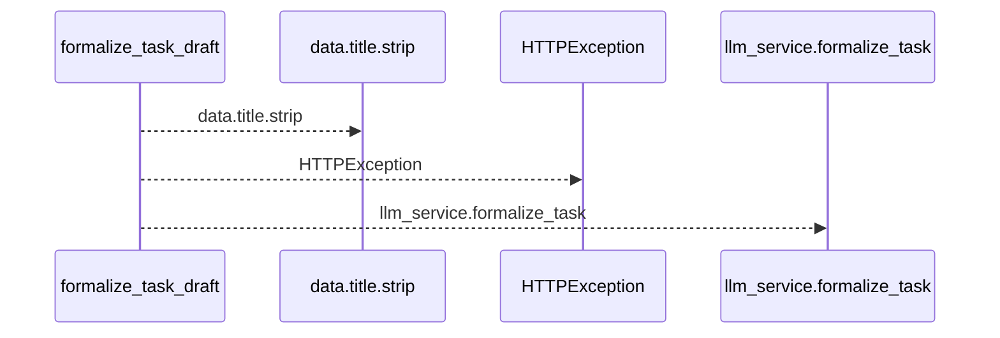
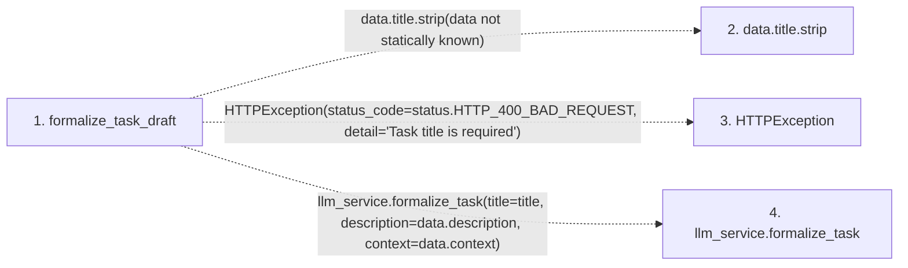

# formalize_task_draft

**Entry point:** `formalize_task_draft` (`http`)
**Source:** [routers_llm](../modules/routers_llm.md)
**Modules touched:** [routers_llm](../modules/routers_llm.md)

## Call sequence

<!-- Auto-generated from static call edges. Dashed arrows are external or unresolved calls. Reviewed runtime conditions and side effects belong in Behavior. -->

## Data flow

<!-- Auto-generated static analysis. Treat values and boundaries as best-effort hints, not runtime proof. -->

### Step data

| Step | Inputs | Reads | Writes | Returns |
|---|---|---|---|---|
| `formalize_task_draft` | `data: FormalizeDraftRequest`, `llm_service: Annotated[LLMService, Depends(get_llm_service)]` | `status` | - | `...` |
| `data.title.strip` | - | - | - | - |
| `HTTPException` | - | - | - | - |
| `llm_service.formalize_task` | - | - | - | - |

### Call data

| From | To | Line | Call |
|---|---|---:|---|
| formalize_task_draft | data.title.strip | 127 | `data.title.strip(data not statically known)` |
| formalize_task_draft | HTTPException | 129 | `HTTPException(status_code=status.HTTP_400_BAD_REQUEST, detail='Task title is required')` |
| formalize_task_draft | llm_service.formalize_task | 134 | `llm_service.formalize_task(title=title, description=data.description, context=data.context)` |

### Boundary effects

*No boundary effects detected.*

### Static analysis gaps

| Kind | Step | Target | Line |
|---|---|---|---:|
| unresolved_call | `formalize_task_draft` | `data.title.strip` | 127 |
| external_call | `formalize_task_draft` | `HTTPException` | 129 |
| unresolved_call | `formalize_task_draft` | `llm_service.formalize_task` | 134 |

## Behavior

This flow starts at `formalize_task_draft` and is classified as `http`. The generated call and data-flow sections are bounded static projections; runtime conditions and side effects require source-level confirmation.
