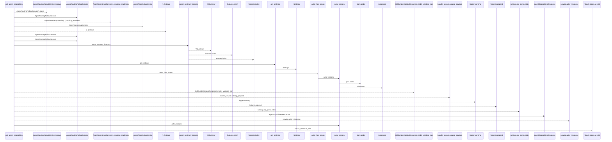
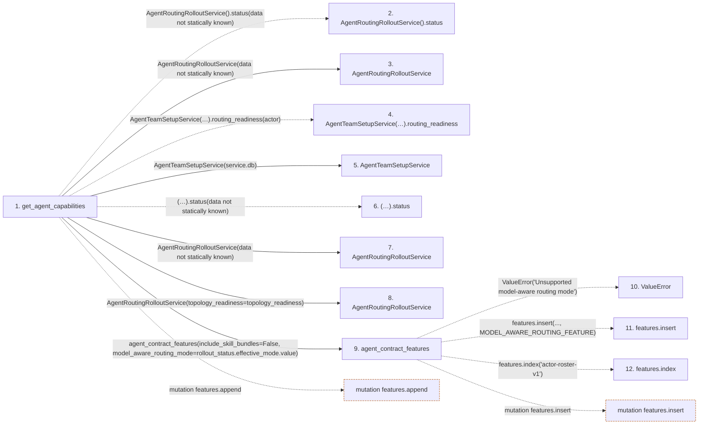

# get_agent_capabilities

**Entry point:** `get_agent_capabilities` (`http`)
**Source:** [routers_agent](../modules/routers_agent.md)
**Modules touched:** [agent_contract](../modules/agent_contract.md), [agent_routing_rollout](../modules/agent_routing_rollout.md), [agent_service](../modules/agent_service.md), and 4 more

**Complete modules touched:**

- [agent_contract](../modules/agent_contract.md)
- [agent_routing_rollout](../modules/agent_routing_rollout.md)
- [agent_service](../modules/agent_service.md)
- [agent_team_setup_service](../modules/agent_team_setup_service.md)
- [config](../modules/config.md)
- [routers_agent](../modules/routers_agent.md)
- [schemas_agent](../modules/schemas_agent.md)

## Call sequence

<!-- Auto-generated from static call edges. Dashed arrows are external or unresolved calls. Reviewed runtime conditions and side effects belong in Behavior. -->

## Data flow

<!-- Auto-generated static analysis. Treat values and boundaries as best-effort hints, not runtime proof. -->

### Step data

| Step | Inputs | Reads | Writes | Returns |
|---|---|---|---|---|
| `get_agent_capabilities` | `request: Request`, `actor: Annotated[AgentActor, Depends(get_agent_actor)]`, `service: Annotated[AgentWorkService, Depends(get_agent_work_service)]`, `bundle_service: Annotated[AgentSkillBundleService, Depends(get_agent_skill_bundle_service)]` | `SkillBundleArtifactError` | `recommended_skills[...]` | `AgentCapabilitiesResponse(...)` |
| `AgentRoutingRolloutService().status` | - | - | - | - |
| `AgentRoutingRolloutService` | - | - | - | - |
| `AgentTeamSetupService(…).routing_readiness` | - | - | - | - |
| `AgentTeamSetupService` | - | - | - | - |
| `(…).status` | - | - | - | - |
| `AgentRoutingRolloutService` | - | - | - | - |
| `AgentRoutingRolloutService` | - | - | - | - |
| `agent_contract_features` | `include_skill_bundles: bool`, `model_aware_routing_mode: str` | `AGENT_CONTRACT_FEATURES`, `SKILL_BUNDLES_FEATURE`, `MODEL_AWARE_ROUTING_FEATURE` | - | `features` |
| `ValueError` | - | - | - | - |
| `features.insert` | - | - | - | - |
| `features.index` | - | - | - | - |

### Call data

| From | To | Line | Call |
|---|---|---:|---|
| get_agent_capabilities | AgentRoutingRolloutService().status | 337 | `AgentRoutingRolloutService().status(data not statically known)` |
| get_agent_capabilities | AgentRoutingRolloutService | 337 | `AgentRoutingRolloutService(data not statically known)` |
| get_agent_capabilities | AgentTeamSetupService(…).routing_readiness | 339 | `AgentTeamSetupService(service.db).routing_readiness(actor)` |
| get_agent_capabilities | AgentTeamSetupService | 339 | `AgentTeamSetupService(service.db)` |
| get_agent_capabilities | (…).status | 342 | `(AgentRoutingRolloutService() if topology_readiness.status == AgentRoutingTopologyReadinessStatus.UNAVAILABLE else AgentRoutingRolloutService(topology_readiness=topology_readiness)).status(data not statically known)` |
| get_agent_capabilities | AgentRoutingRolloutService | 343 | `AgentRoutingRolloutService(data not statically known)` |
| get_agent_capabilities | AgentRoutingRolloutService | 346 | `AgentRoutingRolloutService(topology_readiness=topology_readiness)` |
| get_agent_capabilities | agent_contract_features | 350 | `agent_contract_features(include_skill_bundles=False, model_aware_routing_mode=rollout_status.effective_mode.value)` |
| agent_contract_features | ValueError | 41 | `ValueError('Unsupported model-aware routing mode')` |
| agent_contract_features | features.insert | 49 | `features.insert(..., MODEL_AWARE_ROUTING_FEATURE)` |
| agent_contract_features | features.index | 50 | `features.index('actor-roster-v1')` |

### Boundary effects

| Kind | Target | Step | Line |
|---|---|---|---:|
| mutation | `features.append` | `get_agent_capabilities` | 370 |
| mutation | `features.insert` | `agent_contract_features` | 49 |

### Static analysis gaps

| Kind | Step | Target | Line |
|---|---|---|---:|
| unresolved_call | `get_agent_capabilities` | `AgentRoutingRolloutService().status` | 337 |
| unresolved_call | `get_agent_capabilities` | `AgentTeamSetupService(service.db).routing_readiness` | 339 |
| unresolved_call | `get_agent_capabilities` | `(AgentRoutingRolloutService() if topology_readiness.status == AgentRoutingTopologyReadinessStatus.UNAVAILABLE else AgentRoutingRolloutService(topology_readiness=topology_readiness)).status` | 342 |
| external_call | `agent_contract_features` | `ValueError` | 41 |
| unresolved_call | `agent_contract_features` | `features.index` | 50 |
| step_limit | `get_agent_capabilities` | `first 12 steps` | 0 |

## Behavior

This flow starts at `get_agent_capabilities` and is classified as `http`. The generated call and data-flow sections are bounded static projections; runtime conditions and side effects require source-level confirmation.
