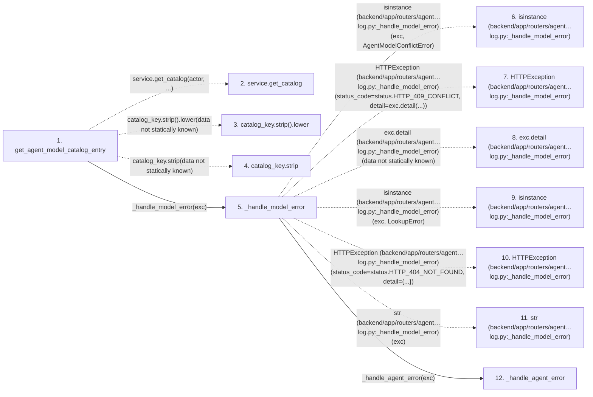

# get_agent_model_catalog_entry

**Entry point:** `get_agent_model_catalog_entry` (`http`)
**Source:** [agent_catalog](../modules/agent_catalog.md)
**Modules touched:** [agent_catalog](../modules/agent_catalog.md), [routers_agent_planning](../modules/routers_agent_planning.md)

## Call sequence

```mermaid
sequenceDiagram
    participant p0 as get_agent_model_catalog_entry
    participant p1 as service.get_catalog
    participant p2 as catalog_key.strip().lower
    participant p3 as catalog_key.strip
    participant p4 as _handle_model_error
    participant p5 as isinstance (backend/app/routers/agent…log.py:_handle_model_error)
    participant p6 as HTTPException (backend/app/routers/agent…log.py:_handle_model_error)
    participant p7 as exc.detail (backend/app/routers/agent…log.py:_handle_model_error)
    participant p8 as str (backend/app/routers/agent…log.py:_handle_model_error)
    participant p9 as _handle_agent_error
    participant p10 as isinstance (backend/app/routers/agent…ing.py:_handle_agent_error)
    participant p11 as HTTPException (backend/app/routers/agent…ing.py:_handle_agent_error)
    participant p12 as str (backend/app/routers/agent…ing.py:_handle_agent_error)
    participant p13 as exc.detail (backend/app/routers/agent…ing.py:_handle_agent_error)
    p0-->>p1: service.get_catalog
    p0-->>p2: catalog_key.strip().lower
    p0-->>p3: catalog_key.strip
    p0->>p4: _handle_model_error
    p4-->>p5: isinstance (backend/app/routers/agent…log.py:_handle_model_error)
    p4-->>p6: HTTPException (backend/app/routers/agent…log.py:_handle_model_error)
    p4-->>p7: exc.detail (backend/app/routers/agent…log.py:_handle_model_error)
    p4-->>p5: isinstance (backend/app/routers/agent…log.py:_handle_model_error)
    p4-->>p6: HTTPException (backend/app/routers/agent…log.py:_handle_model_error)
    p4-->>p8: str (backend/app/routers/agent…log.py:_handle_model_error)
    p4->>p9: _handle_agent_error
    p9-->>p10: isinstance (backend/app/routers/agent…ing.py:_handle_agent_error)
    p9-->>p11: HTTPException (backend/app/routers/agent…ing.py:_handle_agent_error)
    p9-->>p12: str (backend/app/routers/agent…ing.py:_handle_agent_error)
    p9-->>p10: isinstance (backend/app/routers/agent…ing.py:_handle_agent_error)
    p9-->>p11: HTTPException (backend/app/routers/agent…ing.py:_handle_agent_error)
    p9-->>p13: exc.detail (backend/app/routers/agent…ing.py:_handle_agent_error)
    p9-->>p10: isinstance (backend/app/routers/agent…ing.py:_handle_agent_error)
    p9-->>p11: HTTPException (backend/app/routers/agent…ing.py:_handle_agent_error)
    p9-->>p13: exc.detail (backend/app/routers/agent…ing.py:_handle_agent_error)
    p9-->>p10: isinstance (backend/app/routers/agent…ing.py:_handle_agent_error)
    p9-->>p11: HTTPException (backend/app/routers/agent…ing.py:_handle_agent_error)
    p9-->>p12: str (backend/app/routers/agent…ing.py:_handle_agent_error)
    p9-->>p10: isinstance (backend/app/routers/agent…ing.py:_handle_agent_error)
    p9-->>p11: HTTPException (backend/app/routers/agent…ing.py:_handle_agent_error)
    p9-->>p12: str (backend/app/routers/agent…ing.py:_handle_agent_error)
    p9-->>p10: isinstance (backend/app/routers/agent…ing.py:_handle_agent_error)
    p9-->>p11: HTTPException (backend/app/routers/agent…ing.py:_handle_agent_error)
    p9-->>p12: str (backend/app/routers/agent…ing.py:_handle_agent_error)
    p9-->>p10: isinstance (backend/app/routers/agent…ing.py:_handle_agent_error)
```

<!-- Auto-generated from static call edges. Dashed arrows are external or unresolved calls. Reviewed runtime conditions and side effects belong in Behavior. -->

> Call sequence diagram shows 30 of 32 interactions; 2 omitted to keep the visualization within the 30-interaction and generated-diagram limits.

## Data flow

<!-- Auto-generated static analysis. Treat values and boundaries as best-effort hints, not runtime proof. -->

### Step data

| Step | Inputs | Reads | Writes | Returns |
|---|---|---|---|---|
| `get_agent_model_catalog_entry` | `catalog_key: str`, `actor: Annotated[AgentActor, Depends(get_agent_actor)]`, `service: Annotated[AgentModelCatalogService, Depends(get_agent_model_catalog_service)]` | - | - | `...` |
| `service.get_catalog` | - | - | - | - |
| `catalog_key.strip().lower` | - | - | - | - |
| `catalog_key.strip` | - | - | - | - |
| `_handle_model_error` | `exc: Exception` | `AgentModelConflictError`, `status`, `status` | - | - |
| `isinstance (backend/app/routers/agent…log.py:_handle_model_error)` | - | - | - | - |
| `HTTPException (backend/app/routers/agent…log.py:_handle_model_error)` | - | - | - | - |
| `exc.detail (backend/app/routers/agent…log.py:_handle_model_error)` | - | - | - | - |
| `isinstance (backend/app/routers/agent…log.py:_handle_model_error)` | - | - | - | - |
| `HTTPException (backend/app/routers/agent…log.py:_handle_model_error)` | - | - | - | - |
| `str (backend/app/routers/agent…log.py:_handle_model_error)` | - | - | - | - |
| `_handle_agent_error` | `exc: Exception` | `AgentPermissionError`, `status`, `AgentRoutingConflictError`, `status`, `TaskVersionConflictError`, `status`, `AgentConflictError`, `status` | - | - |

### Call data

| From | To | Line | Call |
|---|---|---:|---|
| get_agent_model_catalog_entry | service.get_catalog | 172 | `service.get_catalog(actor, ...)` |
| get_agent_model_catalog_entry | catalog_key.strip().lower | 172 | `catalog_key.strip().lower(data not statically known)` |
| get_agent_model_catalog_entry | catalog_key.strip | 172 | `catalog_key.strip(data not statically known)` |
| get_agent_model_catalog_entry | _handle_model_error | 174 | `_handle_model_error(exc)` |
| _handle_model_error | isinstance (backend/app/routers/agent…log.py:_handle_model_error) | 51 | `isinstance(exc, AgentModelConflictError)` |
| _handle_model_error | HTTPException (backend/app/routers/agent…log.py:_handle_model_error) | 52 | `HTTPException(status_code=status.HTTP_409_CONFLICT, detail=exc.detail(...))` |
| _handle_model_error | exc.detail (backend/app/routers/agent…log.py:_handle_model_error) | 54 | `exc.detail(data not statically known)` |
| _handle_model_error | isinstance (backend/app/routers/agent…log.py:_handle_model_error) | 56 | `isinstance(exc, LookupError)` |
| _handle_model_error | HTTPException (backend/app/routers/agent…log.py:_handle_model_error) | 57 | `HTTPException(status_code=status.HTTP_404_NOT_FOUND, detail={...})` |
| _handle_model_error | str (backend/app/routers/agent…log.py:_handle_model_error) | 61 | `str(exc)` |
| _handle_model_error | _handle_agent_error | 64 | `_handle_agent_error(exc)` |

### Boundary effects

*No boundary effects detected.*

### Static analysis gaps

| Kind | Step | Target | Line |
|---|---|---|---:|
| unresolved_call | `get_agent_model_catalog_entry` | `service.get_catalog` | 172 |
| unresolved_call | `get_agent_model_catalog_entry` | `catalog_key.strip().lower` | 172 |
| unresolved_call | `get_agent_model_catalog_entry` | `catalog_key.strip` | 172 |
| external_call | `_handle_model_error` | `isinstance` | 51 |
| external_call | `_handle_model_error` | `HTTPException` | 52 |
| unresolved_call | `_handle_model_error` | `exc.detail` | 54 |
| external_call | `_handle_model_error` | `isinstance` | 56 |
| external_call | `_handle_model_error` | `HTTPException` | 57 |
| step_limit | `get_agent_model_catalog_entry` | `first 12 steps` | 0 |

## Behavior

This flow starts at `get_agent_model_catalog_entry` and is classified as `http`. The generated call and data-flow sections are bounded static projections; runtime conditions and side effects require source-level confirmation.
