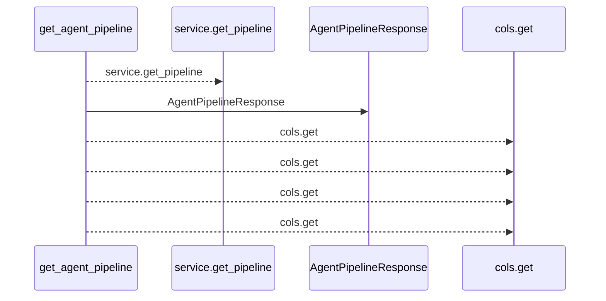
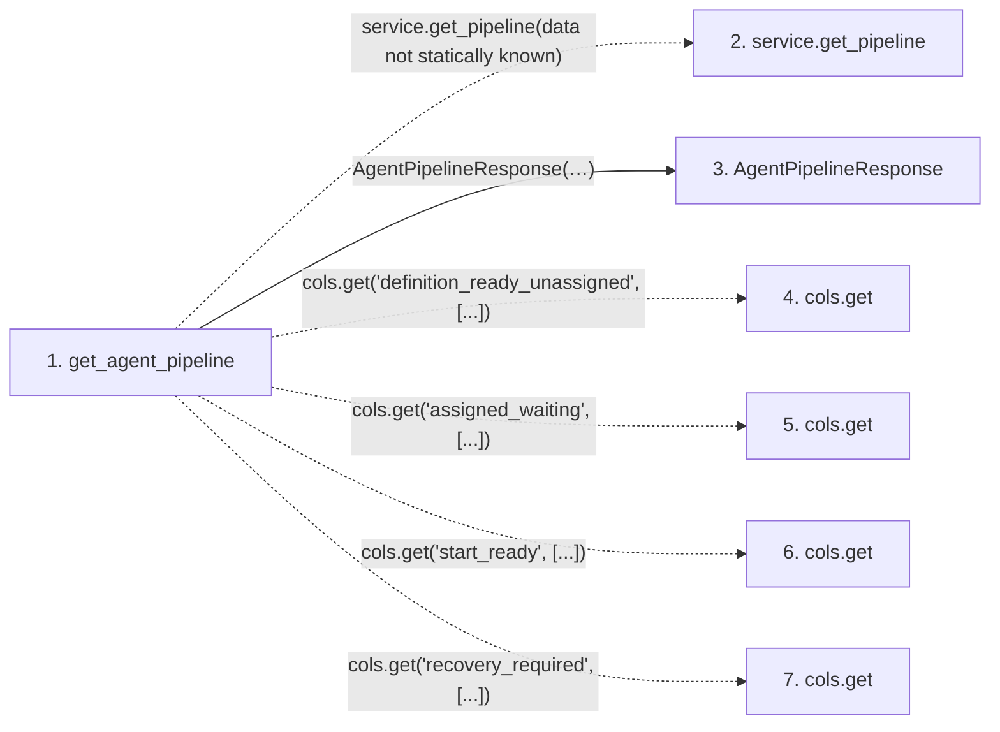

# get_agent_pipeline

**Entry point:** `get_agent_pipeline` (`http`)
**Source:** [routers_agent](../modules/routers_agent.md)
**Modules touched:** [routers_agent](../modules/routers_agent.md), [schemas_agent](../modules/schemas_agent.md)

## Call sequence

<!-- Auto-generated from static call edges. Dashed arrows are external or unresolved calls. Reviewed runtime conditions and side effects belong in Behavior. -->

## Data flow

<!-- Auto-generated static analysis. Treat values and boundaries as best-effort hints, not runtime proof. -->

### Step data

| Step | Inputs | Reads | Writes | Returns |
|---|---|---|---|---|
| `get_agent_pipeline` | `service: Annotated[AgentService, Depends(get_agent_service)]`, `_: Annotated[None, Depends(require_agent_read_access)]` | - | - | `AgentPipelineResponse(...)` |
| `service.get_pipeline` | - | - | - | - |
| `AgentPipelineResponse` | - | - | - | - |
| `cols.get` | - | - | - | - |
| `cols.get` | - | - | - | - |
| `cols.get` | - | - | - | - |
| `cols.get` | - | - | - | - |

### Call data

| From | To | Line | Call |
|---|---|---:|---|
| get_agent_pipeline | service.get_pipeline | 1303 | `service.get_pipeline(data not statically known)` |
| get_agent_pipeline | AgentPipelineResponse | 1304 | `AgentPipelineResponse(needs_definition=cols[...], ready_for_agent=cols[...], definition_ready_unassigned=cols.get(...), assigned_waiting=cols.get(...), start_ready=cols.get(...), executing=cols[...], verification_required=cols[...], recovery_required=cols.get(...))` |
| get_agent_pipeline | cols.get | 1307 | `cols.get('definition_ready_unassigned', [...])` |
| get_agent_pipeline | cols.get | 1308 | `cols.get('assigned_waiting', [...])` |
| get_agent_pipeline | cols.get | 1309 | `cols.get('start_ready', [...])` |
| get_agent_pipeline | cols.get | 1312 | `cols.get('recovery_required', [...])` |

### Boundary effects

*No boundary effects detected.*

### Static analysis gaps

| Kind | Step | Target | Line |
|---|---|---|---:|
| unresolved_call | `get_agent_pipeline` | `service.get_pipeline` | 1303 |
| unresolved_call | `get_agent_pipeline` | `cols.get` | 1307 |
| unresolved_call | `get_agent_pipeline` | `cols.get` | 1308 |
| unresolved_call | `get_agent_pipeline` | `cols.get` | 1309 |
| unresolved_call | `get_agent_pipeline` | `cols.get` | 1312 |

## Behavior

This flow starts at `get_agent_pipeline` and is classified as `http`. The generated call and data-flow sections are bounded static projections; runtime conditions and side effects require source-level confirmation.
