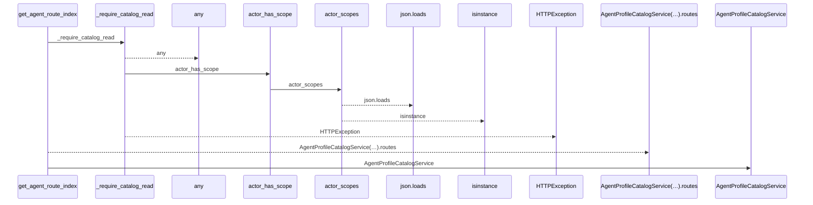
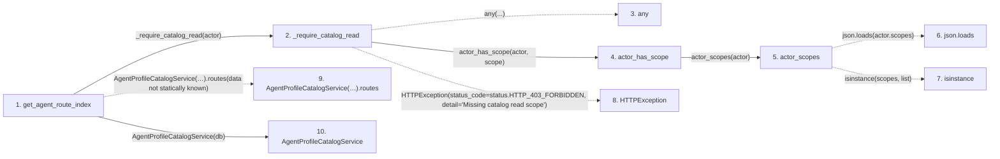

# get_agent_route_index

**Entry point:** `get_agent_route_index` (`http`)
**Source:** [agent_catalog](../modules/agent_catalog.md)
**Modules touched:** [agent_catalog](../modules/agent_catalog.md), [agent_profile_catalog_service](../modules/agent_profile_catalog_service.md), [agent_service](../modules/agent_service.md)

## Call sequence

<!-- Auto-generated from static call edges. Dashed arrows are external or unresolved calls. Reviewed runtime conditions and side effects belong in Behavior. -->

## Data flow

<!-- Auto-generated static analysis. Treat values and boundaries as best-effort hints, not runtime proof. -->

### Step data

| Step | Inputs | Reads | Writes | Returns |
|---|---|---|---|---|
| `get_agent_route_index` | `actor: Annotated[AgentActor, Depends(get_agent_actor)]`, `db: Annotated[AsyncSession, Depends(get_db, scope='function')]` | - | - | `...` |
| `_require_catalog_read` | `actor: AgentActor` | `status` | - | - |
| `any` | - | - | - | - |
| `actor_has_scope` | `actor: AgentActor`, `scope: str` | - | - | `...` |
| `actor_scopes` | `actor: AgentActor` | `json` | - | `...` |
| `json.loads` | - | - | - | - |
| `isinstance` | - | - | - | - |
| `HTTPException` | - | - | - | - |
| `AgentProfileCatalogService(…).routes` | - | - | - | - |
| `AgentProfileCatalogService` | - | - | - | - |

### Call data

| From | To | Line | Call |
|---|---|---:|---|
| get_agent_route_index | _require_catalog_read | 104 | `_require_catalog_read(actor)` |
| _require_catalog_read | any | 68 | `any(...)` |
| _require_catalog_read | actor_has_scope | 69 | `actor_has_scope(actor, scope)` |
| actor_has_scope | actor_scopes | 80 | `actor_scopes(actor)` |
| actor_scopes | json.loads | 72 | `json.loads(actor.scopes)` |
| actor_scopes | isinstance | 75 | `isinstance(scopes, list)` |
| _require_catalog_read | HTTPException | 72 | `HTTPException(status_code=status.HTTP_403_FORBIDDEN, detail='Missing catalog read scope')` |
| get_agent_route_index | AgentProfileCatalogService(…).routes | 105 | `AgentProfileCatalogService(db).routes(data not statically known)` |
| get_agent_route_index | AgentProfileCatalogService | 105 | `AgentProfileCatalogService(db)` |

### Boundary effects

*No boundary effects detected.*

### Static analysis gaps

| Kind | Step | Target | Line |
|---|---|---|---:|
| external_call | `_require_catalog_read` | `any` | 68 |
| external_call | `actor_scopes` | `json.loads` | 72 |
| external_call | `actor_scopes` | `isinstance` | 75 |
| external_call | `_require_catalog_read` | `HTTPException` | 72 |
| unresolved_call | `get_agent_route_index` | `AgentProfileCatalogService(db).routes` | 105 |

## Behavior

This flow starts at `get_agent_route_index` and is classified as `http`. The generated call and data-flow sections are bounded static projections; runtime conditions and side effects require source-level confirmation.
