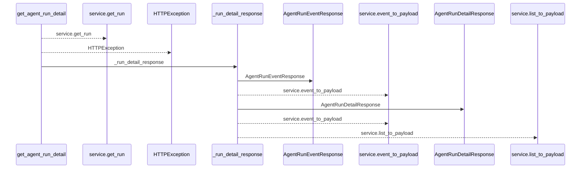
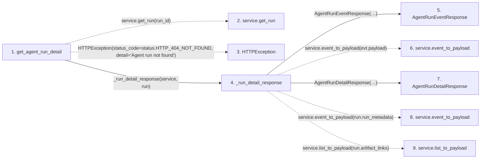

# get_agent_run_detail

**Entry point:** `get_agent_run_detail` (`http`)
**Source:** [routers_agent](../modules/routers_agent.md)
**Modules touched:** [routers_agent](../modules/routers_agent.md), [schemas_agent](../modules/schemas_agent.md)

## Call sequence

<!-- Auto-generated from static call edges. Dashed arrows are external or unresolved calls. Reviewed runtime conditions and side effects belong in Behavior. -->

## Data flow

<!-- Auto-generated static analysis. Treat values and boundaries as best-effort hints, not runtime proof. -->

### Step data

| Step | Inputs | Reads | Writes | Returns |
|---|---|---|---|---|
| `get_agent_run_detail` | `run_id: int`, `service: Annotated[AgentService, Depends(get_agent_service)]`, `_: Annotated[None, Depends(require_agent_read_access)]` | `status` | - | `_run_detail_response(...)` |
| `service.get_run` | - | - | - | - |
| `HTTPException` | - | - | - | - |
| `_run_detail_response` | `service: AgentService`, `run` | - | - | `AgentRunDetailResponse(...)` |
| `AgentRunEventResponse` | - | - | - | - |
| `service.event_to_payload` | - | - | - | - |
| `AgentRunDetailResponse` | - | - | - | - |
| `service.event_to_payload` | - | - | - | - |
| `service.list_to_payload` | - | - | - | - |

### Call data

| From | To | Line | Call |
|---|---|---:|---|
| get_agent_run_detail | service.get_run | 1331 | `service.get_run(run_id)` |
| get_agent_run_detail | HTTPException | 1333 | `HTTPException(status_code=status.HTTP_404_NOT_FOUND, detail='Agent run not found')` |
| get_agent_run_detail | _run_detail_response | 1334 | `_run_detail_response(service, run)` |
| _run_detail_response | AgentRunEventResponse | 1262 | `AgentRunEventResponse(id=evt.id, run_id=evt.run_id, event_type=evt.event_type, message=evt.message, payload=service.event_to_payload(...), trace_id=evt.trace_id, span_id=evt.span_id, correlation_id=evt.correlation_id, idempotency_key=evt.idempotency_key, created_at=evt.created_at)` |
| _run_detail_response | service.event_to_payload | 1267 | `service.event_to_payload(evt.payload)` |
| _run_detail_response | AgentRunDetailResponse | 1276 | `AgentRunDetailResponse(id=run.id, task_id=run.task_id, actor_id=run.actor_id, assignment_id=run.assignment_id, claim_generation=run.claim_generation, status=run.status, trace_id=run.trace_id, model_binding_id=run.model_binding_id, model_binding_revision=run.model_binding_revision, configured_model_alias=run.configured_model_alias, resolved_model_id=run.resolved_model_id, model_trust_state=run.model_trust_state, model_match_basis=run.model_match_basis, model=run.model, tool_name=run.tool_name, metadata=service.event_to_payload(...), artifact_links=service.list_to_payload(...), commit_url=run.commit_url, pr_url=run.pr_url, summary=run.summary, error=run.error, started_at=run.started_at, ended_at=run.ended_at, heartbeat_at=run.heartbeat_at, events=events)` |
| _run_detail_response | service.event_to_payload | 1292 | `service.event_to_payload(run.run_metadata)` |
| _run_detail_response | service.list_to_payload | 1293 | `service.list_to_payload(run.artifact_links)` |

### Boundary effects

*No boundary effects detected.*

### Static analysis gaps

| Kind | Step | Target | Line |
|---|---|---|---:|
| unresolved_call | `get_agent_run_detail` | `service.get_run` | 1331 |
| external_call | `get_agent_run_detail` | `HTTPException` | 1333 |
| unresolved_call | `_run_detail_response` | `service.event_to_payload` | 1267 |
| unresolved_call | `_run_detail_response` | `service.event_to_payload` | 1292 |
| unresolved_call | `_run_detail_response` | `service.list_to_payload` | 1293 |

## Behavior

This flow starts at `get_agent_run_detail` and is classified as `http`. The generated call and data-flow sections are bounded static projections; runtime conditions and side effects require source-level confirmation.
