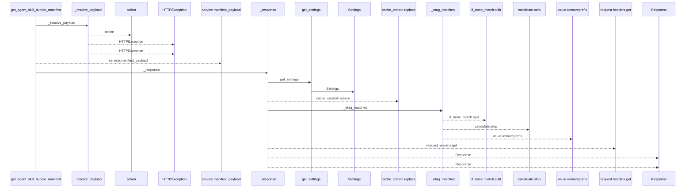
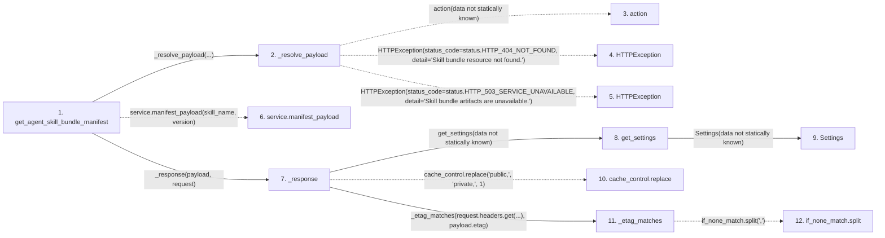

# get_agent_skill_bundle_manifest

**Entry point:** `get_agent_skill_bundle_manifest` (`http`)
**Source:** [agent_skill_bundles](../modules/agent_skill_bundles.md)
**Modules touched:** [agent_skill_bundles](../modules/agent_skill_bundles.md), [config](../modules/config.md)

## Call sequence

<!-- Auto-generated from static call edges. Dashed arrows are external or unresolved calls. Reviewed runtime conditions and side effects belong in Behavior. -->

## Data flow

<!-- Auto-generated static analysis. Treat values and boundaries as best-effort hints, not runtime proof. -->

### Step data

| Step | Inputs | Reads | Writes | Returns |
|---|---|---|---|---|
| `get_agent_skill_bundle_manifest` | `skill_name: str`, `version: str`, `request: Request`, `service: Annotated[AgentSkillBundleService, Depends(get_agent_skill_bundle_service)]`, `_access: Annotated[None, Depends(require_agent_skill_bundle_access)]` | - | - | `_response(...)` |
| `_resolve_payload` | `action: Callable[[], SkillBundlePayload]` | `SkillBundleNotFoundError`, `status`, `SkillBundleArtifactError`, `status` | - | `action(...)` |
| `action` | - | - | - | - |
| `HTTPException` | - | - | - | - |
| `HTTPException` | - | - | - | - |
| `service.manifest_payload` | - | - | - | - |
| `_response` | `payload: SkillBundlePayload`, `request: Request` | `status` | `headers[...]` | `Response(...)`, `Response(...)` |
| `get_settings` | - | - | - | `Settings(...)` |
| `Settings` | - | - | - | - |
| `cache_control.replace` | - | - | - | - |
| `_etag_matches` | `if_none_match: str \| None`, `etag: str` | - | - | `False`, `True`, `False` |
| `if_none_match.split` | - | - | - | - |

### Call data

| From | To | Line | Call |
|---|---|---:|---|
| get_agent_skill_bundle_manifest | _resolve_payload | 146 | `_resolve_payload(...)` |
| _resolve_payload | action | 67 | `action(data not statically known)` |
| _resolve_payload | HTTPException | 69 | `HTTPException(status_code=status.HTTP_404_NOT_FOUND, detail='Skill bundle resource not found.')` |
| _resolve_payload | HTTPException | 74 | `HTTPException(status_code=status.HTTP_503_SERVICE_UNAVAILABLE, detail='Skill bundle artifacts are unavailable.')` |
| get_agent_skill_bundle_manifest | service.manifest_payload | 146 | `service.manifest_payload(skill_name, version)` |
| get_agent_skill_bundle_manifest | _response | 147 | `_response(payload, request)` |
| _response | get_settings | 92 | `get_settings(data not statically known)` |
| get_settings | Settings | 481 | `Settings(data not statically known)` |
| _response | cache_control.replace | 93 | `cache_control.replace('public,', 'private,', 1)` |
| _response | _etag_matches | 102 | `_etag_matches(request.headers.get(...), payload.etag)` |
| _etag_matches | if_none_match.split | 83 | `if_none_match.split(',')` |

### Boundary effects

*No boundary effects detected.*

### Static analysis gaps

| Kind | Step | Target | Line |
|---|---|---|---:|
| unresolved_call | `_resolve_payload` | `action` | 67 |
| external_call | `_resolve_payload` | `HTTPException` | 69 |
| external_call | `_resolve_payload` | `HTTPException` | 74 |
| unresolved_call | `get_agent_skill_bundle_manifest` | `service.manifest_payload` | 146 |
| unresolved_call | `_response` | `cache_control.replace` | 93 |
| unresolved_call | `_etag_matches` | `if_none_match.split` | 83 |
| step_limit | `get_agent_skill_bundle_manifest` | `first 12 steps` | 0 |

## Behavior

This flow starts at `get_agent_skill_bundle_manifest` and is classified as `http`. The generated call and data-flow sections are bounded static projections; runtime conditions and side effects require source-level confirmation.
