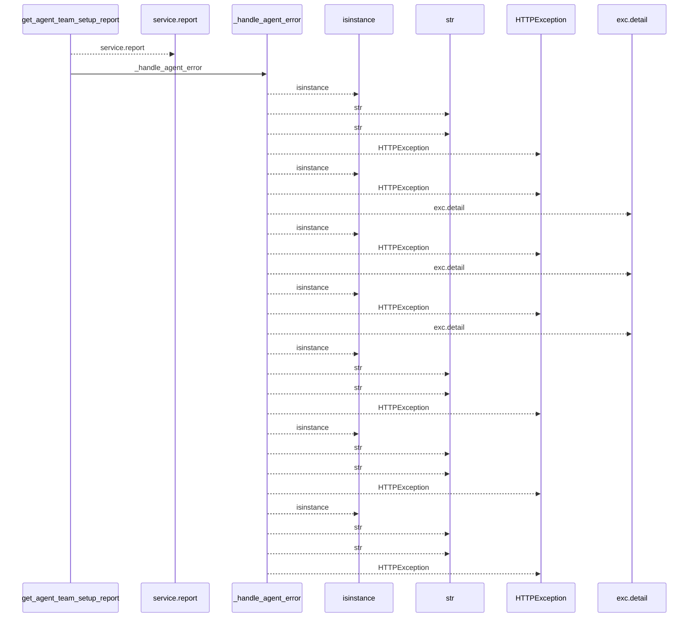
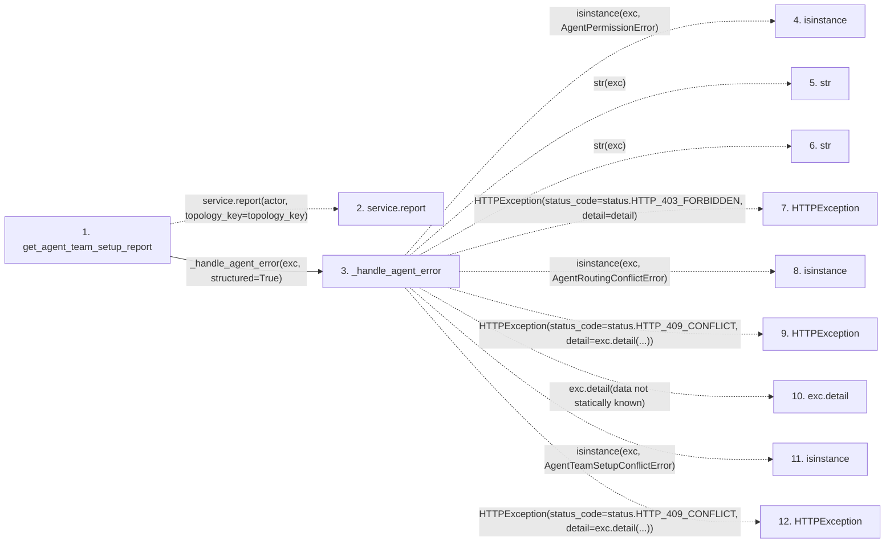

# get_agent_team_setup_report

**Entry point:** `get_agent_team_setup_report` (`http`)
**Source:** [routers_agent](../modules/routers_agent.md)
**Modules touched:** [routers_agent](../modules/routers_agent.md)

## Call sequence

<!-- Auto-generated from static call edges. Dashed arrows are external or unresolved calls. Reviewed runtime conditions and side effects belong in Behavior. -->

## Data flow

<!-- Auto-generated static analysis. Treat values and boundaries as best-effort hints, not runtime proof. -->

### Step data

| Step | Inputs | Reads | Writes | Returns |
|---|---|---|---|---|
| `get_agent_team_setup_report` | `response: Response`, `actor: Annotated[AgentActor, Depends(get_agent_admin_actor)]`, `service: Annotated[AgentTeamSetupService, Depends(get_agent_team_setup_service)]`, `topology_key: Annotated[Optional[str], Query()]` | - | `response.headers[...]`, `response.headers[...]` | `result` |
| `service.report` | - | - | - | - |
| `_handle_agent_error` | `exc: Exception`, `structured: bool` | `AgentPermissionError`, `status`, `AgentRoutingConflictError`, `status`, `AgentTeamSetupConflictError`, `status`, `TaskVersionConflictError`, `status` | - | - |
| `isinstance` | - | - | - | - |
| `str` | - | - | - | - |
| `str` | - | - | - | - |
| `HTTPException` | - | - | - | - |
| `isinstance` | - | - | - | - |
| `HTTPException` | - | - | - | - |
| `exc.detail` | - | - | - | - |
| `isinstance` | - | - | - | - |
| `HTTPException` | - | - | - | - |

### Call data

| From | To | Line | Call |
|---|---|---:|---|
| get_agent_team_setup_report | service.report | 498 | `service.report(actor, topology_key=topology_key)` |
| get_agent_team_setup_report | _handle_agent_error | 500 | `_handle_agent_error(exc, structured=True)` |
| _handle_agent_error | isinstance | 244 | `isinstance(exc, AgentPermissionError)` |
| _handle_agent_error | str | 246 | `str(exc)` |
| _handle_agent_error | str | 248 | `str(exc)` |
| _handle_agent_error | HTTPException | 250 | `HTTPException(status_code=status.HTTP_403_FORBIDDEN, detail=detail)` |
| _handle_agent_error | isinstance | 251 | `isinstance(exc, AgentRoutingConflictError)` |
| _handle_agent_error | HTTPException | 252 | `HTTPException(status_code=status.HTTP_409_CONFLICT, detail=exc.detail(...))` |
| _handle_agent_error | exc.detail | 252 | `exc.detail(data not statically known)` |
| _handle_agent_error | isinstance | 253 | `isinstance(exc, AgentTeamSetupConflictError)` |
| _handle_agent_error | HTTPException | 254 | `HTTPException(status_code=status.HTTP_409_CONFLICT, detail=exc.detail(...))` |

### Boundary effects

*No boundary effects detected.*

### Static analysis gaps

| Kind | Step | Target | Line |
|---|---|---|---:|
| unresolved_call | `get_agent_team_setup_report` | `service.report` | 498 |
| external_call | `_handle_agent_error` | `isinstance` | 244 |
| external_call | `_handle_agent_error` | `HTTPException` | 250 |
| external_call | `_handle_agent_error` | `isinstance` | 251 |
| external_call | `_handle_agent_error` | `HTTPException` | 252 |
| unresolved_call | `_handle_agent_error` | `exc.detail` | 252 |
| external_call | `_handle_agent_error` | `isinstance` | 253 |
| external_call | `_handle_agent_error` | `HTTPException` | 254 |
| step_limit | `get_agent_team_setup_report` | `first 12 steps` | 0 |

## Behavior

This flow starts at `get_agent_team_setup_report` and is classified as `http`. The generated call and data-flow sections are bounded static projections; runtime conditions and side effects require source-level confirmation.
