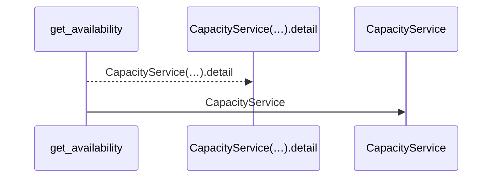
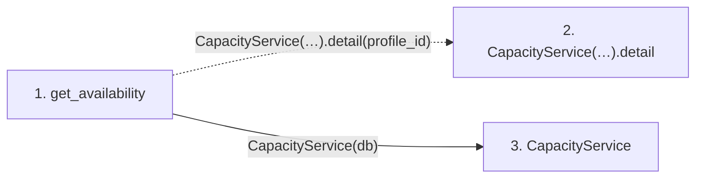

# get_availability

**Entry point:** `get_availability` (`http`)
**Source:** [routers_capacity](../modules/routers_capacity.md)
**Modules touched:** [capacity_service](../modules/capacity_service.md), [routers_capacity](../modules/routers_capacity.md)

## Call sequence

<!-- Auto-generated from static call edges. Dashed arrows are external or unresolved calls. Reviewed runtime conditions and side effects belong in Behavior. -->

## Data flow

<!-- Auto-generated static analysis. Treat values and boundaries as best-effort hints, not runtime proof. -->

### Step data

| Step | Inputs | Reads | Writes | Returns |
|---|---|---|---|---|
| `get_availability` | `profile_id: int`, `db: Database` | - | - | `...` |
| `CapacityService(…).detail` | - | - | - | - |
| `CapacityService` | - | - | - | - |

### Call data

| From | To | Line | Call |
|---|---|---:|---|
| get_availability | CapacityService(…).detail | 34 | `CapacityService(db).detail(profile_id)` |
| get_availability | CapacityService | 34 | `CapacityService(db)` |

### Boundary effects

*No boundary effects detected.*

### Static analysis gaps

| Kind | Step | Target | Line |
|---|---|---|---:|
| unresolved_call | `get_availability` | `CapacityService(db).detail` | 34 |

## Behavior

Returns calendar selection, reconciliation hints and current absence provenance only to the profile owner or an operator. Ordinary project access does not grant private availability detail.
