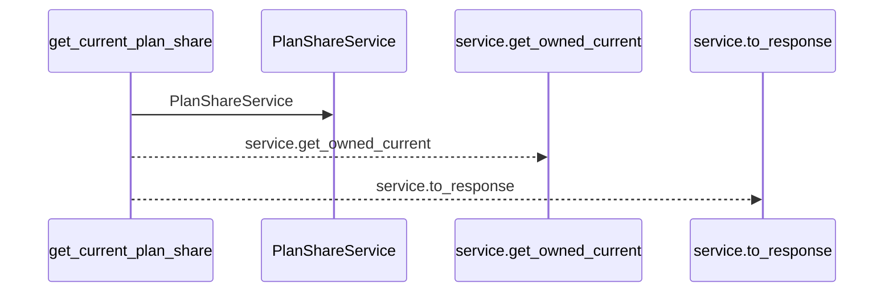
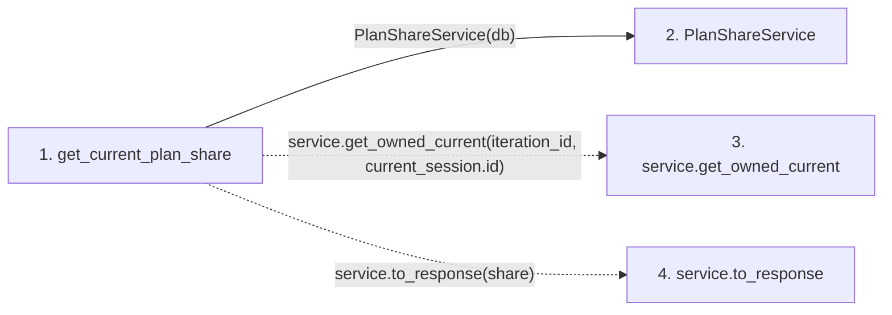

# get_current_plan_share

**Entry point:** `get_current_plan_share` (`http`)
**Source:** [plan_shares](../modules/plan_shares.md)
**Modules touched:** [plan_share_service](../modules/plan_share_service.md), [plan_shares](../modules/plan_shares.md)

## Call sequence

<!-- Auto-generated from static call edges. Dashed arrows are external or unresolved calls. Reviewed runtime conditions and side effects belong in Behavior. -->

## Data flow

<!-- Auto-generated static analysis. Treat values and boundaries as best-effort hints, not runtime proof. -->

### Step data

| Step | Inputs | Reads | Writes | Returns |
|---|---|---|---|---|
| `get_current_plan_share` | `iteration_id: int`, `response: Response`, `current_session: Annotated[UserSession, Depends(session_service.get_current_session)]`, `db: Annotated[AsyncSession, Depends(get_db, scope='function')]` | - | `response.headers[...]` | `...` |
| `PlanShareService` | - | - | - | - |
| `service.get_owned_current` | - | - | - | - |
| `service.to_response` | - | - | - | - |

### Call data

| From | To | Line | Call |
|---|---|---:|---|
| get_current_plan_share | PlanShareService | 33 | `PlanShareService(db)` |
| get_current_plan_share | service.get_owned_current | 34 | `service.get_owned_current(iteration_id, current_session.id)` |
| get_current_plan_share | service.to_response | 35 | `service.to_response(share)` |

### Boundary effects

*No boundary effects detected.*

### Static analysis gaps

| Kind | Step | Target | Line |
|---|---|---|---:|
| unresolved_call | `get_current_plan_share` | `service.get_owned_current` | 34 |
| unresolved_call | `get_current_plan_share` | `service.to_response` | 35 |

## Behavior

This flow starts at `get_current_plan_share` and is classified as `http`. The generated call and data-flow sections are bounded static projections; runtime conditions and side effects require source-level confirmation.
