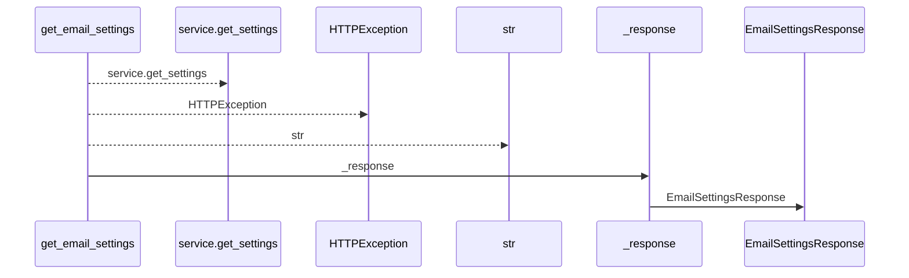
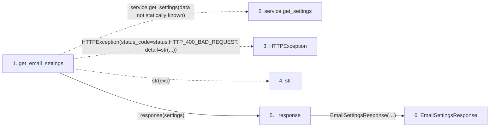

# get_email_settings

**Entry point:** `get_email_settings` (`http`)
**Source:** [routers_email_settings](../modules/routers_email_settings.md)
**Modules touched:** [routers_email_settings](../modules/routers_email_settings.md), [schemas_email_settings](../modules/schemas_email_settings.md)

## Call sequence

<!-- Auto-generated from static call edges. Dashed arrows are external or unresolved calls. Reviewed runtime conditions and side effects belong in Behavior. -->

## Data flow

<!-- Auto-generated static analysis. Treat values and boundaries as best-effort hints, not runtime proof. -->

### Step data

| Step | Inputs | Reads | Writes | Returns |
|---|---|---|---|---|
| `get_email_settings` | `service: Annotated[EmailSettingsService, Depends(get_settings_service)]` | `RuntimeSettingsError`, `status` | - | `_response(...)` |
| `service.get_settings` | - | - | - | - |
| `HTTPException` | - | - | - | - |
| `str` | - | - | - | - |
| `_response` | `settings` | - | - | `EmailSettingsResponse(...)` |
| `EmailSettingsResponse` | - | - | - | - |

### Call data

| From | To | Line | Call |
|---|---|---:|---|
| get_email_settings | service.get_settings | 49 | `service.get_settings(data not statically known)` |
| get_email_settings | HTTPException | 51 | `HTTPException(status_code=status.HTTP_400_BAD_REQUEST, detail=str(...))` |
| get_email_settings | str | 53 | `str(exc)` |
| get_email_settings | _response | 56 | `_response(settings)` |
| _response | EmailSettingsResponse | 24 | `EmailSettingsResponse(enabled=settings.enabled, smtp_host=settings.smtp_host, smtp_port=settings.smtp_port, smtp_user=settings.smtp_user, smtp_from_email=settings.smtp_from_email, smtp_use_tls=settings.smtp_use_tls, has_password=settings.has_password, field_sources=settings.field_sources)` |

### Boundary effects

*No boundary effects detected.*

### Static analysis gaps

| Kind | Step | Target | Line |
|---|---|---|---:|
| unresolved_call | `get_email_settings` | `service.get_settings` | 49 |
| external_call | `get_email_settings` | `HTTPException` | 51 |

## Behavior

This flow starts at `get_email_settings` and is classified as `http`. The generated call and data-flow sections are bounded static projections; runtime conditions and side effects require source-level confirmation.
