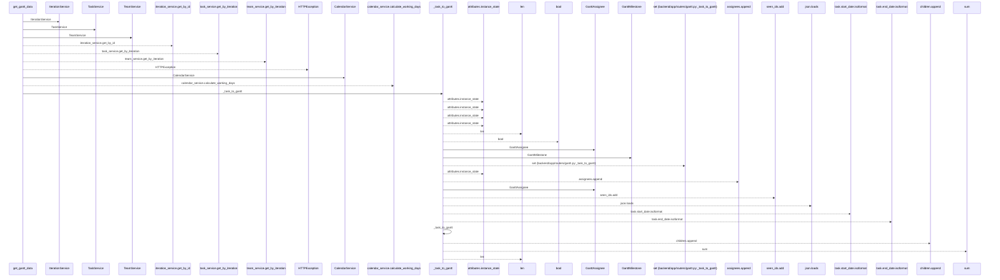
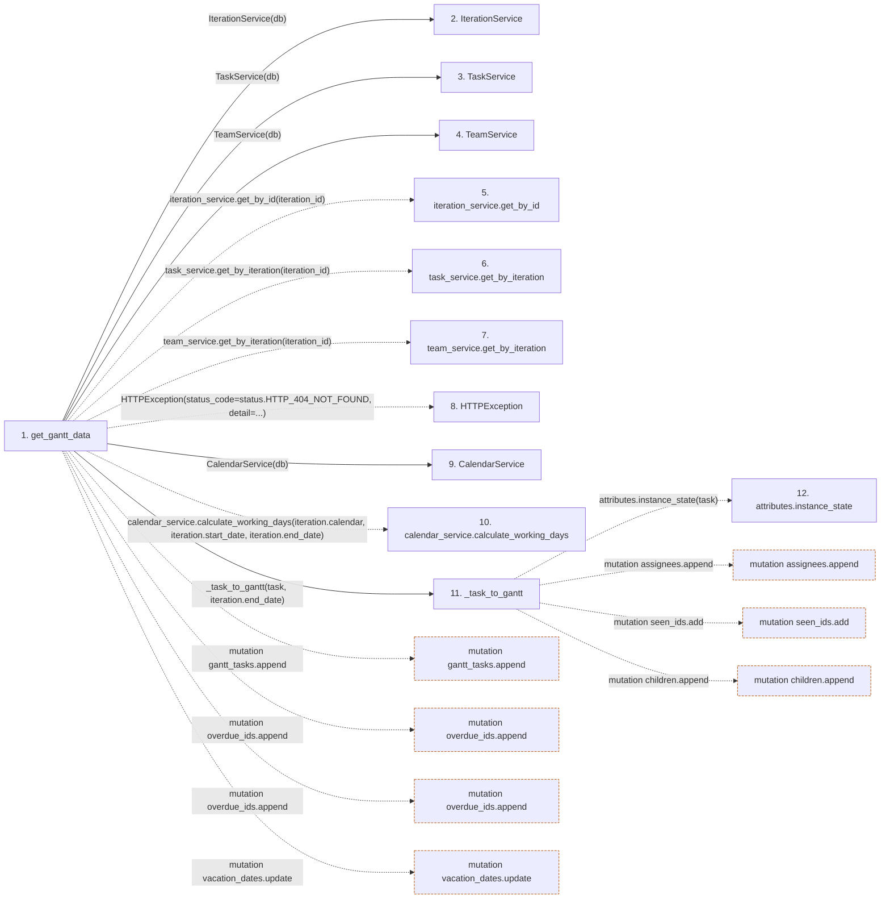

# get_gantt_data

**Entry point:** `get_gantt_data` (`http`)
**Source:** [routers_gantt](../modules/routers_gantt.md)
**Modules touched:** [calendar_service](../modules/calendar_service.md), [iteration_service](../modules/iteration_service.md), [routers_gantt](../modules/routers_gantt.md), [schemas_gantt](../modules/schemas_gantt.md), and 3 more

**Complete modules touched:**

- [calendar_service](../modules/calendar_service.md)
- [iteration_service](../modules/iteration_service.md)
- [routers_gantt](../modules/routers_gantt.md)
- [schemas_gantt](../modules/schemas_gantt.md)
- [schemas_iteration](../modules/schemas_iteration.md)
- [task_service](../modules/task_service.md)
- [team_service](../modules/team_service.md)

## Call sequence

<!-- Auto-generated from static call edges. Dashed arrows are external or unresolved calls. Reviewed runtime conditions and side effects belong in Behavior. -->

> Call sequence diagram shows 30 of 44 interactions; 14 omitted to keep the visualization within the 30-interaction and generated-diagram limits.

## Data flow

<!-- Auto-generated static analysis. Treat values and boundaries as best-effort hints, not runtime proof. -->

### Step data

| Step | Inputs | Reads | Writes | Returns |
|---|---|---|---|---|
| `get_gantt_data` | `iteration_id: int`, `db: Annotated[AsyncSession, Depends(get_db)]` | `status` | `member_vacations[...]` | `GanttResponse(...)` |
| `IterationService` | - | - | - | - |
| `TaskService` | - | - | - | - |
| `TeamService` | - | - | - | - |
| `iteration_service.get_by_id` | - | - | - | - |
| `task_service.get_by_iteration` | - | - | - | - |
| `team_service.get_by_iteration` | - | - | - | - |
| `HTTPException` | - | - | - | - |
| `CalendarService` | - | - | - | - |
| `calendar_service.calculate_working_days` | - | - | - | - |
| `_task_to_gantt` | `task: Task`, `iteration_end_date: date`, `issues: Optional[list[WorkloadIssue]]`, `decisions: Optional[list[SchedulingDecision]]` | `json` | - | `None`, `GanttTask(...)` |
| `attributes.instance_state` | - | - | - | - |

### Call data

| From | To | Line | Call |
|---|---|---:|---|
| get_gantt_data | IterationService | 144 | `IterationService(db)` |
| get_gantt_data | TaskService | 145 | `TaskService(db)` |
| get_gantt_data | TeamService | 146 | `TeamService(db)` |
| get_gantt_data | iteration_service.get_by_id | 151 | `iteration_service.get_by_id(iteration_id)` |
| get_gantt_data | task_service.get_by_iteration | 152 | `task_service.get_by_iteration(iteration_id)` |
| get_gantt_data | team_service.get_by_iteration | 153 | `team_service.get_by_iteration(iteration_id)` |
| get_gantt_data | HTTPException | 156 | `HTTPException(status_code=status.HTTP_404_NOT_FOUND, detail=...)` |
| get_gantt_data | CalendarService | 162 | `CalendarService(db)` |
| get_gantt_data | calendar_service.calculate_working_days | 163 | `calendar_service.calculate_working_days(iteration.calendar, iteration.start_date, iteration.end_date)` |
| get_gantt_data | _task_to_gantt | 175 | `_task_to_gantt(task, iteration.end_date)` |
| _task_to_gantt | attributes.instance_state | 253 | `attributes.instance_state(task)` |

### Boundary effects

| Kind | Target | Step | Line |
|---|---|---|---:|
| mutation | `gantt_tasks.append` | `get_gantt_data` | 178 |
| mutation | `overdue_ids.append` | `get_gantt_data` | 181 |
| mutation | `overdue_ids.append` | `get_gantt_data` | 186 |
| mutation | `vacation_dates.update` | `get_gantt_data` | 205 |
| mutation | `assignees.append` | `_task_to_gantt` | 297 |
| mutation | `seen_ids.add` | `_task_to_gantt` | 300 |
| mutation | `children.append` | `_task_to_gantt` | 332 |

### Static analysis gaps

| Kind | Step | Target | Line |
|---|---|---|---:|
| unresolved_call | `get_gantt_data` | `iteration_service.get_by_id` | 151 |
| unresolved_call | `get_gantt_data` | `task_service.get_by_iteration` | 152 |
| unresolved_call | `get_gantt_data` | `team_service.get_by_iteration` | 153 |
| external_call | `get_gantt_data` | `HTTPException` | 156 |
| unresolved_call | `get_gantt_data` | `calendar_service.calculate_working_days` | 163 |
| external_call | `_task_to_gantt` | `attributes.instance_state` | 253 |
| step_limit | `get_gantt_data` | `first 12 steps` | 0 |

## Behavior

This flow starts at `get_gantt_data` and is classified as `http`. The generated call and data-flow sections are bounded static projections; runtime conditions and side effects require source-level confirmation.
