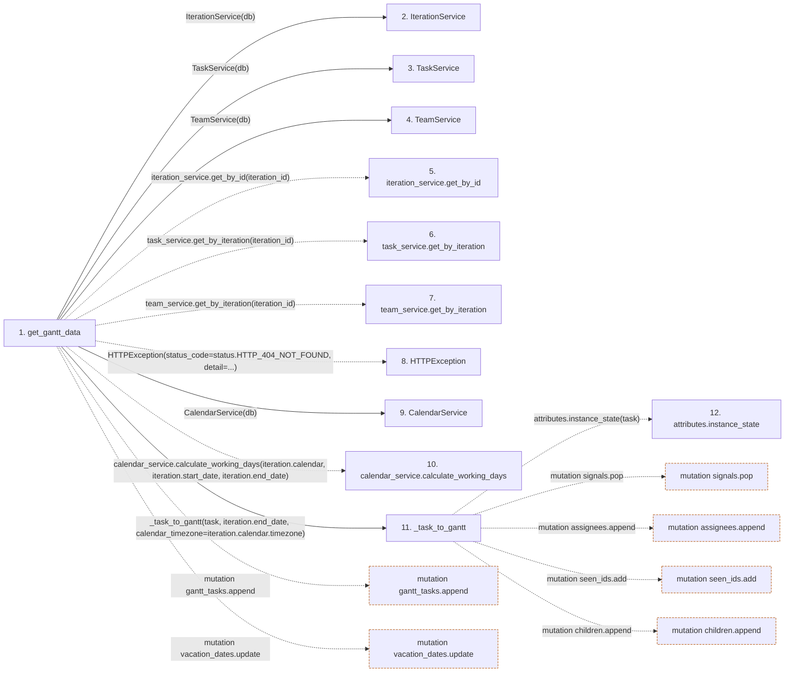

# get_gantt_data

**Entry point:** `get_gantt_data` (`http`)
**Source:** [routers_gantt](../modules/routers_gantt.md)
**Modules touched:** [calendar_service](../modules/calendar_service.md), [iteration_service](../modules/iteration_service.md), [routers_gantt](../modules/routers_gantt.md), [schemas_gantt](../modules/schemas_gantt.md), and 5 more

**Complete modules touched:**

- [calendar_service](../modules/calendar_service.md)
- [iteration_service](../modules/iteration_service.md)
- [routers_gantt](../modules/routers_gantt.md)
- [schemas_gantt](../modules/schemas_gantt.md)
- [schemas_iteration](../modules/schemas_iteration.md)
- [services_work_metrics](../modules/services_work_metrics.md)
- [task_service](../modules/task_service.md)
- [team_service](../modules/team_service.md)
- [time](../modules/time.md)

## Call sequence

```mermaid
sequenceDiagram
    participant p0 as get_gantt_data
    participant p1 as IterationService
    participant p2 as TaskService
    participant p3 as TeamService
    participant p4 as iteration_service.get_by_id
    participant p5 as task_service.get_by_iteration
    participant p6 as team_service.get_by_iteration
    participant p7 as HTTPException
    participant p8 as CalendarService
    participant p9 as calendar_service.calculate_working_days
    participant p10 as _task_to_gantt
    participant p11 as attributes.instance_state
    participant p12 as bool (backend/app/routers/gantt.py:_task_to_gantt)
    participant p13 as len
    participant p14 as task.__dict__.get (backend/app/routers/gantt.py:_task_to_gantt)
    participant p15 as task_signals
    participant p16 as working_today
    participant p17 as as_utc(…).astimezone(…).date
    participant p18 as as_utc(…).astimezone
    participant p19 as as_utc
    participant p20 as value.replace
    participant p21 as value.astimezone
    participant p22 as utc_now
    participant p23 as datetime.now
    participant p24 as ZoneInfo
    participant p25 as bool (backend/app/services/work_metrics.py:task_signals)
    participant p26 as task.__dict__.get (backend/app/services/work_metrics.py:task_signals)
    p0->>p1: IterationService
    p0->>p2: TaskService
    p0->>p3: TeamService
    p0-->>p4: iteration_service.get_by_id
    p0-->>p5: task_service.get_by_iteration
    p0-->>p6: team_service.get_by_iteration
    p0-->>p7: HTTPException
    p0->>p8: CalendarService
    p0-->>p9: calendar_service.calculate_working_days
    p0->>p10: _task_to_gantt
    p10-->>p11: attributes.instance_state
    p10-->>p11: attributes.instance_state
    p10-->>p11: attributes.instance_state
    p10-->>p11: attributes.instance_state
    p10-->>p12: bool (backend/app/routers/gantt.py:_task_to_gantt)
    p10-->>p13: len
    p10-->>p14: task.__dict__.get (backend/app/routers/gantt.py:_task_to_gantt)
    p10->>p15: task_signals
    p15->>p16: working_today
    p16-->>p17: as_utc(…).astimezone(…).date
    p16-->>p18: as_utc(…).astimezone
    p16->>p19: as_utc
    p19-->>p20: value.replace
    p19-->>p21: value.astimezone
    p16->>p22: utc_now
    p22-->>p23: datetime.now
    p16-->>p24: ZoneInfo
    p15-->>p25: bool (backend/app/services/work_metrics.py:task_signals)
    p15-->>p25: bool (backend/app/services/work_metrics.py:task_signals)
    p15-->>p26: task.__dict__.get (backend/app/services/work_metrics.py:task_signals)
```

<!-- Auto-generated from static call edges. Dashed arrows are external or unresolved calls. Reviewed runtime conditions and side effects belong in Behavior. -->

> Call sequence diagram shows 30 of 76 interactions; 46 omitted to keep the visualization within the 30-interaction and generated-diagram limits.

## Data flow

<!-- Auto-generated static analysis. Treat values and boundaries as best-effort hints, not runtime proof. -->

### Step data

| Step | Inputs | Reads | Writes | Returns |
|---|---|---|---|---|
| `get_gantt_data` | `iteration_id: int`, `db: Annotated[AsyncSession, Depends(get_db, scope='function')]` | `status` | `member_vacations[...]` | `GanttResponse(...)` |
| `IterationService` | - | - | - | - |
| `TaskService` | - | - | - | - |
| `TeamService` | - | - | - | - |
| `iteration_service.get_by_id` | - | - | - | - |
| `task_service.get_by_iteration` | - | - | - | - |
| `team_service.get_by_iteration` | - | - | - | - |
| `HTTPException` | - | - | - | - |
| `CalendarService` | - | - | - | - |
| `calendar_service.calculate_working_days` | - | - | - | - |
| `_task_to_gantt` | `task: Task`, `iteration_end_date: date`, `issues: Optional[list[WorkloadIssue]]`, `decisions: Optional[list[SchedulingDecision]]`, `calendar_timezone: str` | `json` | - | `None`, `GanttTask(...)` |
| `attributes.instance_state` | - | - | - | - |

### Call data

| From | To | Line | Call |
|---|---|---:|---|
| get_gantt_data | IterationService | 135 | `IterationService(db)` |
| get_gantt_data | TaskService | 136 | `TaskService(db)` |
| get_gantt_data | TeamService | 137 | `TeamService(db)` |
| get_gantt_data | iteration_service.get_by_id | 142 | `iteration_service.get_by_id(iteration_id)` |
| get_gantt_data | task_service.get_by_iteration | 143 | `task_service.get_by_iteration(iteration_id)` |
| get_gantt_data | team_service.get_by_iteration | 144 | `team_service.get_by_iteration(iteration_id)` |
| get_gantt_data | HTTPException | 147 | `HTTPException(status_code=status.HTTP_404_NOT_FOUND, detail=...)` |
| get_gantt_data | CalendarService | 153 | `CalendarService(db)` |
| get_gantt_data | calendar_service.calculate_working_days | 154 | `calendar_service.calculate_working_days(iteration.calendar, iteration.start_date, iteration.end_date)` |
| get_gantt_data | _task_to_gantt | 166 | `_task_to_gantt(task, iteration.end_date, calendar_timezone=iteration.calendar.timezone)` |
| _task_to_gantt | attributes.instance_state | 251 | `attributes.instance_state(task)` |

### Boundary effects

| Kind | Target | Step | Line |
|---|---|---|---:|
| mutation | `gantt_tasks.append` | `get_gantt_data` | 169 |
| mutation | `vacation_dates.update` | `get_gantt_data` | 190 |
| mutation | `signals.pop` | `_task_to_gantt` | 266 |
| mutation | `assignees.append` | `_task_to_gantt` | 299 |
| mutation | `seen_ids.add` | `_task_to_gantt` | 302 |
| mutation | `children.append` | `_task_to_gantt` | 334 |

### Static analysis gaps

| Kind | Step | Target | Line |
|---|---|---|---:|
| unresolved_call | `get_gantt_data` | `iteration_service.get_by_id` | 142 |
| unresolved_call | `get_gantt_data` | `task_service.get_by_iteration` | 143 |
| unresolved_call | `get_gantt_data` | `team_service.get_by_iteration` | 144 |
| external_call | `get_gantt_data` | `HTTPException` | 147 |
| unresolved_call | `get_gantt_data` | `calendar_service.calculate_working_days` | 154 |
| external_call | `_task_to_gantt` | `attributes.instance_state` | 251 |
| step_limit | `get_gantt_data` | `first 12 steps` | 0 |

## Behavior

This flow starts at `get_gantt_data` and is classified as `http`. The generated call and data-flow sections are bounded static projections; runtime conditions and side effects require source-level confirmation.
