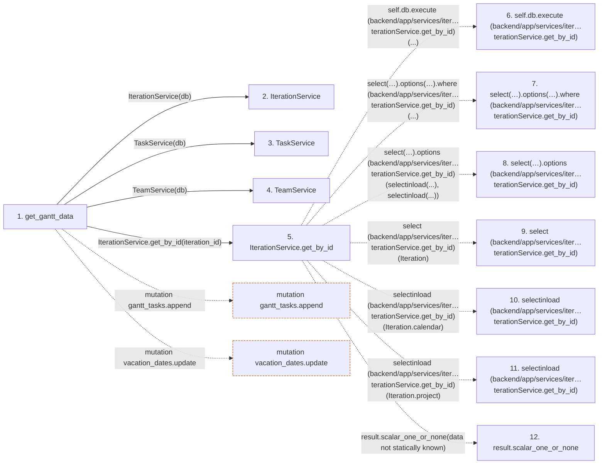

# get_gantt_data

**Entry point:** `get_gantt_data` (`http`)
**Source:** [routers_gantt](../modules/routers_gantt.md)
**Modules touched:** [calendar_service](../modules/calendar_service.md), [iteration_service](../modules/iteration_service.md), [query_limits](../modules/query_limits.md), [routers_gantt](../modules/routers_gantt.md), and 8 more

**Complete modules touched:**

- [calendar_service](../modules/calendar_service.md)
- [iteration_service](../modules/iteration_service.md)
- [query_limits](../modules/query_limits.md)
- [routers_gantt](../modules/routers_gantt.md)
- [schemas_calendar](../modules/schemas_calendar.md)
- [schemas_gantt](../modules/schemas_gantt.md)
- [schemas_iteration](../modules/schemas_iteration.md)
- [services_work_metrics](../modules/services_work_metrics.md)
- [task_hierarchy_service](../modules/task_hierarchy_service.md)
- [task_service](../modules/task_service.md)
- [team_service](../modules/team_service.md)
- [time](../modules/time.md)

## Call sequence

> Static overview in presentation order, not runtime execution order. Arrows retain captured callers; representative internal continuations and boundary examples precede repeated helper detail.

<!-- Auto-generated from static call edges. Dashed arrows are external or unresolved calls. Reviewed runtime conditions and side effects belong in Behavior. -->

```mermaid
sequenceDiagram
    participant p0 as get_gantt_data
    participant p1 as TaskService.get_by_iteration
    participant p2 as TeamService.get_by_iteration
    participant p3 as CalendarService.calculate_working_days
    participant p4 as _task_to_gantt
    participant p5 as IterationService
    participant p6 as TaskService
    participant p7 as TeamService
    participant p8 as IterationService.get_by_id
    participant p9 as CalendarService
    participant p10 as _overdue_task_ids
    participant p11 as GanttResponse
    participant p12 as IterationResponse
    participant p13 as TaskService._task_graph_query
    participant p14 as task_signals
    participant p15 as TaskService._load_iteration_tree
    participant p16 as TaskHierarchyService._load_iteration_tree
    participant p17 as working_today
    participant p18 as TeamService._member_options
    participant p19 as WorkingDaysResponse
    participant p20 as CollectionLimitExceededError
    participant p21 as GanttAssignee
    participant p22 as GanttMilestone
    participant p23 as GanttTask
    participant p24 as _get_calculated_effort
    participant p25 as TaskHierarchyService._task_graph_query
    participant p26 as TaskHierarchyService
    participant p27 as effective_work_flags
    participant p28 as as_utc
    participant p29 as HTTPException
    participant p30 as gantt_tasks.append
    p0->>p1: TaskService.get_by_iteration
    p0->>p2: TeamService.get_by_iteration
    p0->>p3: CalendarService.calculate_working_days
    p0->>p4: _task_to_gantt
    p0->>p5: IterationService
    p0->>p6: TaskService
    p0->>p7: TeamService
    p0->>p8: IterationService.get_by_id
    p0->>p9: CalendarService
    p0->>p10: _overdue_task_ids
    p0->>p11: GanttResponse
    p0->>p12: IterationResponse
    p1->>p13: TaskService._task_graph_query
    p4->>p14: task_signals
    p1->>p15: TaskService._load_iteration_tree
    p15->>p16: TaskHierarchyService._load_iteration_tree
    p14->>p17: working_today
    p2->>p18: TeamService._member_options
    p3->>p19: WorkingDaysResponse
    p1->>p20: CollectionLimitExceededError
    p4->>p21: GanttAssignee
    p4->>p22: GanttMilestone
    p4->>p23: GanttTask
    p4->>p24: _get_calculated_effort
    p13->>p25: TaskHierarchyService._task_graph_query
    p13->>p26: TaskHierarchyService
    p14->>p27: effective_work_flags
    p17->>p28: as_utc
    p0-->>p29: HTTPException(status_code=status.HTTP_404_NOT_FOUND, detail=...)
    p0-->>p30: gantt_tasks.append(gantt_task)
```

> Call sequence diagram shows 30 of 175 interactions; 145 omitted to keep the visualization within the 30-interaction and generated-diagram limits, with uncertain identities omitted rather than inferred.

> Captured boundary calls: external 1 of 71 (70 omitted); unresolved 1 of 68 (67 omitted). These counts cover the captured static trace.

Omitted captured detail, grouped by actual caller occurrence and target module:

| Caller | Parent step | Target module | Kind | Omitted interactions |
| --- | --- | --- | --- | --- |
| `backend/app/services/iteration_service.py:IterationService.get_by_id` | 5 | - | unresolved | 4 |
| `backend/app/services/iteration_service.py:IterationService.get_by_id` | 5 | - | external | 3 |
| `backend/app/services/task_service.py:TaskService.get_by_iteration` | 13 | - | unresolved | 6 |
| `backend/app/services/task_hierarchy_service.py:TaskHierarchyService._task_graph_query` | 18 | - | unresolved | 6 |
| `backend/app/services/task_hierarchy_service.py:TaskHierarchyService._task_graph_query` | 18 | - | external | 8 |
| `backend/app/services/task_service.py:TaskService.get_by_iteration` | 13 | - | external | 2 |
| `backend/app/services/task_hierarchy_service.py:TaskHierarchyService._load_iteration_tree` | 41 | - | unresolved | 20 |
| `backend/app/services/task_hierarchy_service.py:TaskHierarchyService._load_iteration_tree` | 41 | - | external | 11 |
> Omission summary shows 8 of 34 groups; 26 further groups are not expanded here. Counts above include all omitted interactions.
> Detailed flow queries retain their own coverage and limits; omitted paths may execute at runtime.

## Data flow

<!-- Auto-generated static analysis. Treat values and boundaries as best-effort hints, not runtime proof. -->

### Analysis coverage

**Effect analysis partially available.** Flow assembly and source effect analysis are separate; empty observations do not prove an empty handler body.

Source steps: 37; effect analysis evaluated: 20, partial: 0, unavailable: 17. Counts include steps omitted from the displayed trace.

Collector observations for 20 source steps with known totals: observed: 105, emitted: 105, omitted: 0. Unavailable totals are excluded.

- Callable record unavailable for one or more source steps; those steps have no represented callable body.
- Effect collector totals unavailable; observed counts cover captured records only.

| Step | Callable record | Effect analysis | Collector totals | Observed | Emitted | Omitted |
|---|---|---|---|---:|---:|---:|
| `get_gantt_data` | `available` | `evaluated` | `available` | `7` | `7` | `0` |
| `IterationService` | `unavailable` | `unavailable` | `unavailable` | — | — | — |
| `TaskService` | `unavailable` | `unavailable` | `unavailable` | — | — | — |
| `TeamService` | `unavailable` | `unavailable` | `unavailable` | — | — | — |
| `IterationService.get_by_id` | `available` | `evaluated` | `available` | `3` | `3` | `0` |
| `self.db.execute (backend/app/services/iter…terationService.get_by_id)` | `not_applicable` | `not_applicable` | `not_applicable` | — | — | — |
| `select(…).options(…).where (backend/app/services/iter…terationService.get_by_id)` | `not_applicable` | `not_applicable` | `not_applicable` | — | — | — |
| `select(…).options (backend/app/services/iter…terationService.get_by_id)` | `not_applicable` | `not_applicable` | `not_applicable` | — | — | — |
| `select (backend/app/services/iter…terationService.get_by_id)` | `not_applicable` | `not_applicable` | `not_applicable` | — | — | — |
| `selectinload (backend/app/services/iter…terationService.get_by_id)` | `not_applicable` | `not_applicable` | `not_applicable` | — | — | — |
| `selectinload (backend/app/services/iter…terationService.get_by_id)` | `not_applicable` | `not_applicable` | `not_applicable` | — | — | — |
| `result.scalar_one_or_none` | `not_applicable` | `not_applicable` | `not_applicable` | — | — | — |

```mermaid
flowchart LR
    s1["1. get_gantt_data"]
    s2["2. IterationService"]
    s3["3. TaskService"]
    s4["4. TeamService"]
    s5["5. IterationService.get_by_id"]
    s6["6. self.db.execute (backend/app/services/iter…terationService.get_by_id)"]
    s7["7. select(…).options(…).where (backend/app/services/iter…terationService.get_by_id)"]
    s8["8. select(…).options (backend/app/services/iter…terationService.get_by_id)"]
    s9["9. select (backend/app/services/iter…terationService.get_by_id)"]
    s10["10. selectinload (backend/app/services/iter…terationService.get_by_id)"]
    s11["11. selectinload (backend/app/services/iter…terationService.get_by_id)"]
    s12["12. result.scalar_one_or_none"]
    s1 -->|"IterationService(db)"| s2
    s1 -->|"TaskService(db)"| s3
    s1 -->|"TeamService(db)"| s4
    s1 -->|"IterationService.get_by_id(iteration_id)"| s5
    s5 -. "self.db.execute (backend/app/services/iter…terationService.get_by_id)(...)" .-> s6
    s5 -. "select(…).options(…).where (backend/app/services/iter…terationService.get_by_id)(...)" .-> s7
    s5 -. "select(…).options (backend/app/services/iter…terationService.get_by_id)(selectinload(...), selectinload(...))" .-> s8
    s5 -. "select (backend/app/services/iter…terationService.get_by_id)(Iteration)" .-> s9
    s5 -. "selectinload (backend/app/services/iter…terationService.get_by_id)(Iteration.calendar)" .-> s10
    s5 -. "selectinload (backend/app/services/iter…terationService.get_by_id)(Iteration.project)" .-> s11
    s5 -. "result.scalar_one_or_none(data not statically known)" .-> s12
    b0["mutation gantt_tasks.append"]
    s1 -. "mutation gantt_tasks.append" .-> b0
    b1["mutation vacation_dates.update"]
    s1 -. "mutation vacation_dates.update" .-> b1
    click s1 "../modules/routers_gantt.md"
    click s2 "../modules/iteration_service.md"
    click s3 "../modules/task_service.md"
    click s4 "../modules/team_service.md"
    click s5 "../modules/iteration_service.md"
    classDef boundary stroke:#b45309,stroke-dasharray: 4 2
    class b0 boundary
    class b1 boundary
```

### Step data

| Step | Inputs | Reads | Writes | Returns |
|---|---|---|---|---|
| `get_gantt_data` | `iteration_id: int`, `db: Annotated[AsyncSession, Depends(get_db, scope='function')]` | `status` | `member_vacations[...]` | `GanttResponse(...)` |
| `IterationService` | - | - | - | - |
| `TaskService` | - | - | - | - |
| `TeamService` | - | - | - | - |
| `IterationService.get_by_id` | `iteration_id: int` | `Iteration` | - | `result.scalar_one_or_none(...)` |
| `self.db.execute (backend/app/services/iter…terationService.get_by_id)` | - | - | - | - |
| `select(…).options(…).where (backend/app/services/iter…terationService.get_by_id)` | - | - | - | - |
| `select(…).options (backend/app/services/iter…terationService.get_by_id)` | - | - | - | - |
| `select (backend/app/services/iter…terationService.get_by_id)` | - | - | - | - |
| `selectinload (backend/app/services/iter…terationService.get_by_id)` | - | - | - | - |
| `selectinload (backend/app/services/iter…terationService.get_by_id)` | - | - | - | - |
| `result.scalar_one_or_none` | - | - | - | - |

### Call data

| From | To | Line | Call |
|---|---|---:|---|
| get_gantt_data | IterationService | 136 | `IterationService(db)` |
| get_gantt_data | TaskService | 137 | `TaskService(db)` |
| get_gantt_data | TeamService | 138 | `TeamService(db)` |
| get_gantt_data | IterationService.get_by_id | 143 | `iteration_service.get_by_id(iteration_id)` |
| IterationService.get_by_id | self.db.execute (backend/app/services/iter…terationService.get_by_id) | 323 | `self.db.execute(...)` |
| IterationService.get_by_id | select(…).options(…).where (backend/app/services/iter…terationService.get_by_id) | 324 | `select(Iteration).options(selectinload(Iteration.calendar), selectinload(Iteration.project)).where(...)` |
| IterationService.get_by_id | select(…).options (backend/app/services/iter…terationService.get_by_id) | 324 | `select(Iteration).options(selectinload(...), selectinload(...))` |
| IterationService.get_by_id | select (backend/app/services/iter…terationService.get_by_id) | 324 | `select(Iteration)` |
| IterationService.get_by_id | selectinload (backend/app/services/iter…terationService.get_by_id) | 326 | `selectinload(Iteration.calendar)` |
| IterationService.get_by_id | selectinload (backend/app/services/iter…terationService.get_by_id) | 327 | `selectinload(Iteration.project)` |
| IterationService.get_by_id | result.scalar_one_or_none | 331 | `result.scalar_one_or_none(data not statically known)` |

### Boundary effects

| Kind | Target | Step | Line |
|---|---|---|---:|
| mutation | `gantt_tasks.append` | `get_gantt_data` | 170 |
| mutation | `vacation_dates.update` | `get_gantt_data` | 191 |

### Static analysis gaps

| Kind | Step | Target | Line |
|---|---|---|---:|
| unresolved_call | `IterationService.get_by_id` | `self.db.execute` | 323 |
| unresolved_call | `IterationService.get_by_id` | `select(Iteration).options(selectinload(Iteration.calendar), selectinload(Iteration.project)).where` | 324 |
| unresolved_call | `IterationService.get_by_id` | `select(Iteration).options` | 324 |
| external_call | `IterationService.get_by_id` | `select` | 324 |
| external_call | `IterationService.get_by_id` | `selectinload` | 326 |
| external_call | `IterationService.get_by_id` | `selectinload` | 327 |
| unresolved_call | `IterationService.get_by_id` | `result.scalar_one_or_none` | 331 |
| step_limit | `get_gantt_data` | `first 12 steps` | 0 |

## Behavior

This flow starts at `get_gantt_data` and is classified as `http`. The generated call and data-flow sections are bounded static projections; runtime conditions and side effects require source-level confirmation.
