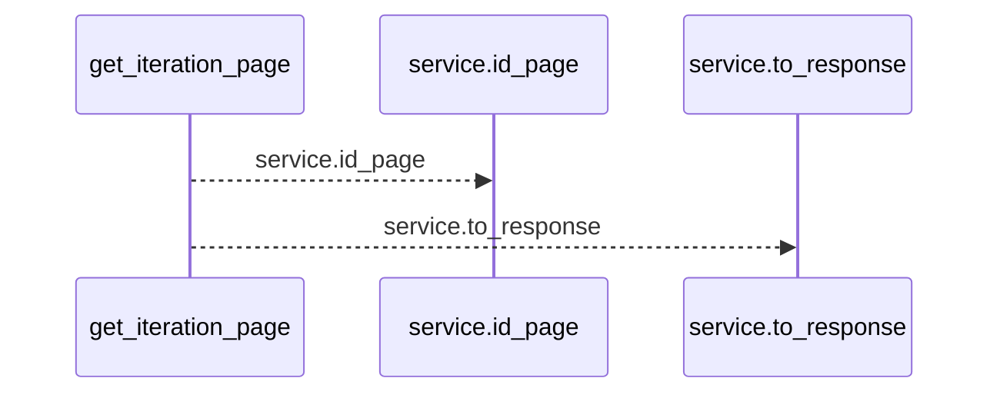
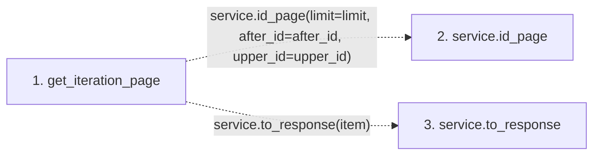

# get_iteration_page

**Entry point:** `get_iteration_page` (`http`)
**Source:** [iterations](../modules/iterations.md)
**Modules touched:** [iterations](../modules/iterations.md)

## Call sequence

<!-- Auto-generated from static call edges. Dashed arrows are external or unresolved calls. Reviewed runtime conditions and side effects belong in Behavior. -->

## Data flow

<!-- Auto-generated static analysis. Treat values and boundaries as best-effort hints, not runtime proof. -->

### Step data

| Step | Inputs | Reads | Writes | Returns |
|---|---|---|---|---|
| `get_iteration_page` | `service: Annotated[IterationService, Depends(get_iteration_service)]`, `limit: int`, `after_id: int`, `upper_id: int \| None` | - | `page[...]` | `page` |
| `service.id_page` | - | - | - | - |
| `service.to_response` | - | - | - | - |

### Call data

| From | To | Line | Call |
|---|---|---:|---|
| get_iteration_page | service.id_page | 34 | `service.id_page(limit=limit, after_id=after_id, upper_id=upper_id)` |
| get_iteration_page | service.to_response | 35 | `service.to_response(item)` |

### Boundary effects

*No boundary effects detected.*

### Static analysis gaps

| Kind | Step | Target | Line |
|---|---|---|---:|
| unresolved_call | `get_iteration_page` | `service.id_page` | 34 |
| unresolved_call | `get_iteration_page` | `service.to_response` | 35 |

## Behavior

This flow starts at `get_iteration_page` and is classified as `http`. The generated call and data-flow sections are bounded static projections; runtime conditions and side effects require source-level confirmation.
