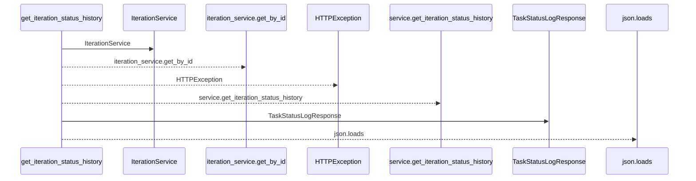
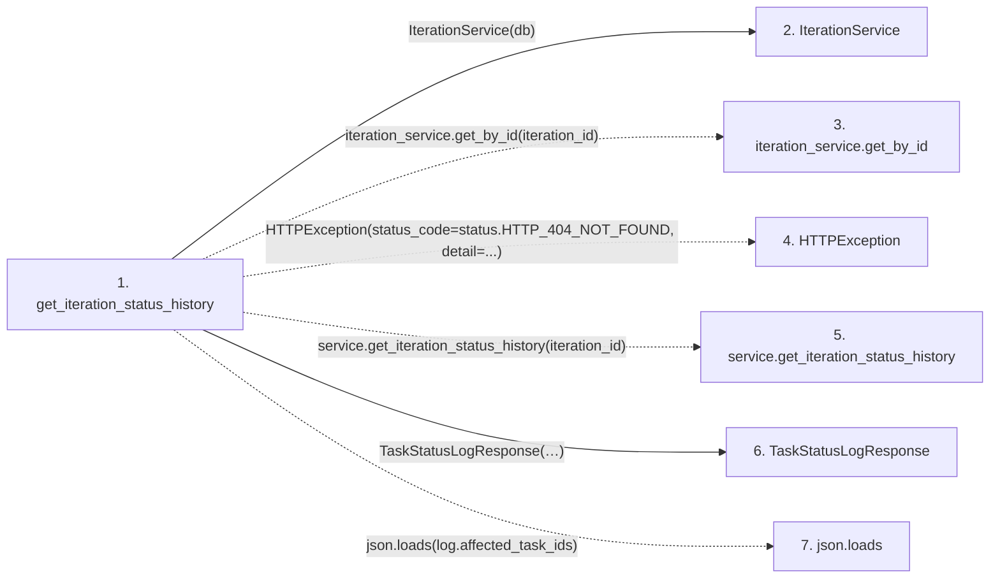

# get_iteration_status_history

**Entry point:** `get_iteration_status_history` (`http`)
**Source:** [tasks](../modules/tasks.md)
**Modules touched:** [iteration_service](../modules/iteration_service.md), [schemas_task](../modules/schemas_task.md), [tasks](../modules/tasks.md)

## Call sequence

<!-- Auto-generated from static call edges. Dashed arrows are external or unresolved calls. Reviewed runtime conditions and side effects belong in Behavior. -->

## Data flow

<!-- Auto-generated static analysis. Treat values and boundaries as best-effort hints, not runtime proof. -->

### Step data

| Step | Inputs | Reads | Writes | Returns |
|---|---|---|---|---|
| `get_iteration_status_history` | `iteration_id: int`, `service: Annotated[TaskService, Depends(get_task_service)]`, `db: Annotated[AsyncSession, Depends(get_db)]` | `status` | - | `...` |
| `IterationService` | - | - | - | - |
| `iteration_service.get_by_id` | - | - | - | - |
| `HTTPException` | - | - | - | - |
| `service.get_iteration_status_history` | - | - | - | - |
| `TaskStatusLogResponse` | - | - | - | - |
| `json.loads` | - | - | - | - |

### Call data

| From | To | Line | Call |
|---|---|---:|---|
| get_iteration_status_history | IterationService | 1007 | `IterationService(db)` |
| get_iteration_status_history | iteration_service.get_by_id | 1008 | `iteration_service.get_by_id(iteration_id)` |
| get_iteration_status_history | HTTPException | 1010 | `HTTPException(status_code=status.HTTP_404_NOT_FOUND, detail=...)` |
| get_iteration_status_history | service.get_iteration_status_history | 1015 | `service.get_iteration_status_history(iteration_id)` |
| get_iteration_status_history | TaskStatusLogResponse | 1018 | `TaskStatusLogResponse(id=log.id, task_id=log.task_id, task_title=log.task_title, from_status=log.from_status, to_status=log.to_status, changed_at=log.changed_at, reason=log.reason, triggered_by=log.triggered_by, affected_task_ids=...)` |
| get_iteration_status_history | json.loads | 1027 | `json.loads(log.affected_task_ids)` |

### Boundary effects

*No boundary effects detected.*

### Static analysis gaps

| Kind | Step | Target | Line |
|---|---|---|---:|
| unresolved_call | `get_iteration_status_history` | `iteration_service.get_by_id` | 1008 |
| external_call | `get_iteration_status_history` | `HTTPException` | 1010 |
| unresolved_call | `get_iteration_status_history` | `service.get_iteration_status_history` | 1015 |
| external_call | `get_iteration_status_history` | `json.loads` | 1027 |

## Behavior

This flow starts at `get_iteration_status_history` and is classified as `http`. The generated call and data-flow sections are bounded static projections; runtime conditions and side effects require source-level confirmation.
