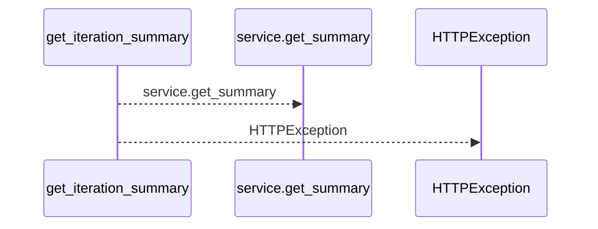
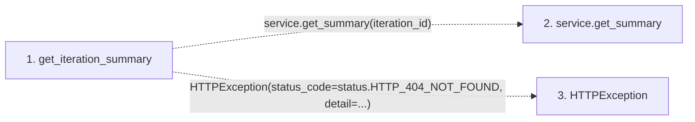

# get_iteration_summary

**Entry point:** `get_iteration_summary` (`http`)
**Source:** [iterations](../modules/iterations.md)
**Modules touched:** [iterations](../modules/iterations.md)

## Call sequence

<!-- Auto-generated from static call edges. Dashed arrows are external or unresolved calls. Reviewed runtime conditions and side effects belong in Behavior. -->

## Data flow

<!-- Auto-generated static analysis. Treat values and boundaries as best-effort hints, not runtime proof. -->

### Step data

| Step | Inputs | Reads | Writes | Returns |
|---|---|---|---|---|
| `get_iteration_summary` | `iteration_id: int`, `service: Annotated[IterationService, Depends(get_iteration_service)]` | `status` | - | `summary` |
| `service.get_summary` | - | - | - | - |
| `HTTPException` | - | - | - | - |

### Call data

| From | To | Line | Call |
|---|---|---:|---|
| get_iteration_summary | service.get_summary | 160 | `service.get_summary(iteration_id)` |
| get_iteration_summary | HTTPException | 162 | `HTTPException(status_code=status.HTTP_404_NOT_FOUND, detail=...)` |

### Boundary effects

*No boundary effects detected.*

### Static analysis gaps

| Kind | Step | Target | Line |
|---|---|---|---:|
| unresolved_call | `get_iteration_summary` | `service.get_summary` | 160 |
| external_call | `get_iteration_summary` | `HTTPException` | 162 |

## Behavior

This flow starts at `get_iteration_summary` and is classified as `http`. The generated call and data-flow sections are bounded static projections; runtime conditions and side effects require source-level confirmation.
