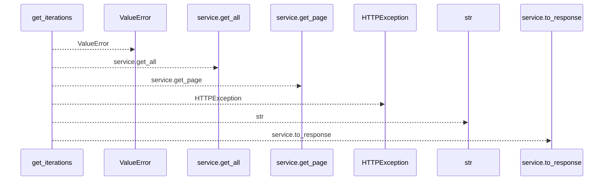
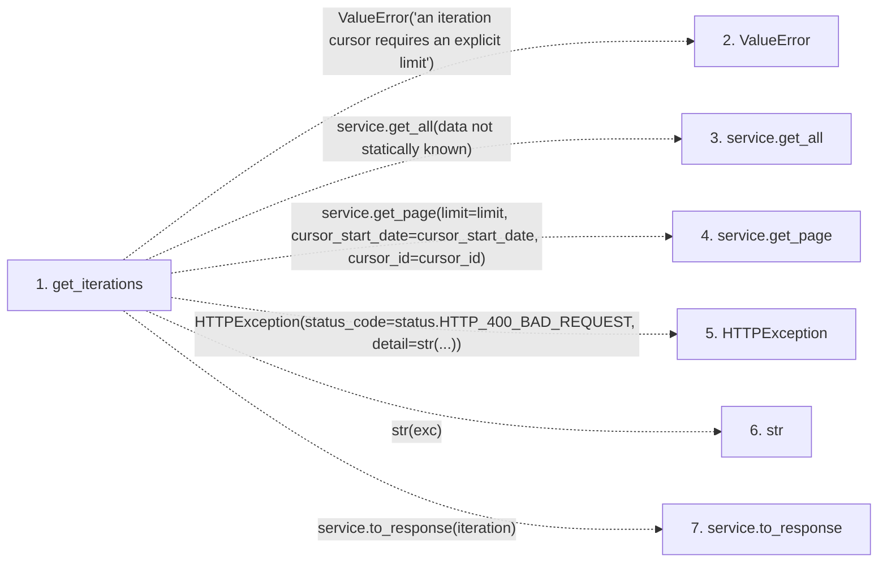

# get_iterations

**Entry point:** `get_iterations` (`http`)
**Source:** [iterations](../modules/iterations.md)
**Modules touched:** [iterations](../modules/iterations.md)

## Call sequence

<!-- Auto-generated from static call edges. Dashed arrows are external or unresolved calls. Reviewed runtime conditions and side effects belong in Behavior. -->

## Data flow

<!-- Auto-generated static analysis. Treat values and boundaries as best-effort hints, not runtime proof. -->

### Step data

| Step | Inputs | Reads | Writes | Returns |
|---|---|---|---|---|
| `get_iterations` | `service: Annotated[IterationService, Depends(get_iteration_service)]`, `limit: Annotated[int \| None, Query(ge=1, le=MAX_ITERATION_LIST_ITEMS)]`, `cursor_start_date: date \| None`, `cursor_id: int \| None` | `status` | - | `...` |
| `ValueError` | - | - | - | - |
| `service.get_all` | - | - | - | - |
| `service.get_page` | - | - | - | - |
| `HTTPException` | - | - | - | - |
| `str` | - | - | - | - |
| `service.to_response` | - | - | - | - |

### Call data

| From | To | Line | Call |
|---|---|---:|---|
| get_iterations | ValueError | 53 | `ValueError('an iteration cursor requires an explicit limit')` |
| get_iterations | service.get_all | 54 | `service.get_all(data not statically known)` |
| get_iterations | service.get_page | 56 | `service.get_page(limit=limit, cursor_start_date=cursor_start_date, cursor_id=cursor_id)` |
| get_iterations | HTTPException | 62 | `HTTPException(status_code=status.HTTP_400_BAD_REQUEST, detail=str(...))` |
| get_iterations | str | 64 | `str(exc)` |
| get_iterations | service.to_response | 66 | `service.to_response(iteration)` |

### Boundary effects

*No boundary effects detected.*

### Static analysis gaps

| Kind | Step | Target | Line |
|---|---|---|---:|
| external_call | `get_iterations` | `ValueError` | 53 |
| unresolved_call | `get_iterations` | `service.get_all` | 54 |
| unresolved_call | `get_iterations` | `service.get_page` | 56 |
| external_call | `get_iterations` | `HTTPException` | 62 |
| unresolved_call | `get_iterations` | `service.to_response` | 66 |

## Behavior

This flow starts at `get_iterations` and is classified as `http`. The generated call and data-flow sections are bounded static projections; runtime conditions and side effects require source-level confirmation.
