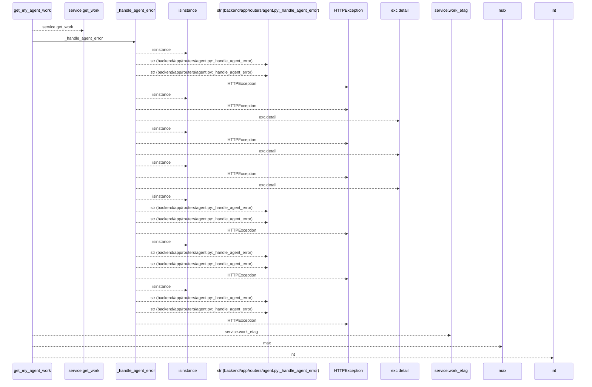
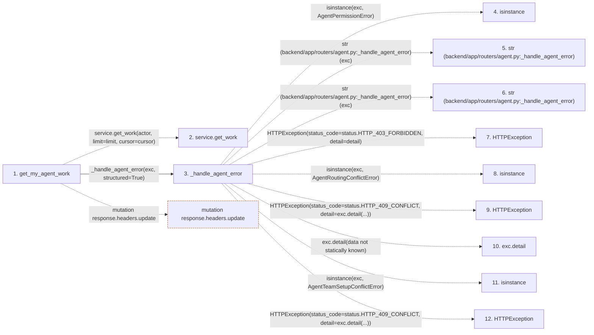

# get_my_agent_work

**Entry point:** `get_my_agent_work` (`http`)
**Source:** [routers_agent](../modules/routers_agent.md)
**Modules touched:** [routers_agent](../modules/routers_agent.md), [time](../modules/time.md)

## Call sequence

<!-- Auto-generated from static call edges. Dashed arrows are external or unresolved calls. Reviewed runtime conditions and side effects belong in Behavior. -->

> Call sequence diagram shows 30 of 42 interactions; 12 omitted to keep the visualization within the 30-interaction and generated-diagram limits.

## Data flow

<!-- Auto-generated static analysis. Treat values and boundaries as best-effort hints, not runtime proof. -->

### Step data

| Step | Inputs | Reads | Writes | Returns |
|---|---|---|---|---|
| `get_my_agent_work` | `actor: Annotated[AgentActor, Depends(get_agent_actor)]`, `service: Annotated[AgentWorkService, Depends(get_agent_work_service)]`, `response: Response`, `limit: int`, `cursor: Optional[str]`, `if_none_match: Annotated[Optional[str], Header(alias='If-None-Match')]` | `status` | `cache_headers[...]` | `Response(...)`, `decision` |
| `service.get_work` | - | - | - | - |
| `_handle_agent_error` | `exc: Exception`, `structured: bool` | `AgentPermissionError`, `status`, `AgentRoutingConflictError`, `status`, `AgentTeamSetupConflictError`, `status`, `TaskVersionConflictError`, `status` | - | - |
| `isinstance` | - | - | - | - |
| `str (backend/app/routers/agent.py:_handle_agent_error)` | - | - | - | - |
| `str (backend/app/routers/agent.py:_handle_agent_error)` | - | - | - | - |
| `HTTPException` | - | - | - | - |
| `isinstance` | - | - | - | - |
| `HTTPException` | - | - | - | - |
| `exc.detail` | - | - | - | - |
| `isinstance` | - | - | - | - |
| `HTTPException` | - | - | - | - |

### Call data

| From | To | Line | Call |
|---|---|---:|---|
| get_my_agent_work | service.get_work | 777 | `service.get_work(actor, limit=limit, cursor=cursor)` |
| get_my_agent_work | _handle_agent_error | 779 | `_handle_agent_error(exc, structured=True)` |
| _handle_agent_error | isinstance | 252 | `isinstance(exc, AgentPermissionError)` |
| _handle_agent_error | str (backend/app/routers/agent.py:_handle_agent_error) | 254 | `str(exc)` |
| _handle_agent_error | str (backend/app/routers/agent.py:_handle_agent_error) | 256 | `str(exc)` |
| _handle_agent_error | HTTPException | 258 | `HTTPException(status_code=status.HTTP_403_FORBIDDEN, detail=detail)` |
| _handle_agent_error | isinstance | 259 | `isinstance(exc, AgentRoutingConflictError)` |
| _handle_agent_error | HTTPException | 260 | `HTTPException(status_code=status.HTTP_409_CONFLICT, detail=exc.detail(...))` |
| _handle_agent_error | exc.detail | 260 | `exc.detail(data not statically known)` |
| _handle_agent_error | isinstance | 261 | `isinstance(exc, AgentTeamSetupConflictError)` |
| _handle_agent_error | HTTPException | 262 | `HTTPException(status_code=status.HTTP_409_CONFLICT, detail=exc.detail(...))` |

### Boundary effects

| Kind | Target | Step | Line |
|---|---|---|---:|
| mutation | `response.headers.update` | `get_my_agent_work` | 794 |

### Static analysis gaps

| Kind | Step | Target | Line |
|---|---|---|---:|
| unresolved_call | `get_my_agent_work` | `service.get_work` | 777 |
| external_call | `_handle_agent_error` | `isinstance` | 252 |
| external_call | `_handle_agent_error` | `HTTPException` | 258 |
| external_call | `_handle_agent_error` | `isinstance` | 259 |
| external_call | `_handle_agent_error` | `HTTPException` | 260 |
| unresolved_call | `_handle_agent_error` | `exc.detail` | 260 |
| external_call | `_handle_agent_error` | `isinstance` | 261 |
| external_call | `_handle_agent_error` | `HTTPException` | 262 |
| step_limit | `get_my_agent_work` | `first 12 steps` | 0 |

## Behavior

This flow starts at `get_my_agent_work` and is classified as `http`. The generated call and data-flow sections are bounded static projections; runtime conditions and side effects require source-level confirmation.
