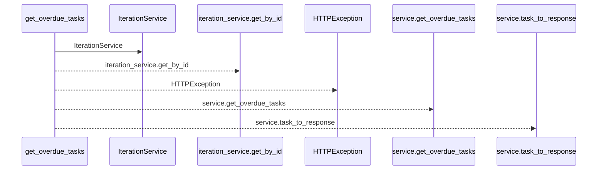
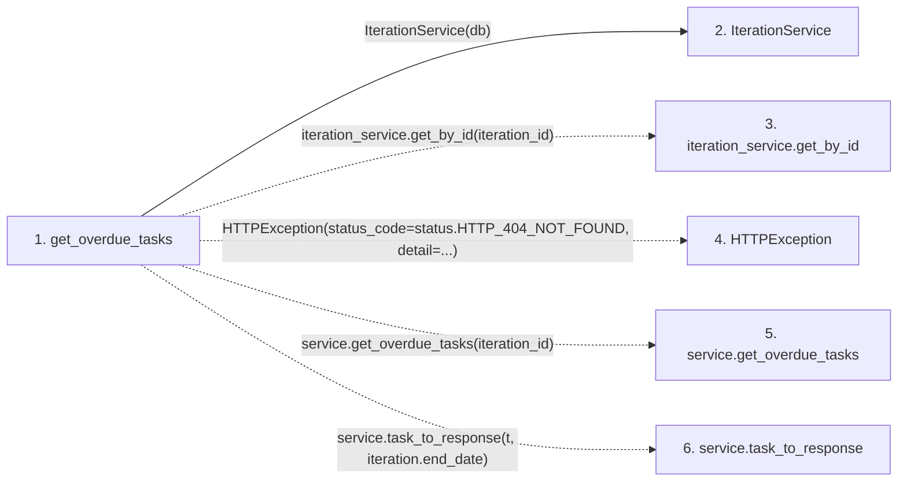

# get_overdue_tasks

**Entry point:** `get_overdue_tasks` (`http`)
**Source:** [tasks](../modules/tasks.md)
**Modules touched:** [iteration_service](../modules/iteration_service.md), [tasks](../modules/tasks.md)

## Call sequence

<!-- Auto-generated from static call edges. Dashed arrows are external or unresolved calls. Reviewed runtime conditions and side effects belong in Behavior. -->

## Data flow

<!-- Auto-generated static analysis. Treat values and boundaries as best-effort hints, not runtime proof. -->

### Step data

| Step | Inputs | Reads | Writes | Returns |
|---|---|---|---|---|
| `get_overdue_tasks` | `iteration_id: int`, `service: Annotated[TaskService, Depends(get_task_service)]`, `db: Annotated[AsyncSession, Depends(get_db, scope='function')]` | `status` | - | `...` |
| `IterationService` | - | - | - | - |
| `iteration_service.get_by_id` | - | - | - | - |
| `HTTPException` | - | - | - | - |
| `service.get_overdue_tasks` | - | - | - | - |
| `service.task_to_response` | - | - | - | - |

### Call data

| From | To | Line | Call |
|---|---|---:|---|
| get_overdue_tasks | IterationService | 1043 | `IterationService(db)` |
| get_overdue_tasks | iteration_service.get_by_id | 1044 | `iteration_service.get_by_id(iteration_id)` |
| get_overdue_tasks | HTTPException | 1047 | `HTTPException(status_code=status.HTTP_404_NOT_FOUND, detail=...)` |
| get_overdue_tasks | service.get_overdue_tasks | 1052 | `service.get_overdue_tasks(iteration_id)` |
| get_overdue_tasks | service.task_to_response | 1053 | `service.task_to_response(t, iteration.end_date)` |

### Boundary effects

*No boundary effects detected.*

### Static analysis gaps

| Kind | Step | Target | Line |
|---|---|---|---:|
| unresolved_call | `get_overdue_tasks` | `iteration_service.get_by_id` | 1044 |
| external_call | `get_overdue_tasks` | `HTTPException` | 1047 |
| unresolved_call | `get_overdue_tasks` | `service.get_overdue_tasks` | 1052 |
| unresolved_call | `get_overdue_tasks` | `service.task_to_response` | 1053 |

## Behavior

This flow starts at `get_overdue_tasks` and is classified as `http`. The generated call and data-flow sections are bounded static projections; runtime conditions and side effects require source-level confirmation.
