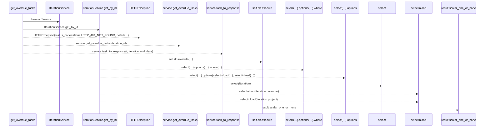
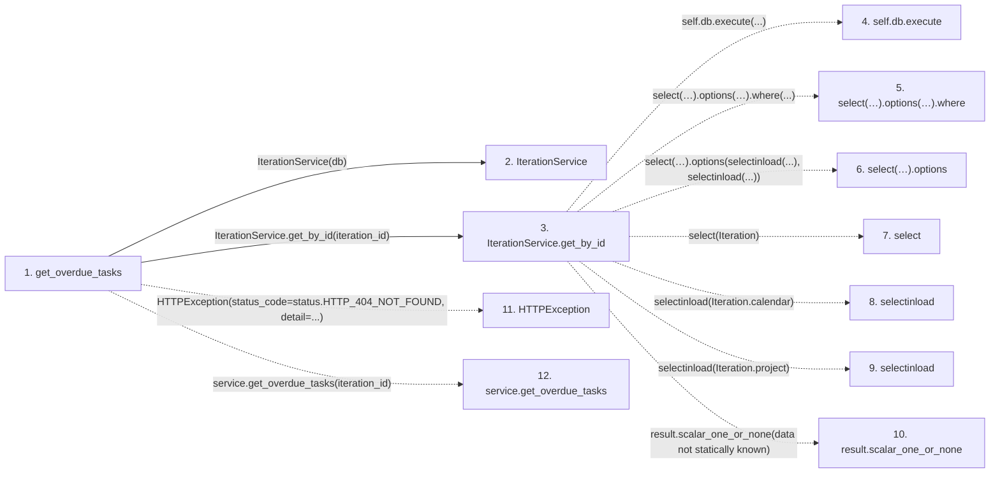

# get_overdue_tasks

**Entry point:** `get_overdue_tasks` (`http`)
**Source:** [tasks](../modules/tasks.md)
**Modules touched:** [iteration_service](../modules/iteration_service.md), [tasks](../modules/tasks.md)

## Call sequence

> Static overview in presentation order, not runtime execution order. Arrows retain captured callers; representative internal continuations and boundary examples precede repeated helper detail.

<!-- Auto-generated from static call edges. Dashed arrows are external or unresolved calls. Reviewed runtime conditions and side effects belong in Behavior. -->

```mermaid
sequenceDiagram
    participant p0 as get_overdue_tasks
    participant p1 as IterationService
    participant p2 as IterationService.get_by_id
    participant p3 as HTTPException
    participant p4 as service.get_overdue_tasks
    participant p5 as service.task_to_response
    participant p6 as self.db.execute
    participant p7 as select(…).options(…).where
    participant p8 as select(…).options
    participant p9 as select
    participant p10 as selectinload
    participant p11 as result.scalar_one_or_none
    p0->>p1: IterationService
    p0->>p2: IterationService.get_by_id
    p0-->>p3: HTTPException(status_code=status.HTTP_404_NOT_FOUND, detail=...)
    p0-->>p4: service.get_overdue_tasks(iteration_id)
    p0-->>p5: service.task_to_response(t, iteration.end_date)
    p2-->>p6: self.db.execute(...)
    p2-->>p7: select(…).options(…).where(...)
    p2-->>p8: select(…).options(selectinload(...), selectinload(...))
    p2-->>p9: select(Iteration)
    p2-->>p10: selectinload(Iteration.calendar)
    p2-->>p10: selectinload(Iteration.project)
    p2-->>p11: result.scalar_one_or_none
```

> Call sequence diagram shows 12 of 12 interactions; 0 omitted to keep the visualization within the 30-interaction and generated-diagram limits, with uncertain identities omitted rather than inferred.

> Captured boundary calls: external 4 of 4 (0 omitted); unresolved 6 of 6 (0 omitted). These counts cover the captured static trace.
> Detailed flow queries retain their own coverage and limits; omitted paths may execute at runtime.

## Data flow

<!-- Auto-generated static analysis. Treat values and boundaries as best-effort hints, not runtime proof. -->

### Analysis coverage

**Effect analysis partially available.** Flow assembly and source effect analysis are separate; empty observations do not prove an empty handler body.

Source steps: 3; effect analysis evaluated: 2, partial: 0, unavailable: 1. Counts include steps omitted from the displayed trace.

Collector observations for 2 source steps with known totals: observed: 8, emitted: 8, omitted: 0. Unavailable totals are excluded.

- Callable record unavailable for one or more source steps; those steps have no represented callable body.
- Effect collector totals unavailable; observed counts cover captured records only.

| Step | Callable record | Effect analysis | Collector totals | Observed | Emitted | Omitted |
|---|---|---|---|---:|---:|---:|
| `get_overdue_tasks` | `available` | `evaluated` | `available` | `5` | `5` | `0` |
| `IterationService` | `unavailable` | `unavailable` | `unavailable` | — | — | — |
| `IterationService.get_by_id` | `available` | `evaluated` | `available` | `3` | `3` | `0` |
| `self.db.execute` | `not_applicable` | `not_applicable` | `not_applicable` | — | — | — |
| `select(…).options(…).where` | `not_applicable` | `not_applicable` | `not_applicable` | — | — | — |
| `select(…).options` | `not_applicable` | `not_applicable` | `not_applicable` | — | — | — |
| `select` | `not_applicable` | `not_applicable` | `not_applicable` | — | — | — |
| `selectinload` | `not_applicable` | `not_applicable` | `not_applicable` | — | — | — |
| `selectinload` | `not_applicable` | `not_applicable` | `not_applicable` | — | — | — |
| `result.scalar_one_or_none` | `not_applicable` | `not_applicable` | `not_applicable` | — | — | — |
| `HTTPException` | `not_applicable` | `not_applicable` | `not_applicable` | — | — | — |
| `service.get_overdue_tasks` | `not_applicable` | `not_applicable` | `not_applicable` | — | — | — |

```mermaid
flowchart LR
    s1["1. get_overdue_tasks"]
    s2["2. IterationService"]
    s3["3. IterationService.get_by_id"]
    s4["4. self.db.execute"]
    s5["5. select(…).options(…).where"]
    s6["6. select(…).options"]
    s7["7. select"]
    s8["8. selectinload"]
    s9["9. selectinload"]
    s10["10. result.scalar_one_or_none"]
    s11["11. HTTPException"]
    s12["12. service.get_overdue_tasks"]
    s1 -->|"IterationService(db)"| s2
    s1 -->|"IterationService.get_by_id(iteration_id)"| s3
    s3 -. "self.db.execute(...)" .-> s4
    s3 -. "select(…).options(…).where(...)" .-> s5
    s3 -. "select(…).options(selectinload(...), selectinload(...))" .-> s6
    s3 -. "select(Iteration)" .-> s7
    s3 -. "selectinload(Iteration.calendar)" .-> s8
    s3 -. "selectinload(Iteration.project)" .-> s9
    s3 -. "result.scalar_one_or_none(data not statically known)" .-> s10
    s1 -. "HTTPException(status_code=status.HTTP_404_NOT_FOUND, detail=...)" .-> s11
    s1 -. "service.get_overdue_tasks(iteration_id)" .-> s12
    click s1 "../modules/tasks.md"
    click s2 "../modules/iteration_service.md"
    click s3 "../modules/iteration_service.md"
```

### Step data

| Step | Inputs | Reads | Writes | Returns |
|---|---|---|---|---|
| `get_overdue_tasks` | `iteration_id: int`, `service: Annotated[TaskService, Depends(get_task_service)]`, `db: Annotated[AsyncSession, Depends(get_db, scope='function')]` | `status` | - | `...` |
| `IterationService` | - | - | - | - |
| `IterationService.get_by_id` | `iteration_id: int` | `Iteration` | - | `result.scalar_one_or_none(...)` |
| `self.db.execute` | - | - | - | - |
| `select(…).options(…).where` | - | - | - | - |
| `select(…).options` | - | - | - | - |
| `select` | - | - | - | - |
| `selectinload` | - | - | - | - |
| `selectinload` | - | - | - | - |
| `result.scalar_one_or_none` | - | - | - | - |
| `HTTPException` | - | - | - | - |
| `service.get_overdue_tasks` | - | - | - | - |

### Call data

| From | To | Line | Call |
|---|---|---:|---|
| get_overdue_tasks | IterationService | 1079 | `IterationService(db)` |
| get_overdue_tasks | IterationService.get_by_id | 1080 | `iteration_service.get_by_id(iteration_id)` |
| IterationService.get_by_id | self.db.execute | 323 | `self.db.execute(...)` |
| IterationService.get_by_id | select(…).options(…).where | 324 | `select(Iteration).options(selectinload(Iteration.calendar), selectinload(Iteration.project)).where(...)` |
| IterationService.get_by_id | select(…).options | 324 | `select(Iteration).options(selectinload(...), selectinload(...))` |
| IterationService.get_by_id | select | 324 | `select(Iteration)` |
| IterationService.get_by_id | selectinload | 326 | `selectinload(Iteration.calendar)` |
| IterationService.get_by_id | selectinload | 327 | `selectinload(Iteration.project)` |
| IterationService.get_by_id | result.scalar_one_or_none | 331 | `result.scalar_one_or_none(data not statically known)` |
| get_overdue_tasks | HTTPException | 1083 | `HTTPException(status_code=status.HTTP_404_NOT_FOUND, detail=...)` |
| get_overdue_tasks | service.get_overdue_tasks | 1088 | `service.get_overdue_tasks(iteration_id)` |

### Boundary effects

*No boundary-effect observations were captured in this static trace.*

### Static analysis gaps

| Kind | Step | Target | Line |
|---|---|---|---:|
| unresolved_call | `IterationService.get_by_id` | `self.db.execute` | 323 |
| unresolved_call | `IterationService.get_by_id` | `select(Iteration).options(selectinload(Iteration.calendar), selectinload(Iteration.project)).where` | 324 |
| unresolved_call | `IterationService.get_by_id` | `select(Iteration).options` | 324 |
| external_call | `IterationService.get_by_id` | `select` | 324 |
| external_call | `IterationService.get_by_id` | `selectinload` | 326 |
| external_call | `IterationService.get_by_id` | `selectinload` | 327 |
| unresolved_call | `IterationService.get_by_id` | `result.scalar_one_or_none` | 331 |
| external_call | `get_overdue_tasks` | `HTTPException` | 1083 |
| unresolved_call | `get_overdue_tasks` | `service.get_overdue_tasks` | 1088 |
| step_limit | `get_overdue_tasks` | `first 12 steps` | 0 |

## Behavior

This flow starts at `get_overdue_tasks` and is classified as `http`. The generated call and data-flow sections are bounded static projections; runtime conditions and side effects require source-level confirmation.
