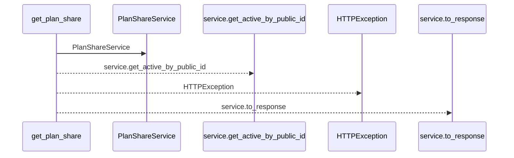
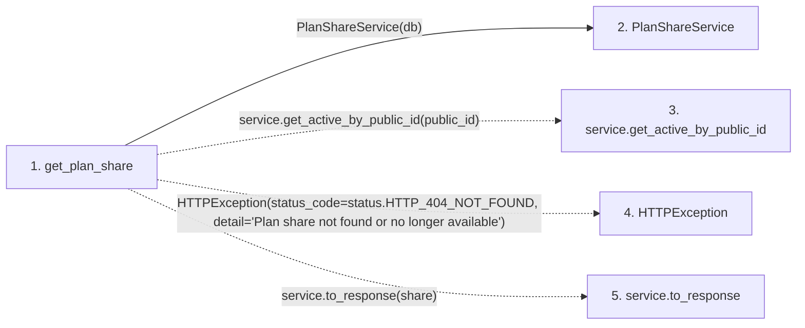

# get_plan_share

**Entry point:** `get_plan_share` (`http`)
**Source:** [plan_shares](../modules/plan_shares.md)
**Modules touched:** [plan_share_service](../modules/plan_share_service.md), [plan_shares](../modules/plan_shares.md)

## Call sequence

<!-- Auto-generated from static call edges. Dashed arrows are external or unresolved calls. Reviewed runtime conditions and side effects belong in Behavior. -->

## Data flow

<!-- Auto-generated static analysis. Treat values and boundaries as best-effort hints, not runtime proof. -->

### Step data

| Step | Inputs | Reads | Writes | Returns |
|---|---|---|---|---|
| `get_plan_share` | `public_id: str`, `response: Response`, `db: Annotated[AsyncSession, Depends(get_db, scope='function')]` | `status` | `response.headers[...]` | `service.to_response(...)` |
| `PlanShareService` | - | - | - | - |
| `service.get_active_by_public_id` | - | - | - | - |
| `HTTPException` | - | - | - | - |
| `service.to_response` | - | - | - | - |

### Call data

| From | To | Line | Call |
|---|---|---:|---|
| get_plan_share | PlanShareService | 75 | `PlanShareService(db)` |
| get_plan_share | service.get_active_by_public_id | 76 | `service.get_active_by_public_id(public_id)` |
| get_plan_share | HTTPException | 78 | `HTTPException(status_code=status.HTTP_404_NOT_FOUND, detail='Plan share not found or no longer available')` |
| get_plan_share | service.to_response | 82 | `service.to_response(share)` |

### Boundary effects

*No boundary effects detected.*

### Static analysis gaps

| Kind | Step | Target | Line |
|---|---|---|---:|
| unresolved_call | `get_plan_share` | `service.get_active_by_public_id` | 76 |
| external_call | `get_plan_share` | `HTTPException` | 78 |
| unresolved_call | `get_plan_share` | `service.to_response` | 82 |

## Behavior

This flow starts at `get_plan_share` and is classified as `http`. The generated call and data-flow sections are bounded static projections; runtime conditions and side effects require source-level confirmation.
