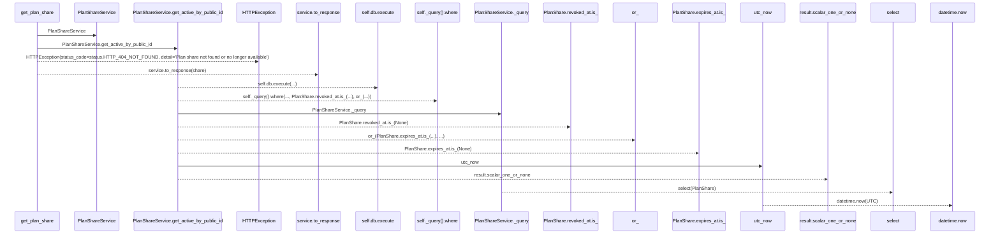
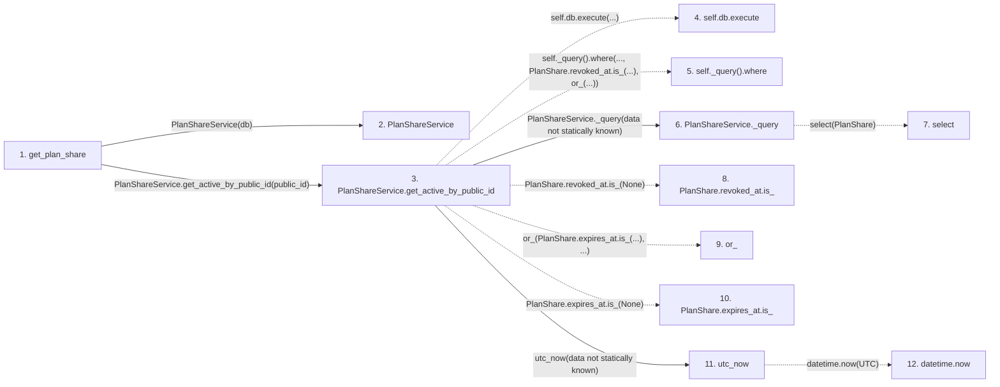

# get_plan_share

**Entry point:** `get_plan_share` (`http`)
**Source:** [plan_shares](../modules/plan_shares.md)
**Modules touched:** [plan_share_service](../modules/plan_share_service.md), [plan_shares](../modules/plan_shares.md), [time](../modules/time.md)

## Call sequence

> Static overview in presentation order, not runtime execution order. Arrows retain captured callers; representative internal continuations and boundary examples precede repeated helper detail.

<!-- Auto-generated from static call edges. Dashed arrows are external or unresolved calls. Reviewed runtime conditions and side effects belong in Behavior. -->

```mermaid
sequenceDiagram
    participant p0 as get_plan_share
    participant p1 as PlanShareService
    participant p2 as PlanShareService.get_active_by_public_id
    participant p3 as HTTPException
    participant p4 as service.to_response
    participant p5 as self.db.execute
    participant p6 as self._query().where
    participant p7 as PlanShareService._query
    participant p8 as PlanShare.revoked_at.is_
    participant p9 as or_
    participant p10 as PlanShare.expires_at.is_
    participant p11 as utc_now
    participant p12 as result.scalar_one_or_none
    participant p13 as select
    participant p14 as datetime.now
    p0->>p1: PlanShareService
    p0->>p2: PlanShareService.get_active_by_public_id
    p0-->>p3: HTTPException(status_code=status.HTTP_404_NOT_FOUND, detail='Plan share not found or no longer available')
    p0-->>p4: service.to_response(share)
    p2-->>p5: self.db.execute(...)
    p2-->>p6: self._query().where(..., PlanShare.revoked_at.is_(...), or_(...))
    p2->>p7: PlanShareService._query
    p2-->>p8: PlanShare.revoked_at.is_(None)
    p2-->>p9: or_(PlanShare.expires_at.is_(...), ...)
    p2-->>p10: PlanShare.expires_at.is_(None)
    p2->>p11: utc_now
    p2-->>p12: result.scalar_one_or_none
    p7-->>p13: select(PlanShare)
    p11-->>p14: datetime.now(UTC)
```

> Call sequence diagram shows 14 of 14 interactions; 0 omitted to keep the visualization within the 30-interaction and generated-diagram limits, with uncertain identities omitted rather than inferred.

> Captured boundary calls: external 4 of 4 (0 omitted); unresolved 6 of 6 (0 omitted). These counts cover the captured static trace.
> Detailed flow queries retain their own coverage and limits; omitted paths may execute at runtime.

## Data flow

<!-- Auto-generated static analysis. Treat values and boundaries as best-effort hints, not runtime proof. -->

### Analysis coverage

**Effect analysis partially available.** Flow assembly and source effect analysis are separate; empty observations do not prove an empty handler body.

Source steps: 5; effect analysis evaluated: 4, partial: 0, unavailable: 1. Counts include steps omitted from the displayed trace.

Collector observations for 4 source steps with known totals: observed: 14, emitted: 14, omitted: 0. Unavailable totals are excluded.

- Callable record unavailable for one or more source steps; those steps have no represented callable body.
- Effect collector totals unavailable; observed counts cover captured records only.

| Step | Callable record | Effect analysis | Collector totals | Observed | Emitted | Omitted |
|---|---|---|---|---:|---:|---:|
| `get_plan_share` | `available` | `evaluated` | `available` | `6` | `6` | `0` |
| `PlanShareService` | `unavailable` | `unavailable` | `unavailable` | — | — | — |
| `PlanShareService.get_active_by_public_id` | `available` | `evaluated` | `available` | `4` | `4` | `0` |
| `self.db.execute` | `not_applicable` | `not_applicable` | `not_applicable` | — | — | — |
| `self._query().where` | `not_applicable` | `not_applicable` | `not_applicable` | — | — | — |
| `PlanShareService._query` | `available` | `evaluated` | `available` | `2` | `2` | `0` |
| `select` | `not_applicable` | `not_applicable` | `not_applicable` | — | — | — |
| `PlanShare.revoked_at.is_` | `not_applicable` | `not_applicable` | `not_applicable` | — | — | — |
| `or_` | `not_applicable` | `not_applicable` | `not_applicable` | — | — | — |
| `PlanShare.expires_at.is_` | `not_applicable` | `not_applicable` | `not_applicable` | — | — | — |
| `utc_now` | `available` | `evaluated` | `available` | `2` | `2` | `0` |
| `datetime.now` | `not_applicable` | `not_applicable` | `not_applicable` | — | — | — |

```mermaid
flowchart LR
    s1["1. get_plan_share"]
    s2["2. PlanShareService"]
    s3["3. PlanShareService.get_active_by_public_id"]
    s4["4. self.db.execute"]
    s5["5. self._query().where"]
    s6["6. PlanShareService._query"]
    s7["7. select"]
    s8["8. PlanShare.revoked_at.is_"]
    s9["9. or_"]
    s10["10. PlanShare.expires_at.is_"]
    s11["11. utc_now"]
    s12["12. datetime.now"]
    s1 -->|"PlanShareService(db)"| s2
    s1 -->|"PlanShareService.get_active_by_public_id(public_id)"| s3
    s3 -. "self.db.execute(...)" .-> s4
    s3 -. "self._query().where(..., PlanShare.revoked_at.is_(...), or_(...))" .-> s5
    s3 -->|"PlanShareService._query(data not statically known)"| s6
    s6 -. "select(PlanShare)" .-> s7
    s3 -. "PlanShare.revoked_at.is_(None)" .-> s8
    s3 -. "or_(PlanShare.expires_at.is_(...), ...)" .-> s9
    s3 -. "PlanShare.expires_at.is_(None)" .-> s10
    s3 -->|"utc_now(data not statically known)"| s11
    s11 -. "datetime.now(UTC)" .-> s12
    click s1 "../modules/plan_shares.md"
    click s2 "../modules/plan_share_service.md"
    click s3 "../modules/plan_share_service.md"
    click s6 "../modules/plan_share_service.md"
    click s11 "../modules/time.md"
```

### Step data

| Step | Inputs | Reads | Writes | Returns |
|---|---|---|---|---|
| `get_plan_share` | `public_id: str`, `response: Response`, `db: Annotated[AsyncSession, Depends(get_db, scope='function')]` | `status` | `response.headers[...]` | `service.to_response(...)` |
| `PlanShareService` | - | - | - | - |
| `PlanShareService.get_active_by_public_id` | `public_id: str` | `PlanShare`, `PlanShare` | - | `result.scalar_one_or_none(...)` |
| `self.db.execute` | - | - | - | - |
| `self._query().where` | - | - | - | - |
| `PlanShareService._query` | - | `PlanShare` | - | `select(...)` |
| `select` | - | - | - | - |
| `PlanShare.revoked_at.is_` | - | - | - | - |
| `or_` | - | - | - | - |
| `PlanShare.expires_at.is_` | - | - | - | - |
| `utc_now` | - | `UTC` | - | `datetime.now(...)` |
| `datetime.now` | - | - | - | - |

### Call data

| From | To | Line | Call |
|---|---|---:|---|
| get_plan_share | PlanShareService | 75 | `PlanShareService(db)` |
| get_plan_share | PlanShareService.get_active_by_public_id | 76 | `service.get_active_by_public_id(public_id)` |
| PlanShareService.get_active_by_public_id | self.db.execute | 121 | `self.db.execute(...)` |
| PlanShareService.get_active_by_public_id | self._query().where | 122 | `self._query().where(..., PlanShare.revoked_at.is_(...), or_(...))` |
| PlanShareService.get_active_by_public_id | PlanShareService._query | 122 | `self._query(data not statically known)` |
| PlanShareService._query | select | 27 | `select(PlanShare)` |
| PlanShareService.get_active_by_public_id | PlanShare.revoked_at.is_ | 124 | `PlanShare.revoked_at.is_(None)` |
| PlanShareService.get_active_by_public_id | or_ | 125 | `or_(PlanShare.expires_at.is_(...), ...)` |
| PlanShareService.get_active_by_public_id | PlanShare.expires_at.is_ | 125 | `PlanShare.expires_at.is_(None)` |
| PlanShareService.get_active_by_public_id | utc_now | 125 | `utc_now(data not statically known)` |
| utc_now | datetime.now | 13 | `datetime.now(UTC)` |

### Boundary effects

*No boundary-effect observations were captured in this static trace.*

### Static analysis gaps

| Kind | Step | Target | Line |
|---|---|---|---:|
| unresolved_call | `PlanShareService.get_active_by_public_id` | `self.db.execute` | 121 |
| unresolved_call | `PlanShareService.get_active_by_public_id` | `self._query().where` | 122 |
| external_call | `PlanShareService._query` | `select` | 27 |
| unresolved_call | `PlanShareService.get_active_by_public_id` | `PlanShare.revoked_at.is_` | 124 |
| external_call | `PlanShareService.get_active_by_public_id` | `or_` | 125 |
| unresolved_call | `PlanShareService.get_active_by_public_id` | `PlanShare.expires_at.is_` | 125 |
| external_call | `utc_now` | `datetime.now` | 13 |
| step_limit | `get_plan_share` | `first 12 steps` | 0 |

## Behavior

This flow starts at `get_plan_share` and is classified as `http`. The generated call and data-flow sections are bounded static projections; runtime conditions and side effects require source-level confirmation.
