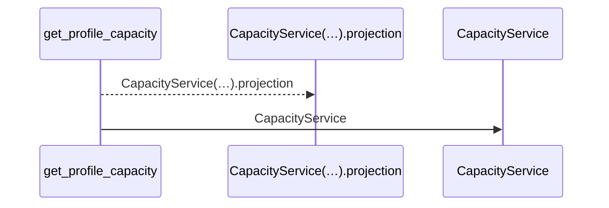
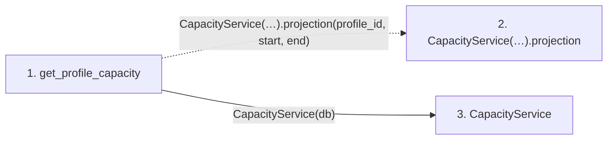

# get_profile_capacity

**Entry point:** `get_profile_capacity` (`http`)
**Source:** [routers_capacity](../modules/routers_capacity.md)
**Modules touched:** [capacity_service](../modules/capacity_service.md), [routers_capacity](../modules/routers_capacity.md)

## Call sequence

<!-- Auto-generated from static call edges. Dashed arrows are external or unresolved calls. Reviewed runtime conditions and side effects belong in Behavior. -->

## Data flow

<!-- Auto-generated static analysis. Treat values and boundaries as best-effort hints, not runtime proof. -->

### Step data

| Step | Inputs | Reads | Writes | Returns |
|---|---|---|---|---|
| `get_profile_capacity` | `profile_id: int`, `start: date`, `end: date`, `db: Database` | - | - | `...` |
| `CapacityService(…).projection` | - | - | - | - |
| `CapacityService` | - | - | - | - |

### Call data

| From | To | Line | Call |
|---|---|---:|---|
| get_profile_capacity | CapacityService(…).projection | 59 | `CapacityService(db).projection(profile_id, start, end)` |
| get_profile_capacity | CapacityService | 59 | `CapacityService(db)` |

### Boundary effects

*No boundary effects detected.*

### Static analysis gaps

| Kind | Step | Target | Line |
|---|---|---|---:|
| unresolved_call | `get_profile_capacity` | `CapacityService(db).projection` | 59 |

## Behavior

Accepts an inclusive range of at most 366 days for a visible person. Authorized allocations expose their factors, private allocations only busy hours. Unknown effort and calendar coverage limitations remain explicit. Saved baseline effort is distributed over working dates for explanation, independently of forecast dates.
