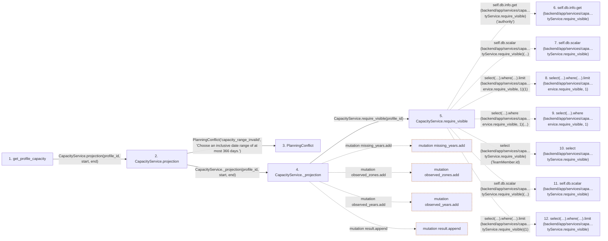

# get_profile_capacity

**Entry point:** `get_profile_capacity` (`http`)
**Source:** [routers_capacity](../modules/routers_capacity.md)
**Modules touched:** [authority](../modules/authority.md), [calendar_rules](../modules/calendar_rules.md), [capacity_adjustments](../modules/capacity_adjustments.md), [capacity_service](../modules/capacity_service.md), and 3 more

**Complete modules touched:**

- [authority](../modules/authority.md)
- [calendar_rules](../modules/calendar_rules.md)
- [capacity_adjustments](../modules/capacity_adjustments.md)
- [capacity_service](../modules/capacity_service.md)
- [commands](../modules/commands.md)
- [routers_capacity](../modules/routers_capacity.md)
- [services_work_metrics](../modules/services_work_metrics.md)

## Call sequence

> Static overview in presentation order, not runtime execution order. Arrows retain captured callers; representative internal continuations and boundary examples precede repeated helper detail.

<!-- Auto-generated from static call edges. Dashed arrows are external or unresolved calls. Reviewed runtime conditions and side effects belong in Behavior. -->

```mermaid
sequenceDiagram
    participant p0 as get_profile_capacity
    participant p1 as CapacityService.projection
    participant p2 as CapacityService
    participant p3 as CapacityService._projection
    participant p4 as CapacityService.require_visible
    participant p5 as AnnualCalendars.for_iteration
    participant p6 as CapacityService.absence_ranges
    participant p7 as included_work_ids
    participant p8 as load_dated_availability
    participant p9 as PeriodCommitments.for_day
    participant p10 as PlanningConflict
    participant p11 as internal_authority
    participant p12 as AnnualCalendars
    participant p13 as PeriodCommitments
    participant p14 as agreed_calendar
    participant p15 as DatedAvailability
    participant p16 as CommitmentRate
    participant p17 as AuthorityError
    participant p18 as select (backend/app/services/capa…pacityService._projection)
    participant p19 as self.db.info.get (backend/app/services/capa…pacityService._projection)
    participant p20 as self.db.scalar (backend/app/services/capa…pacityService._projection)
    participant p21 as select(…).where (backend/app/services/capa…pacityService._projection)
    participant p22 as self.db.get (backend/app/services/capa…pacityService._projection)
    participant p23 as list (backend/app/services/capa…pacityService._projection)
    participant p24 as (…).all (backend/app/services/capa…ityService._projection, 2)
    participant p25 as self.db.scalars
    participant p26 as select(…).join(…).where(…).options
    participant p27 as select(…).join(…).where (backend/app/services/capa…pacityService._projection)
    participant p28 as select(…).join (backend/app/services/capa…pacityService._projection)
    participant p29 as selectinload(…).selectinload
    p0->>p1: CapacityService.projection
    p0->>p2: CapacityService
    p1->>p3: CapacityService._projection
    p3->>p4: CapacityService.require_visible
    p3->>p5: AnnualCalendars.for_iteration
    p3->>p6: CapacityService.absence_ranges
    p3->>p7: included_work_ids
    p3->>p8: load_dated_availability
    p3->>p9: PeriodCommitments.for_day
    p1->>p10: PlanningConflict
    p3->>p11: internal_authority
    p3->>p12: AnnualCalendars
    p3->>p13: PeriodCommitments
    p3->>p14: agreed_calendar
    p8->>p15: DatedAvailability
    p9->>p16: CommitmentRate
    p4->>p17: AuthorityError
    p3-->>p18: select (backend/app/services/capa…pacityService._projection)(PlanningState.revision)
    p3-->>p19: self.db.info.get (backend/app/services/capa…pacityService._projection)('authority')
    p3-->>p20: self.db.scalar (backend/app/services/capa…pacityService._projection)(...)
    p3-->>p21: select(…).where (backend/app/services/capa…pacityService._projection)(...)
    p3-->>p22: self.db.get (backend/app/services/capa…pacityService._projection)(ProfileAvailability, profile_id)
    p3-->>p23: list (backend/app/services/capa…pacityService._projection)(...)
    p3-->>p24: (…).all (backend/app/services/capa…ityService._projection, 2)
    p3-->>p25: self.db.scalars(...)
    p3-->>p26: select(…).join(…).where(…).options(...)
    p3-->>p27: select(…).join(…).where (backend/app/services/capa…pacityService._projection)(..., ..., ...)
    p3-->>p28: select(…).join (backend/app/services/capa…pacityService._projection)(Iteration)
    p3-->>p18: select (backend/app/services/capa…pacityService._projection)(TeamMember)
    p3-->>p29: selectinload(…).selectinload(Iteration.calendar)
```

> Call sequence diagram shows 30 of 177 interactions; 147 omitted to keep the visualization within the 30-interaction and generated-diagram limits, with uncertain identities omitted rather than inferred.

> Captured boundary calls: external 3 of 57 (54 omitted); unresolved 10 of 96 (86 omitted). These counts cover the captured static trace.

Omitted captured detail, grouped by actual caller occurrence and target module:

| Caller | Parent step | Target module | Kind | Omitted interactions |
| --- | --- | --- | --- | --- |
| `backend/app/services/capacity_service.py:CapacityService.require_visible` | 5 | - | unresolved | 8 |
| `backend/app/services/capacity_service.py:CapacityService.require_visible` | 5 | - | external | 2 |
| `backend/app/services/capacity_service.py:CapacityService.require_visible` | 5 | [backend/app/authority.py](../modules/authority.md) | internal | 1 |
| `backend/app/authority.py:internal_authority` | 16 | - | unresolved | 1 |
| `backend/app/services/capacity_service.py:CapacityService.require_visible` | 5 | [backend/app/commands.py](../modules/commands.md) | internal | 1 |
| `backend/app/services/capacity_service.py:CapacityService._projection` | 4 | - | external | 32 |
| `backend/app/services/capacity_service.py:CapacityService._projection` | 4 | - | unresolved | 26 |
| `backend/app/services/calendar_rules.py:AnnualCalendars.for_iteration` | 37 | [backend/app/services/calendar_rules.py](../modules/calendar_rules.md) | internal | 1 |
> Omission summary shows 8 of 21 groups; 13 further groups are not expanded here. Counts above include all omitted interactions.
> Detailed flow queries retain their own coverage and limits; omitted paths may execute at runtime.

## Data flow

<!-- Auto-generated static analysis. Treat values and boundaries as best-effort hints, not runtime proof. -->

### Analysis coverage

**Effect analysis partially available.** Flow assembly and source effect analysis are separate; empty observations do not prove an empty handler body.

Source steps: 25; effect analysis evaluated: 14, partial: 0, unavailable: 11. Counts include steps omitted from the displayed trace.

Collector observations for 14 source steps with known totals: observed: 65, emitted: 65, omitted: 0. Unavailable totals are excluded.

- Callable record unavailable for one or more source steps; those steps have no represented callable body.
- Effect collector totals unavailable; observed counts cover captured records only.

| Step | Callable record | Effect analysis | Collector totals | Observed | Emitted | Omitted |
|---|---|---|---|---:|---:|---:|
| `get_profile_capacity` | `available` | `evaluated` | `available` | `5` | `5` | `0` |
| `CapacityService.projection` | `available` | `evaluated` | `available` | `4` | `4` | `0` |
| `PlanningConflict` | `unavailable` | `unavailable` | `unavailable` | — | — | — |
| `CapacityService._projection` | `available` | `evaluated` | `available` | `15` | `15` | `0` |
| `CapacityService.require_visible` | `available` | `evaluated` | `available` | `3` | `3` | `0` |
| `self.db.info.get (backend/app/services/capa…tyService.require_visible)` | `not_applicable` | `not_applicable` | `not_applicable` | — | — | — |
| `self.db.scalar (backend/app/services/capa…tyService.require_visible)` | `not_applicable` | `not_applicable` | `not_applicable` | — | — | — |
| `select(…).where(…).limit (backend/app/services/capa…ervice.require_visible, 1)` | `not_applicable` | `not_applicable` | `not_applicable` | — | — | — |
| `select(…).where (backend/app/services/capa…ervice.require_visible, 1)` | `not_applicable` | `not_applicable` | `not_applicable` | — | — | — |
| `select (backend/app/services/capa…tyService.require_visible)` | `not_applicable` | `not_applicable` | `not_applicable` | — | — | — |
| `self.db.scalar (backend/app/services/capa…tyService.require_visible)` | `not_applicable` | `not_applicable` | `not_applicable` | — | — | — |
| `select(…).where(…).limit (backend/app/services/capa…tyService.require_visible)` | `not_applicable` | `not_applicable` | `not_applicable` | — | — | — |

```mermaid
flowchart LR
    s1["1. get_profile_capacity"]
    s2["2. CapacityService.projection"]
    s3["3. PlanningConflict"]
    s4["4. CapacityService._projection"]
    s5["5. CapacityService.require_visible"]
    s6["6. self.db.info.get (backend/app/services/capa…tyService.require_visible)"]
    s7["7. self.db.scalar (backend/app/services/capa…tyService.require_visible)"]
    s8["8. select(…).where(…).limit (backend/app/services/capa…ervice.require_visible, 1)"]
    s9["9. select(…).where (backend/app/services/capa…ervice.require_visible, 1)"]
    s10["10. select (backend/app/services/capa…tyService.require_visible)"]
    s11["11. self.db.scalar (backend/app/services/capa…tyService.require_visible)"]
    s12["12. select(…).where(…).limit (backend/app/services/capa…tyService.require_visible)"]
    s1 -->|"CapacityService.projection(profile_id, start, end)"| s2
    s2 -->|"PlanningConflict('capacity_range_invalid', 'Choose an inclusive date range of at most 366 days.')"| s3
    s2 -->|"CapacityService._projection(profile_id, start, end)"| s4
    s4 -->|"CapacityService.require_visible(profile_id)"| s5
    s5 -. "self.db.info.get (backend/app/services/capa…tyService.require_visible)('authority')" .-> s6
    s5 -. "self.db.scalar (backend/app/services/capa…tyService.require_visible)(...)" .-> s7
    s5 -. "select(…).where(…).limit (backend/app/services/capa…ervice.require_visible, 1)(1)" .-> s8
    s5 -. "select(…).where (backend/app/services/capa…ervice.require_visible, 1)(...)" .-> s9
    s5 -. "select (backend/app/services/capa…tyService.require_visible)(TeamMember.id)" .-> s10
    s5 -. "self.db.scalar (backend/app/services/capa…tyService.require_visible)(...)" .-> s11
    s5 -. "select(…).where(…).limit (backend/app/services/capa…tyService.require_visible)(1)" .-> s12
    b0["mutation missing_years.add"]
    s4 -. "mutation missing_years.add" .-> b0
    b1["mutation observed_zones.add"]
    s4 -. "mutation observed_zones.add" .-> b1
    b2["mutation observed_years.add"]
    s4 -. "mutation observed_years.add" .-> b2
    b3["mutation result.append"]
    s4 -. "mutation result.append" .-> b3
    click s1 "../modules/routers_capacity.md"
    click s2 "../modules/capacity_service.md"
    click s3 "../modules/commands.md"
    click s4 "../modules/capacity_service.md"
    click s5 "../modules/capacity_service.md"
    classDef boundary stroke:#b45309,stroke-dasharray: 4 2
    class b0 boundary
    class b1 boundary
    class b2 boundary
    class b3 boundary
```

### Step data

| Step | Inputs | Reads | Writes | Returns |
|---|---|---|---|---|
| `get_profile_capacity` | `profile_id: int`, `start: date`, `end: date`, `db: Database` | - | - | `...` |
| `CapacityService.projection` | `profile_id`, `start`, `end` | - | - | `...` |
| `PlanningConflict` | - | - | - | - |
| `CapacityService._projection` | `profile_id`, `start`, `end` | `self.db`, `PlanningState`, `ProfileAvailability`, `Calendar`, `self.db`, `self.db` | `resolved_calendars[...]` | `{...}` |
| `CapacityService.require_visible` | `profile_id` | `self.db`, `TeamMemberProfile` | - | - |
| `self.db.info.get (backend/app/services/capa…tyService.require_visible)` | - | - | - | - |
| `self.db.scalar (backend/app/services/capa…tyService.require_visible)` | - | - | - | - |
| `select(…).where(…).limit (backend/app/services/capa…ervice.require_visible, 1)` | - | - | - | - |
| `select(…).where (backend/app/services/capa…ervice.require_visible, 1)` | - | - | - | - |
| `select (backend/app/services/capa…tyService.require_visible)` | - | - | - | - |
| `self.db.scalar (backend/app/services/capa…tyService.require_visible)` | - | - | - | - |
| `select(…).where(…).limit (backend/app/services/capa…tyService.require_visible)` | - | - | - | - |

### Call data

| From | To | Line | Call |
|---|---|---:|---|
| get_profile_capacity | CapacityService.projection | 60 | `CapacityService(db).projection(profile_id, start, end)` |
| CapacityService.projection | PlanningConflict | 331 | `PlanningConflict('capacity_range_invalid', 'Choose an inclusive date range of at most 366 days.')` |
| CapacityService.projection | CapacityService._projection | 332 | `self._projection(profile_id, start, end)` |
| CapacityService._projection | CapacityService.require_visible | 335 | `self.require_visible(profile_id)` |
| CapacityService.require_visible | self.db.info.get (backend/app/services/capa…tyService.require_visible) | 140 | `self.db.info.get('authority')` |
| CapacityService.require_visible | self.db.scalar (backend/app/services/capa…tyService.require_visible) | 142 | `self.db.scalar(...)` |
| CapacityService.require_visible | select(…).where(…).limit (backend/app/services/capa…ervice.require_visible, 1) | 142 | `select(TeamMember.id).where(TeamMember.profile_id == profile_id).limit(1)` |
| CapacityService.require_visible | select(…).where (backend/app/services/capa…ervice.require_visible, 1) | 142 | `select(TeamMember.id).where(...)` |
| CapacityService.require_visible | select (backend/app/services/capa…tyService.require_visible) | 142 | `select(TeamMember.id)` |
| CapacityService.require_visible | self.db.scalar (backend/app/services/capa…tyService.require_visible) | 145 | `self.db.scalar(...)` |
| CapacityService.require_visible | select(…).where(…).limit (backend/app/services/capa…tyService.require_visible) | 145 | `select(Task.id).where(Task.owner_profile_id == profile_id).limit(1)` |

### Boundary effects

| Kind | Target | Step | Line |
|---|---|---|---:|
| mutation | `missing_years.add` | `CapacityService._projection` | 383 |
| mutation | `observed_zones.add` | `CapacityService._projection` | 386 |
| mutation | `observed_years.add` | `CapacityService._projection` | 387 |
| mutation | `result.append` | `CapacityService._projection` | 398 |

### Static analysis gaps

| Kind | Step | Target | Line |
|---|---|---|---:|
| unresolved_call | `CapacityService.require_visible` | `self.db.info.get` | 140 |
| unresolved_call | `CapacityService.require_visible` | `self.db.scalar` | 142 |
| unresolved_call | `CapacityService.require_visible` | `select(TeamMember.id).where(TeamMember.profile_id == profile_id).limit` | 142 |
| unresolved_call | `CapacityService.require_visible` | `select(TeamMember.id).where` | 142 |
| external_call | `CapacityService.require_visible` | `select` | 142 |
| unresolved_call | `CapacityService.require_visible` | `self.db.scalar` | 145 |
| unresolved_call | `CapacityService.require_visible` | `select(Task.id).where(Task.owner_profile_id == profile_id).limit` | 145 |
| step_limit | `get_profile_capacity` | `first 12 steps` | 0 |

## Behavior

Accepts an inclusive range of at most 366 days for a visible person. Authorized allocations expose their factors, private allocations only busy hours. Unknown effort and calendar coverage limitations remain explicit. Saved baseline effort is distributed over working dates for explanation, independently of forecast dates.
