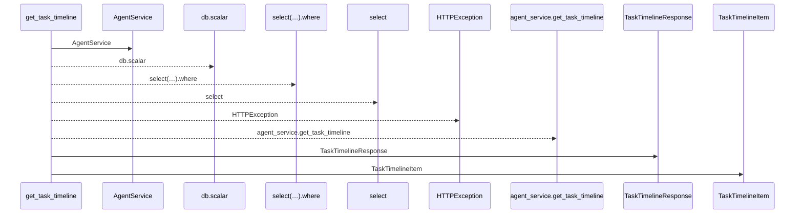
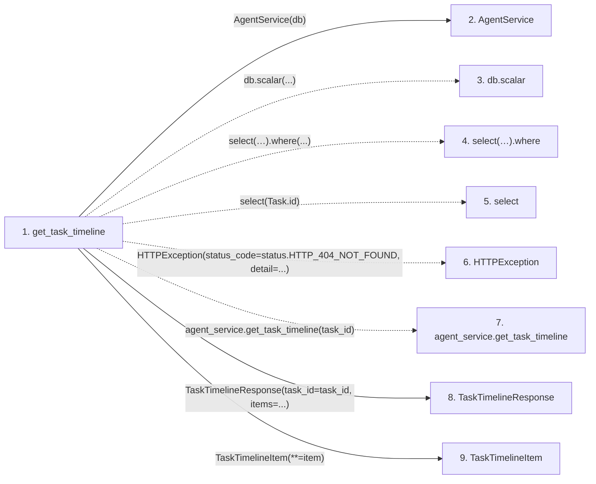

# get_task_timeline

**Entry point:** `get_task_timeline` (`http`)
**Source:** [tasks](../modules/tasks.md)
**Modules touched:** [agent_service](../modules/agent_service.md), [schemas_agent](../modules/schemas_agent.md), [tasks](../modules/tasks.md)

## Call sequence

<!-- Auto-generated from static call edges. Dashed arrows are external or unresolved calls. Reviewed runtime conditions and side effects belong in Behavior. -->

## Data flow

<!-- Auto-generated static analysis. Treat values and boundaries as best-effort hints, not runtime proof. -->

### Step data

| Step | Inputs | Reads | Writes | Returns |
|---|---|---|---|---|
| `get_task_timeline` | `task_id: int`, `db: Annotated[AsyncSession, Depends(get_db, scope='function')]` | `Task`, `status` | - | `TaskTimelineResponse(...)` |
| `AgentService` | - | - | - | - |
| `db.scalar` | - | - | - | - |
| `select(…).where` | - | - | - | - |
| `select` | - | - | - | - |
| `HTTPException` | - | - | - | - |
| `agent_service.get_task_timeline` | - | - | - | - |
| `TaskTimelineResponse` | - | - | - | - |
| `TaskTimelineItem` | - | - | - | - |

### Call data

| From | To | Line | Call |
|---|---|---:|---|
| get_task_timeline | AgentService | 1005 | `AgentService(db)` |
| get_task_timeline | db.scalar | 1006 | `db.scalar(...)` |
| get_task_timeline | select(…).where | 1006 | `select(Task.id).where(...)` |
| get_task_timeline | select | 1006 | `select(Task.id)` |
| get_task_timeline | HTTPException | 1008 | `HTTPException(status_code=status.HTTP_404_NOT_FOUND, detail=...)` |
| get_task_timeline | agent_service.get_task_timeline | 1013 | `agent_service.get_task_timeline(task_id)` |
| get_task_timeline | TaskTimelineResponse | 1014 | `TaskTimelineResponse(task_id=task_id, items=...)` |
| get_task_timeline | TaskTimelineItem | 1016 | `TaskTimelineItem(**=item)` |

### Boundary effects

*No boundary effects detected.*

### Static analysis gaps

| Kind | Step | Target | Line |
|---|---|---|---:|
| unresolved_call | `get_task_timeline` | `db.scalar` | 1006 |
| unresolved_call | `get_task_timeline` | `select(Task.id).where` | 1006 |
| external_call | `get_task_timeline` | `select` | 1006 |
| external_call | `get_task_timeline` | `HTTPException` | 1008 |
| unresolved_call | `get_task_timeline` | `agent_service.get_task_timeline` | 1013 |

## Behavior

This flow starts at `get_task_timeline` and is classified as `http`. The generated call and data-flow sections are bounded static projections; runtime conditions and side effects require source-level confirmation.
