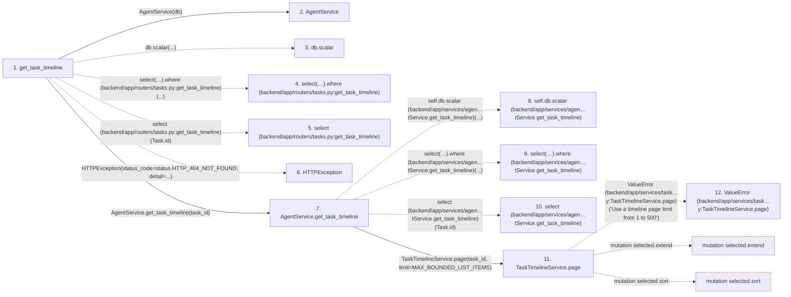

# get_task_timeline

**Entry point:** `get_task_timeline` (`http`)
**Source:** [tasks](../modules/tasks.md)
**Modules touched:** [agent_service](../modules/agent_service.md), [query_limits](../modules/query_limits.md), [schemas_agent](../modules/schemas_agent.md), [task_timeline_service](../modules/task_timeline_service.md), and 2 more

**Complete modules touched:**

- [agent_service](../modules/agent_service.md)
- [query_limits](../modules/query_limits.md)
- [schemas_agent](../modules/schemas_agent.md)
- [task_timeline_service](../modules/task_timeline_service.md)
- [tasks](../modules/tasks.md)
- [time](../modules/time.md)

## Call sequence

> Static overview in presentation order, not runtime execution order. Arrows retain captured callers; representative internal continuations and boundary examples precede repeated helper detail.

<!-- Auto-generated from static call edges. Dashed arrows are external or unresolved calls. Reviewed runtime conditions and side effects belong in Behavior. -->

```mermaid
sequenceDiagram
    participant p0 as get_task_timeline
    participant p1 as AgentService.get_task_timeline
    participant p2 as AgentService
    participant p3 as TaskTimelineResponse
    participant p4 as TaskTimelineItem
    participant p5 as TaskTimelineService.page
    participant p6 as TaskTimelineService.decode
    participant p7 as TaskTimelineService
    participant p8 as CollectionLimitExceededError
    participant p9 as as_utc
    participant p10 as TaskTimelineService.item
    participant p11 as TaskTimelineService._attach_agent_names
    participant p12 as select (backend/app/routers/tasks.py:get_task_timeline)
    participant p13 as db.scalar
    participant p14 as select(…).where (backend/app/routers/tasks.py:get_task_timeline)
    participant p15 as HTTPException
    participant p16 as self.db.scalar (backend/app/services/agen…tService.get_task_timeline)
    participant p17 as select(…).where (backend/app/services/agen…tService.get_task_timeline)
    participant p18 as select (backend/app/services/agen…tService.get_task_timeline)
    participant p19 as item.items
    participant p20 as reversed
    participant p21 as ValueError (backend/app/services/task…y:TaskTimelineService.page)
    participant p22 as self.db.scalar (backend/app/services/task…y:TaskTimelineService.page)
    participant p23 as select(…).where (backend/app/services/task…askTimelineService.page, 1)
    participant p24 as select (backend/app/services/task…y:TaskTimelineService.page)
    participant p25 as LookupError
    participant p26 as select(…).where (backend/app/services/task…askTimelineService.page, 2)
    participant p27 as select(…).where (backend/app/services/task…askTimelineService.page, 3)
    participant p28 as select(…).where (backend/app/services/task…y:TaskTimelineService.page)
    p0->>p1: AgentService.get_task_timeline
    p0->>p2: AgentService
    p0->>p3: TaskTimelineResponse
    p0->>p4: TaskTimelineItem
    p1->>p5: TaskTimelineService.page
    p5->>p6: TaskTimelineService.decode
    p1->>p7: TaskTimelineService
    p1->>p8: CollectionLimitExceededError
    p5->>p9: as_utc
    p5->>p10: TaskTimelineService.item
    p5->>p11: TaskTimelineService._attach_agent_names
    p0-->>p12: select (backend/app/routers/tasks.py:get_task_timeline)(Task.id)
    p0-->>p13: db.scalar(...)
    p0-->>p14: select(…).where (backend/app/routers/tasks.py:get_task_timeline)(...)
    p0-->>p15: HTTPException(status_code=status.HTTP_404_NOT_FOUND, detail=...)
    p1-->>p16: self.db.scalar (backend/app/services/agen…tService.get_task_timeline)(...)
    p1-->>p17: select(…).where (backend/app/services/agen…tService.get_task_timeline)(...)
    p1-->>p18: select (backend/app/services/agen…tService.get_task_timeline)(Task.id)
    p1-->>p19: item.items
    p1-->>p20: reversed(page[...])
    p5-->>p21: ValueError (backend/app/services/task…y:TaskTimelineService.page)('Use a timeline page limit from 1 to 500')
    p5-->>p22: self.db.scalar (backend/app/services/task…y:TaskTimelineService.page)(...)
    p5-->>p23: select(…).where (backend/app/services/task…askTimelineService.page, 1)(...)
    p5-->>p24: select (backend/app/services/task…y:TaskTimelineService.page)(Task.id)
    p5-->>p25: LookupError('Task not found or inaccessible')
    p5-->>p26: select(…).where (backend/app/services/task…askTimelineService.page, 2)(...)
    p5-->>p24: select (backend/app/services/task…y:TaskTimelineService.page)(TaskEvent)
    p5-->>p27: select(…).where (backend/app/services/task…askTimelineService.page, 3)(...)
    p5-->>p24: select (backend/app/services/task…y:TaskTimelineService.page)(TaskStatusLog)
    p5-->>p28: select(…).where (backend/app/services/task…y:TaskTimelineService.page)(...)
```

> Call sequence diagram shows 30 of 96 interactions; 66 omitted to keep the visualization within the 30-interaction and generated-diagram limits, with uncertain identities omitted rather than inferred.

> Captured boundary calls: external 9 of 43 (34 omitted); unresolved 10 of 41 (31 omitted). These counts cover the captured static trace.

Omitted captured detail, grouped by actual caller occurrence and target module:

| Caller | Parent step | Target module | Kind | Omitted interactions |
| --- | --- | --- | --- | --- |
| `backend/app/services/task_timeline_service.py:TaskTimelineService.decode` | 17 | - | external | 14 |
| `backend/app/services/task_timeline_service.py:TaskTimelineService.decode` | 17 | [backend/app/utils/time.py](../modules/time.md) | internal | 1 |
| `backend/app/utils/time.py:as_utc` | 31 | - | unresolved | 2 |
| `backend/app/services/task_timeline_service.py:TaskTimelineService.page` | 11 | - | external | 11 |
| `backend/app/services/task_timeline_service.py:TaskTimelineService.page` | 11 | - | unresolved | 16 |
| `backend/app/services/task_timeline_service.py:TaskTimelineService.item` | 62 | - | external | 7 |
| `backend/app/services/task_timeline_service.py:TaskTimelineService.item` | 62 | - | unresolved | 4 |
| `backend/app/services/task_timeline_service.py:TaskTimelineService._attach_agent_names` | 74 | - | unresolved | 9 |
> Omission summary shows 8 of 9 groups; 1 further groups are not expanded here. Counts above include all omitted interactions.
> Detailed flow queries retain their own coverage and limits; omitted paths may execute at runtime.

## Data flow

<!-- Auto-generated static analysis. Treat values and boundaries as best-effort hints, not runtime proof. -->

### Analysis coverage

**Effect analysis partially available.** Flow assembly and source effect analysis are separate; empty observations do not prove an empty handler body.

Source steps: 13; effect analysis evaluated: 8, partial: 0, unavailable: 5. Counts include steps omitted from the displayed trace.

Collector observations for 8 source steps with known totals: observed: 48, emitted: 48, omitted: 0. Unavailable totals are excluded.

- Callable record unavailable for one or more source steps; those steps have no represented callable body.
- Effect collector totals unavailable; observed counts cover captured records only.

| Step | Callable record | Effect analysis | Collector totals | Observed | Emitted | Omitted |
|---|---|---|---|---:|---:|---:|
| `get_task_timeline` | `available` | `evaluated` | `available` | `5` | `5` | `0` |
| `AgentService` | `unavailable` | `unavailable` | `unavailable` | — | — | — |
| `db.scalar` | `not_applicable` | `not_applicable` | `not_applicable` | — | — | — |
| `select(…).where (backend/app/routers/tasks.py:get_task_timeline)` | `not_applicable` | `not_applicable` | `not_applicable` | — | — | — |
| `select (backend/app/routers/tasks.py:get_task_timeline)` | `not_applicable` | `not_applicable` | `not_applicable` | — | — | — |
| `HTTPException` | `not_applicable` | `not_applicable` | `not_applicable` | — | — | — |
| `AgentService.get_task_timeline` | `available` | `evaluated` | `available` | `6` | `6` | `0` |
| `self.db.scalar (backend/app/services/agen…tService.get_task_timeline)` | `not_applicable` | `not_applicable` | `not_applicable` | — | — | — |
| `select(…).where (backend/app/services/agen…tService.get_task_timeline)` | `not_applicable` | `not_applicable` | `not_applicable` | — | — | — |
| `select (backend/app/services/agen…tService.get_task_timeline)` | `not_applicable` | `not_applicable` | `not_applicable` | — | — | — |
| `TaskTimelineService.page` | `available` | `evaluated` | `available` | `12` | `12` | `0` |
| `ValueError (backend/app/services/task…y:TaskTimelineService.page)` | `not_applicable` | `not_applicable` | `not_applicable` | — | — | — |

```mermaid
flowchart LR
    s1["1. get_task_timeline"]
    s2["2. AgentService"]
    s3["3. db.scalar"]
    s4["4. select(…).where (backend/app/routers/tasks.py:get_task_timeline)"]
    s5["5. select (backend/app/routers/tasks.py:get_task_timeline)"]
    s6["6. HTTPException"]
    s7["7. AgentService.get_task_timeline"]
    s8["8. self.db.scalar (backend/app/services/agen…tService.get_task_timeline)"]
    s9["9. select(…).where (backend/app/services/agen…tService.get_task_timeline)"]
    s10["10. select (backend/app/services/agen…tService.get_task_timeline)"]
    s11["11. TaskTimelineService.page"]
    s12["12. ValueError (backend/app/services/task…y:TaskTimelineService.page)"]
    s1 -->|"AgentService(db)"| s2
    s1 -. "db.scalar(...)" .-> s3
    s1 -. "select(…).where (backend/app/routers/tasks.py:get_task_timeline)(...)" .-> s4
    s1 -. "select (backend/app/routers/tasks.py:get_task_timeline)(Task.id)" .-> s5
    s1 -. "HTTPException(status_code=status.HTTP_404_NOT_FOUND, detail=...)" .-> s6
    s1 -->|"AgentService.get_task_timeline(task_id)"| s7
    s7 -. "self.db.scalar (backend/app/services/agen…tService.get_task_timeline)(...)" .-> s8
    s7 -. "select(…).where (backend/app/services/agen…tService.get_task_timeline)(...)" .-> s9
    s7 -. "select (backend/app/services/agen…tService.get_task_timeline)(Task.id)" .-> s10
    s7 -->|"TaskTimelineService.page(task_id, limit=MAX_BOUNDED_LIST_ITEMS)"| s11
    s11 -. "ValueError (backend/app/services/task…y:TaskTimelineService.page)('Use a timeline page limit from 1 to 500')" .-> s12
    b0["mutation selected.extend"]
    s11 -. "mutation selected.extend" .-> b0
    b1["mutation selected.sort"]
    s11 -. "mutation selected.sort" .-> b1
    click s1 "../modules/tasks.md"
    click s2 "../modules/agent_service.md"
    click s7 "../modules/agent_service.md"
    click s11 "../modules/task_timeline_service.md"
    classDef boundary stroke:#b45309,stroke-dasharray: 4 2
    class b0 boundary
    class b1 boundary
```

### Step data

| Step | Inputs | Reads | Writes | Returns |
|---|---|---|---|---|
| `get_task_timeline` | `task_id: int`, `db: Annotated[AsyncSession, Depends(get_db, scope='function')]` | `Task`, `status` | - | `TaskTimelineResponse(...)` |
| `AgentService` | - | - | - | - |
| `db.scalar` | - | - | - | - |
| `select(…).where (backend/app/routers/tasks.py:get_task_timeline)` | - | - | - | - |
| `select (backend/app/routers/tasks.py:get_task_timeline)` | - | - | - | - |
| `HTTPException` | - | - | - | - |
| `AgentService.get_task_timeline` | `task_id: int` | `Task`, `MAX_BOUNDED_LIST_ITEMS`, `MAX_BOUNDED_LIST_ITEMS` | - | `[...]`, `...` |
| `self.db.scalar (backend/app/services/agen…tService.get_task_timeline)` | - | - | - | - |
| `select(…).where (backend/app/services/agen…tService.get_task_timeline)` | - | - | - | - |
| `select (backend/app/services/agen…tService.get_task_timeline)` | - | - | - | - |
| `TaskTimelineService.page` | `task_id`, `limit`, `cursor` | `Task`, `TaskEvent`, `TaskStatusLog`, `AgentRun`, `AgentRunEvent`, `AgentRun` | - | `dict(...)` |
| `ValueError (backend/app/services/task…y:TaskTimelineService.page)` | - | - | - | - |

### Call data

| From | To | Line | Call |
|---|---|---:|---|
| get_task_timeline | AgentService | 1005 | `AgentService(db)` |
| get_task_timeline | db.scalar | 1006 | `db.scalar(...)` |
| get_task_timeline | select(…).where (backend/app/routers/tasks.py:get_task_timeline) | 1006 | `select(Task.id).where(...)` |
| get_task_timeline | select (backend/app/routers/tasks.py:get_task_timeline) | 1006 | `select(Task.id)` |
| get_task_timeline | HTTPException | 1008 | `HTTPException(status_code=status.HTTP_404_NOT_FOUND, detail=...)` |
| get_task_timeline | AgentService.get_task_timeline | 1013 | `agent_service.get_task_timeline(task_id)` |
| AgentService.get_task_timeline | self.db.scalar (backend/app/services/agen…tService.get_task_timeline) | 1450 | `self.db.scalar(...)` |
| AgentService.get_task_timeline | select(…).where (backend/app/services/agen…tService.get_task_timeline) | 1450 | `select(Task.id).where(...)` |
| AgentService.get_task_timeline | select (backend/app/services/agen…tService.get_task_timeline) | 1450 | `select(Task.id)` |
| AgentService.get_task_timeline | TaskTimelineService.page | 1452 | `TaskTimelineService(self.db, self).page(task_id, limit=MAX_BOUNDED_LIST_ITEMS)` |
| TaskTimelineService.page | ValueError (backend/app/services/task…y:TaskTimelineService.page) | 45 | `ValueError('Use a timeline page limit from 1 to 500')` |

### Boundary effects

| Kind | Target | Step | Line |
|---|---|---|---:|
| mutation | `selected.extend` | `TaskTimelineService.page` | 61 |
| mutation | `selected.sort` | `TaskTimelineService.page` | 62 |

### Static analysis gaps

| Kind | Step | Target | Line |
|---|---|---|---:|
| unresolved_call | `get_task_timeline` | `db.scalar` | 1006 |
| unresolved_call | `get_task_timeline` | `select(Task.id).where` | 1006 |
| external_call | `get_task_timeline` | `select` | 1006 |
| external_call | `get_task_timeline` | `HTTPException` | 1008 |
| unresolved_call | `AgentService.get_task_timeline` | `self.db.scalar` | 1450 |
| unresolved_call | `AgentService.get_task_timeline` | `select(Task.id).where` | 1450 |
| external_call | `AgentService.get_task_timeline` | `select` | 1450 |
| external_call | `TaskTimelineService.page` | `ValueError` | 45 |
| step_limit | `get_task_timeline` | `first 12 steps` | 0 |

## Behavior

This flow starts at `get_task_timeline` and is classified as `http`. The generated call and data-flow sections are bounded static projections; runtime conditions and side effects require source-level confirmation.
