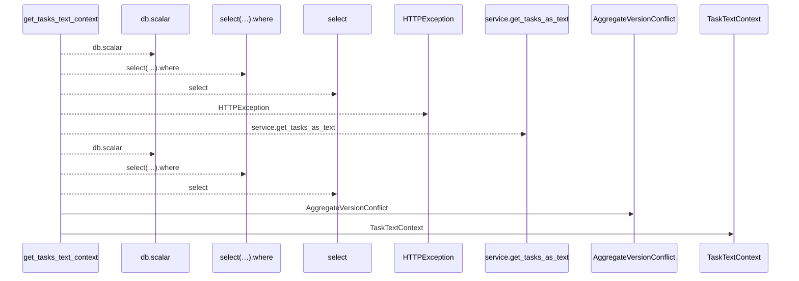
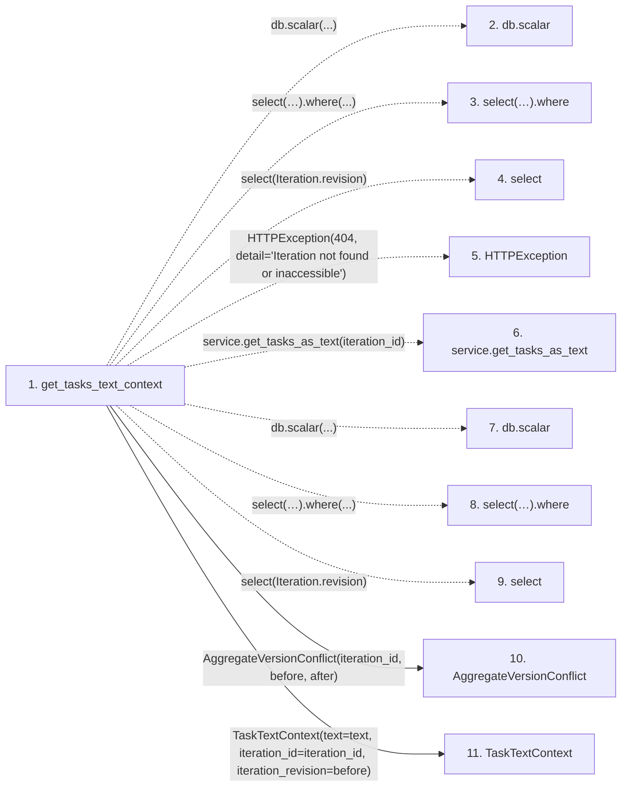

# get_tasks_text_context

**Entry point:** `get_tasks_text_context` (`http`)
**Source:** [tasks](../modules/tasks.md)
**Modules touched:** [commands](../modules/commands.md), [schemas_task](../modules/schemas_task.md), [tasks](../modules/tasks.md)

## Call sequence

<!-- Auto-generated from static call edges. Dashed arrows are external or unresolved calls. Reviewed runtime conditions and side effects belong in Behavior. -->

## Data flow

<!-- Auto-generated static analysis. Treat values and boundaries as best-effort hints, not runtime proof. -->

### Step data

| Step | Inputs | Reads | Writes | Returns |
|---|---|---|---|---|
| `get_tasks_text_context` | `iteration_id: int`, `service: Annotated[TaskService, Depends(get_task_service)]`, `db: Annotated[AsyncSession, Depends(get_db, scope='function')]` | `Iteration`, `Iteration` | - | `TaskTextContext(...)` |
| `db.scalar` | - | - | - | - |
| `select(…).where` | - | - | - | - |
| `select` | - | - | - | - |
| `HTTPException` | - | - | - | - |
| `service.get_tasks_as_text` | - | - | - | - |
| `db.scalar` | - | - | - | - |
| `select(…).where` | - | - | - | - |
| `select` | - | - | - | - |
| `AggregateVersionConflict` | - | - | - | - |
| `TaskTextContext` | - | - | - | - |

### Call data

| From | To | Line | Call |
|---|---|---:|---|
| get_tasks_text_context | db.scalar | 842 | `db.scalar(...)` |
| get_tasks_text_context | select(…).where | 842 | `select(Iteration.revision).where(...)` |
| get_tasks_text_context | select | 842 | `select(Iteration.revision)` |
| get_tasks_text_context | HTTPException | 844 | `HTTPException(404, detail='Iteration not found or inaccessible')` |
| get_tasks_text_context | service.get_tasks_as_text | 845 | `service.get_tasks_as_text(iteration_id)` |
| get_tasks_text_context | db.scalar | 846 | `db.scalar(...)` |
| get_tasks_text_context | select(…).where | 846 | `select(Iteration.revision).where(...)` |
| get_tasks_text_context | select | 846 | `select(Iteration.revision)` |
| get_tasks_text_context | AggregateVersionConflict | 848 | `AggregateVersionConflict(iteration_id, before, after)` |
| get_tasks_text_context | TaskTextContext | 849 | `TaskTextContext(text=text, iteration_id=iteration_id, iteration_revision=before)` |

### Boundary effects

*No boundary effects detected.*

### Static analysis gaps

| Kind | Step | Target | Line |
|---|---|---|---:|
| unresolved_call | `get_tasks_text_context` | `db.scalar` | 842 |
| unresolved_call | `get_tasks_text_context` | `select(Iteration.revision).where` | 842 |
| external_call | `get_tasks_text_context` | `select` | 842 |
| external_call | `get_tasks_text_context` | `HTTPException` | 844 |
| unresolved_call | `get_tasks_text_context` | `service.get_tasks_as_text` | 845 |
| unresolved_call | `get_tasks_text_context` | `db.scalar` | 846 |
| unresolved_call | `get_tasks_text_context` | `select(Iteration.revision).where` | 846 |
| external_call | `get_tasks_text_context` | `select` | 846 |

## Behavior

This flow starts at `get_tasks_text_context` and is classified as `http`. The generated call and data-flow sections are bounded static projections; runtime conditions and side effects require source-level confirmation.
