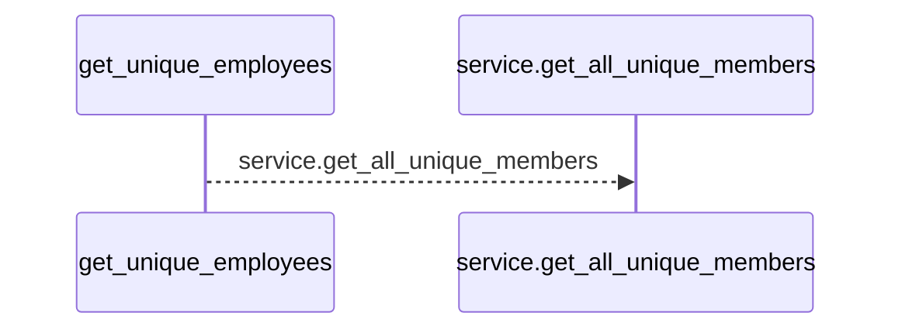
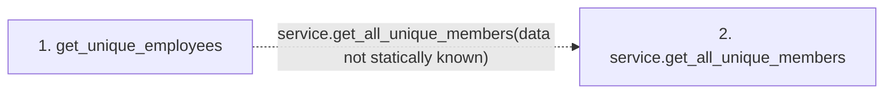

# get_unique_employees

**Entry point:** `get_unique_employees` (`http`)
**Source:** [routers_team](../modules/routers_team.md)
**Modules touched:** [routers_team](../modules/routers_team.md)

## Call sequence

<!-- Auto-generated from static call edges. Dashed arrows are external or unresolved calls. Reviewed runtime conditions and side effects belong in Behavior. -->

## Data flow

<!-- Auto-generated static analysis. Treat values and boundaries as best-effort hints, not runtime proof. -->

### Step data

| Step | Inputs | Reads | Writes | Returns |
|---|---|---|---|---|
| `get_unique_employees` | `service: Annotated[TeamService, Depends(get_team_service)]` | - | - | `...` |
| `service.get_all_unique_members` | - | - | - | - |

### Call data

| From | To | Line | Call |
|---|---|---:|---|
| get_unique_employees | service.get_all_unique_members | 46 | `service.get_all_unique_members(data not statically known)` |

### Boundary effects

*No boundary effects detected.*

### Static analysis gaps

| Kind | Step | Target | Line |
|---|---|---|---:|
| unresolved_call | `get_unique_employees` | `service.get_all_unique_members` | 46 |

## Behavior

This flow starts at `get_unique_employees` and is classified as `http`. The generated call and data-flow sections are bounded static projections; runtime conditions and side effects require source-level confirmation.
