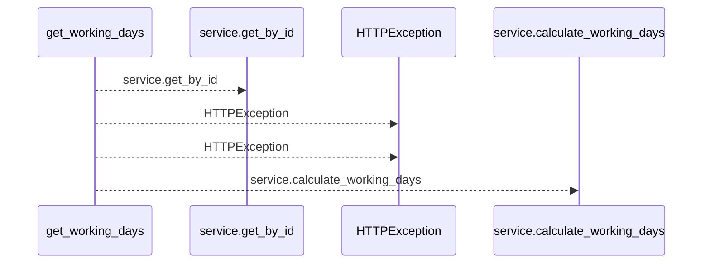
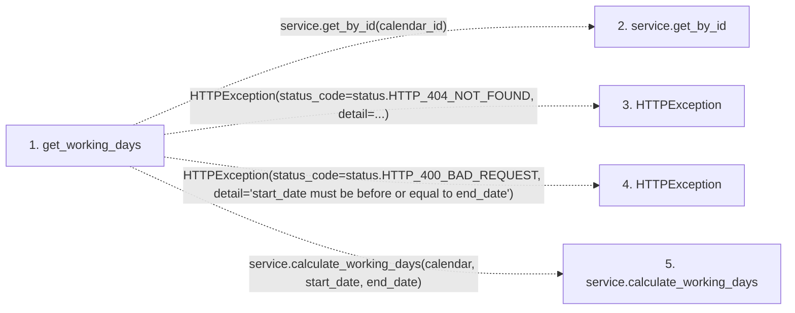

# get_working_days

**Entry point:** `get_working_days` (`http`)
**Source:** [calendars](../modules/calendars.md)
**Modules touched:** [calendars](../modules/calendars.md)

## Call sequence

<!-- Auto-generated from static call edges. Dashed arrows are external or unresolved calls. Reviewed runtime conditions and side effects belong in Behavior. -->

## Data flow

<!-- Auto-generated static analysis. Treat values and boundaries as best-effort hints, not runtime proof. -->

### Step data

| Step | Inputs | Reads | Writes | Returns |
|---|---|---|---|---|
| `get_working_days` | `calendar_id: int`, `start_date: Annotated[date, Query(description='Start date (ISO format)')]`, `end_date: Annotated[date, Query(description='End date (ISO format)')]`, `service: Annotated[CalendarService, Depends(get_calendar_service)]` | `status`, `status` | - | `service.calculate_working_days(...)` |
| `service.get_by_id` | - | - | - | - |
| `HTTPException` | - | - | - | - |
| `HTTPException` | - | - | - | - |
| `service.calculate_working_days` | - | - | - | - |

### Call data

| From | To | Line | Call |
|---|---|---:|---|
| get_working_days | service.get_by_id | 128 | `service.get_by_id(calendar_id)` |
| get_working_days | HTTPException | 130 | `HTTPException(status_code=status.HTTP_404_NOT_FOUND, detail=...)` |
| get_working_days | HTTPException | 136 | `HTTPException(status_code=status.HTTP_400_BAD_REQUEST, detail='start_date must be before or equal to end_date')` |
| get_working_days | service.calculate_working_days | 141 | `service.calculate_working_days(calendar, start_date, end_date)` |

### Boundary effects

*No boundary effects detected.*

### Static analysis gaps

| Kind | Step | Target | Line |
|---|---|---|---:|
| unresolved_call | `get_working_days` | `service.get_by_id` | 128 |
| external_call | `get_working_days` | `HTTPException` | 130 |
| external_call | `get_working_days` | `HTTPException` | 136 |
| unresolved_call | `get_working_days` | `service.calculate_working_days` | 141 |

## Behavior

This flow starts at `get_working_days` and is classified as `http`. The generated call and data-flow sections are bounded static projections; runtime conditions and side effects require source-level confirmation.
