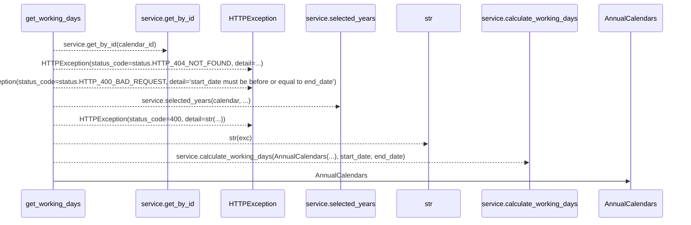
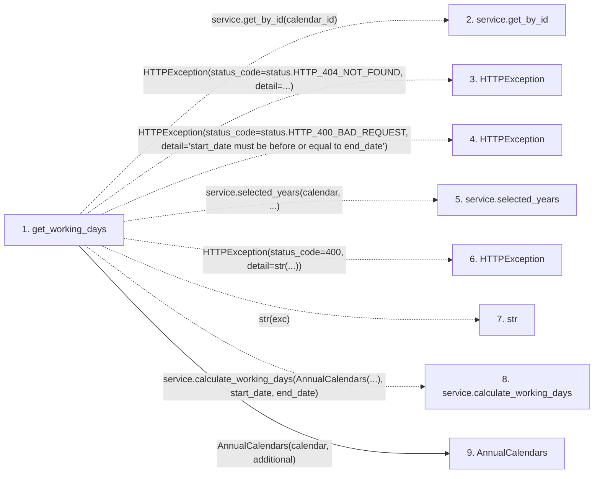

# get_working_days

**Entry point:** `get_working_days` (`http`)
**Source:** [calendars](../modules/calendars.md)
**Modules touched:** [calendar_rules](../modules/calendar_rules.md), [calendars](../modules/calendars.md)

## Call sequence

> Static overview in presentation order, not runtime execution order. Arrows retain captured callers; representative internal continuations and boundary examples precede repeated helper detail.

<!-- Auto-generated from static call edges. Dashed arrows are external or unresolved calls. Reviewed runtime conditions and side effects belong in Behavior. -->

```mermaid
sequenceDiagram
    participant p0 as get_working_days
    participant p1 as service.get_by_id
    participant p2 as HTTPException
    participant p3 as service.selected_years
    participant p4 as str
    participant p5 as service.calculate_working_days
    participant p6 as AnnualCalendars
    p0-->>p1: service.get_by_id(calendar_id)
    p0-->>p2: HTTPException(status_code=status.HTTP_404_NOT_FOUND, detail=...)
    p0-->>p2: HTTPException(status_code=status.HTTP_400_BAD_REQUEST, detail='start_date must be before or equal to end_date')
    p0-->>p3: service.selected_years(calendar, ...)
    p0-->>p2: HTTPException(status_code=400, detail=str(...))
    p0-->>p4: str(exc)
    p0-->>p5: service.calculate_working_days(AnnualCalendars(...), start_date, end_date)
    p0->>p6: AnnualCalendars
```

> Call sequence diagram shows 8 of 8 interactions; 0 omitted to keep the visualization within the 30-interaction and generated-diagram limits, with uncertain identities omitted rather than inferred.

> Captured boundary calls: external 4 of 4 (0 omitted); unresolved 3 of 3 (0 omitted). These counts cover the captured static trace.
> Detailed flow queries retain their own coverage and limits; omitted paths may execute at runtime.

## Data flow

<!-- Auto-generated static analysis. Treat values and boundaries as best-effort hints, not runtime proof. -->

### Analysis coverage

**Effect analysis partially available.** Flow assembly and source effect analysis are separate; empty observations do not prove an empty handler body.

Source steps: 2; effect analysis evaluated: 1, partial: 0, unavailable: 1. Counts include steps omitted from the displayed trace.

Collector observations for 1 source steps with known totals: observed: 8, emitted: 8, omitted: 0. Unavailable totals are excluded.

- Callable record unavailable for one or more source steps; those steps have no represented callable body.
- Effect collector totals unavailable; observed counts cover captured records only.

| Step | Callable record | Effect analysis | Collector totals | Observed | Emitted | Omitted |
|---|---|---|---|---:|---:|---:|
| `get_working_days` | `available` | `evaluated` | `available` | `8` | `8` | `0` |
| `service.get_by_id` | `not_applicable` | `not_applicable` | `not_applicable` | — | — | — |
| `HTTPException` | `not_applicable` | `not_applicable` | `not_applicable` | — | — | — |
| `HTTPException` | `not_applicable` | `not_applicable` | `not_applicable` | — | — | — |
| `service.selected_years` | `not_applicable` | `not_applicable` | `not_applicable` | — | — | — |
| `HTTPException` | `not_applicable` | `not_applicable` | `not_applicable` | — | — | — |
| `str` | `not_applicable` | `not_applicable` | `not_applicable` | — | — | — |
| `service.calculate_working_days` | `not_applicable` | `not_applicable` | `not_applicable` | — | — | — |
| `AnnualCalendars` | `unavailable` | `unavailable` | `unavailable` | — | — | — |

```mermaid
flowchart LR
    s1["1. get_working_days"]
    s2["2. service.get_by_id"]
    s3["3. HTTPException"]
    s4["4. HTTPException"]
    s5["5. service.selected_years"]
    s6["6. HTTPException"]
    s7["7. str"]
    s8["8. service.calculate_working_days"]
    s9["9. AnnualCalendars"]
    s1 -. "service.get_by_id(calendar_id)" .-> s2
    s1 -. "HTTPException(status_code=status.HTTP_404_NOT_FOUND, detail=...)" .-> s3
    s1 -. "HTTPException(status_code=status.HTTP_400_BAD_REQUEST, detail='start_date must be before or equal to end_date')" .-> s4
    s1 -. "service.selected_years(calendar, ...)" .-> s5
    s1 -. "HTTPException(status_code=400, detail=str(...))" .-> s6
    s1 -. "str(exc)" .-> s7
    s1 -. "service.calculate_working_days(AnnualCalendars(...), start_date, end_date)" .-> s8
    s1 -->|"AnnualCalendars(calendar, additional)"| s9
    click s1 "../modules/calendars.md"
    click s9 "../modules/calendar_rules.md"
```

### Step data

| Step | Inputs | Reads | Writes | Returns |
|---|---|---|---|---|
| `get_working_days` | `calendar_id: int`, `start_date: Annotated[date, Query(description='Start date (ISO format)')]`, `end_date: Annotated[date, Query(description='End date (ISO format)')]`, `service: Annotated[CalendarService, Depends(get_calendar_service)]`, `additional_calendar_ids: Annotated[list[int] \| None, Query(max_length=100)]` | `status`, `status` | - | `service.calculate_working_days(...)` |
| `service.get_by_id` | - | - | - | - |
| `HTTPException` | - | - | - | - |
| `HTTPException` | - | - | - | - |
| `service.selected_years` | - | - | - | - |
| `HTTPException` | - | - | - | - |
| `str` | - | - | - | - |
| `service.calculate_working_days` | - | - | - | - |
| `AnnualCalendars` | - | - | - | - |

### Call data

| From | To | Line | Call |
|---|---|---:|---|
| get_working_days | service.get_by_id | 130 | `service.get_by_id(calendar_id)` |
| get_working_days | HTTPException | 132 | `HTTPException(status_code=status.HTTP_404_NOT_FOUND, detail=...)` |
| get_working_days | HTTPException | 138 | `HTTPException(status_code=status.HTTP_400_BAD_REQUEST, detail='start_date must be before or equal to end_date')` |
| get_working_days | service.selected_years | 144 | `service.selected_years(calendar, ...)` |
| get_working_days | HTTPException | 146 | `HTTPException(status_code=400, detail=str(...))` |
| get_working_days | str | 146 | `str(exc)` |
| get_working_days | service.calculate_working_days | 147 | `service.calculate_working_days(AnnualCalendars(...), start_date, end_date)` |
| get_working_days | AnnualCalendars | 147 | `AnnualCalendars(calendar, additional)` |

### Boundary effects

*No boundary-effect observations were captured in this static trace.*

### Static analysis gaps

| Kind | Step | Target | Line |
|---|---|---|---:|
| unresolved_call | `get_working_days` | `service.get_by_id` | 130 |
| external_call | `get_working_days` | `HTTPException` | 132 |
| external_call | `get_working_days` | `HTTPException` | 138 |
| unresolved_call | `get_working_days` | `service.selected_years` | 144 |
| external_call | `get_working_days` | `HTTPException` | 146 |
| unresolved_call | `get_working_days` | `service.calculate_working_days` | 147 |

## Behavior

This flow starts at `get_working_days` and is classified as `http`. The generated call and data-flow sections are bounded static projections; runtime conditions and side effects require source-level confirmation.
