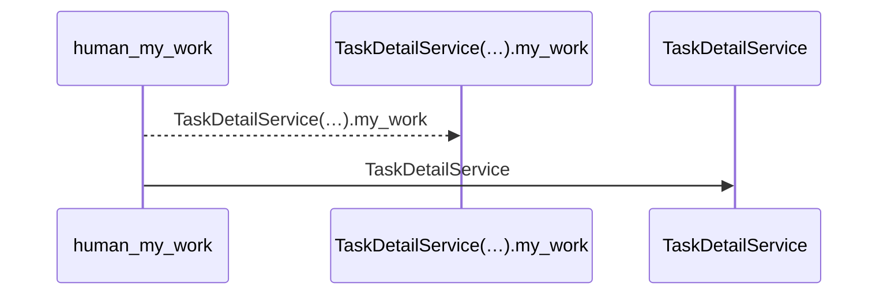
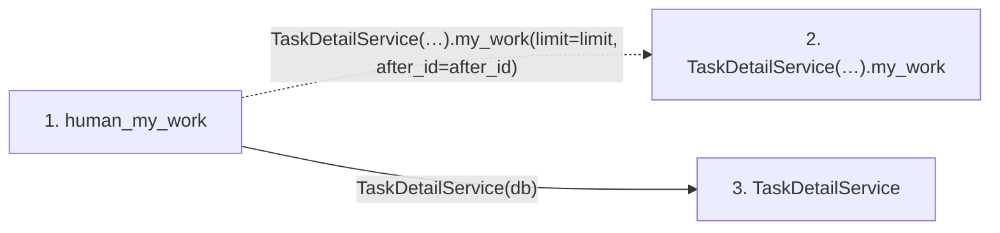

# human_my_work

**Entry point:** `human_my_work` (`http`)
**Source:** [routers_task_domain](../modules/routers_task_domain.md)
**Modules touched:** [routers_task_domain](../modules/routers_task_domain.md), [task_detail_service](../modules/task_detail_service.md)

## Call sequence

<!-- Auto-generated from static call edges. Dashed arrows are external or unresolved calls. Reviewed runtime conditions and side effects belong in Behavior. -->

## Data flow

<!-- Auto-generated static analysis. Treat values and boundaries as best-effort hints, not runtime proof. -->

### Step data

| Step | Inputs | Reads | Writes | Returns |
|---|---|---|---|---|
| `human_my_work` | `db: DB`, `limit: int`, `after_id: int` | - | - | `...` |
| `TaskDetailService(…).my_work` | - | - | - | - |
| `TaskDetailService` | - | - | - | - |

### Call data

| From | To | Line | Call |
|---|---|---:|---|
| human_my_work | TaskDetailService(…).my_work | 51 | `TaskDetailService(db).my_work(limit=limit, after_id=after_id)` |
| human_my_work | TaskDetailService | 51 | `TaskDetailService(db)` |

### Boundary effects

*No boundary effects detected.*

### Static analysis gaps

| Kind | Step | Target | Line |
|---|---|---|---:|
| unresolved_call | `human_my_work` | `TaskDetailService(db).my_work` | 51 |

## Behavior

Returns bounded, authenticated human ownership queues across visible projects, including nested and backlog work. Missing profile or membership is explicit. Closed work without current attributed acceptance remains in reconciliation; exact-agent work selection is a separate protocol.
