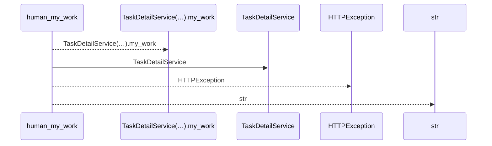
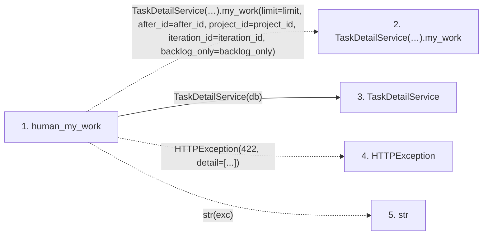

# human_my_work

**Entry point:** `human_my_work` (`http`)
**Source:** [routers_task_domain](../modules/routers_task_domain.md)
**Modules touched:** [routers_task_domain](../modules/routers_task_domain.md), [task_detail_service](../modules/task_detail_service.md)

## Call sequence

<!-- Auto-generated from static call edges. Dashed arrows are external or unresolved calls. Reviewed runtime conditions and side effects belong in Behavior. -->

## Data flow

<!-- Auto-generated static analysis. Treat values and boundaries as best-effort hints, not runtime proof. -->

### Step data

| Step | Inputs | Reads | Writes | Returns |
|---|---|---|---|---|
| `human_my_work` | `db: DB`, `limit: int`, `after_id: int`, `project_id: int \| None`, `iteration_id: int \| None`, `backlog_only: bool` | - | - | `...` |
| `TaskDetailService(…).my_work` | - | - | - | - |
| `TaskDetailService` | - | - | - | - |
| `HTTPException` | - | - | - | - |
| `str` | - | - | - | - |

### Call data

| From | To | Line | Call |
|---|---|---:|---|
| human_my_work | TaskDetailService(…).my_work | 77 | `TaskDetailService(db).my_work(limit=limit, after_id=after_id, project_id=project_id, iteration_id=iteration_id, backlog_only=backlog_only)` |
| human_my_work | TaskDetailService | 77 | `TaskDetailService(db)` |
| human_my_work | HTTPException | 80 | `HTTPException(422, detail=[...])` |
| human_my_work | str | 80 | `str(exc)` |

### Boundary effects

*No boundary effects detected.*

### Static analysis gaps

| Kind | Step | Target | Line |
|---|---|---|---:|
| unresolved_call | `human_my_work` | `TaskDetailService(db).my_work` | 77 |
| external_call | `human_my_work` | `HTTPException` | 80 |

## Behavior

Returns authenticated ownership queues across visible projects, including nested/backlog work. Optional project, iteration and backlog filters apply before cursor pagination; incompatible iteration/backlog selection fails explicitly. Missing profile or membership is explicit. Page cursors are live observations rather than a frozen complete inventory.
