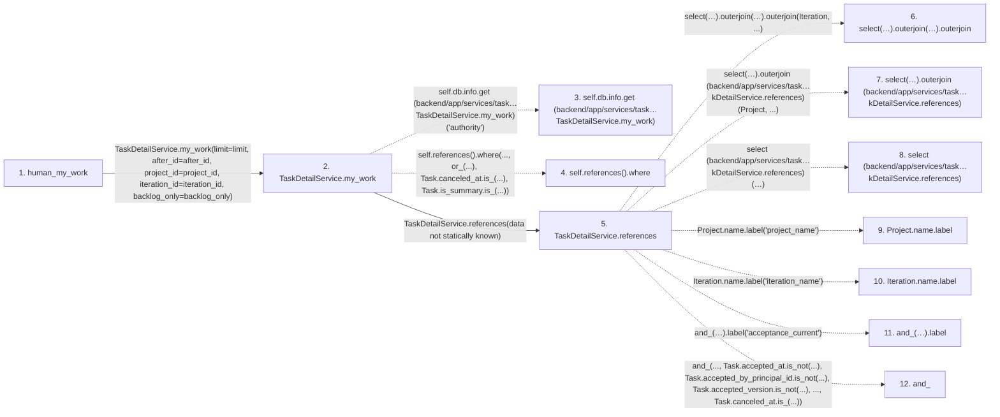

# human_my_work

**Entry point:** `human_my_work` (`http`)
**Source:** [routers_task_domain](../modules/routers_task_domain.md)
**Modules touched:** [agent_routing_policy](../modules/agent_routing_policy.md), [agent_routing_rollout](../modules/agent_routing_rollout.md), [agent_service](../modules/agent_service.md), and 16 more

**Complete modules touched:**

- [agent_routing_policy](../modules/agent_routing_policy.md)
- [agent_routing_rollout](../modules/agent_routing_rollout.md)
- [agent_service](../modules/agent_service.md)
- [agent_team_setup_service](../modules/agent_team_setup_service.md)
- [agent_work_service](../modules/agent_work_service.md)
- [authority](../modules/authority.md)
- [autonomy_canonical](../modules/autonomy_canonical.md)
- [commands](../modules/commands.md)
- [config](../modules/config.md)
- [delivery_dependency_service](../modules/delivery_dependency_service.md)
- [routers_task_domain](../modules/routers_task_domain.md)
- [schemas_task_domain](../modules/schemas_task_domain.md)
- [services_work_metrics](../modules/services_work_metrics.md)
- [task_brief_service](../modules/task_brief_service.md)
- [task_detail](../modules/task_detail.md)
- [task_detail_service](../modules/task_detail_service.md)
- [task_domain_service](../modules/task_domain_service.md)
- [task_service](../modules/task_service.md)
- [time](../modules/time.md)

## Call sequence

> Static overview in presentation order, not runtime execution order. Arrows retain captured callers; representative internal continuations and boundary examples precede repeated helper detail.

<!-- Auto-generated from static call edges. Dashed arrows are external or unresolved calls. Reviewed runtime conditions and side effects belong in Behavior. -->

```mermaid
sequenceDiagram
    participant p0 as human_my_work
    participant p1 as TaskDetailService.my_work
    participant p2 as TaskDetailService
    participant p3 as require_project
    participant p4 as TaskDetailService.page
    participant p5 as TaskDetailService._policy_flags
    participant p6 as TaskDomainService.allowed_actions
    participant p7 as TaskDomainService._policy_task
    participant p8 as get_settings
    participant p9 as DeliveryDependencyService.ready
    participant p10 as action_projection
    participant p11 as TaskBriefService.require_review
    participant p12 as AgentWorkService._start_blockers
    participant p13 as AgentWorkService._selection_pending
    participant p14 as DeliveryDependencyService.projection
    participant p15 as AgentWorkService._resolve_rollout
    participant p16 as AgentWorkService._is_model_aware_assignment
    participant p17 as AgentWorkService._validate_assignment_actor
    participant p18 as sha256_hex
    participant p19 as working_today
    participant p20 as AgentTeamSetupService.routing_readiness
    participant p21 as AgentWorkService._routing_snapshot
    participant p22 as evaluate_actor_authorization
    participant p23 as canonical_json_bytes
    participant p24 as DeliveryDependencyService._accepted
    participant p25 as TaskDetailService.references
    participant p26 as TaskDetailService.reviewer_names
    participant p27 as TaskDomainService
    participant p28 as DeliveryDependencyService
    participant p29 as HTTPException
    participant p30 as self.db.info.get (backend/app/services/task…TaskDetailService.my_work)
    p0->>p1: TaskDetailService.my_work
    p0->>p2: TaskDetailService
    p1->>p3: require_project
    p1->>p4: TaskDetailService.page
    p1->>p5: TaskDetailService._policy_flags
    p1->>p6: TaskDomainService.allowed_actions
    p6->>p7: TaskDomainService._policy_task
    p3->>p8: get_settings
    p6->>p9: DeliveryDependencyService.ready
    p6->>p10: action_projection
    p6->>p11: TaskBriefService.require_review
    p6->>p12: AgentWorkService._start_blockers
    p12->>p13: AgentWorkService._selection_pending
    p9->>p14: DeliveryDependencyService.projection
    p12->>p15: AgentWorkService._resolve_rollout
    p12->>p16: AgentWorkService._is_model_aware_assignment
    p12->>p17: AgentWorkService._validate_assignment_actor
    p11->>p18: sha256_hex
    p12->>p19: working_today
    p15->>p20: AgentTeamSetupService.routing_readiness
    p13->>p21: AgentWorkService._routing_snapshot
    p17->>p22: evaluate_actor_authorization
    p18->>p23: canonical_json_bytes
    p14->>p24: DeliveryDependencyService._accepted
    p1->>p25: TaskDetailService.references
    p1->>p26: TaskDetailService.reviewer_names
    p1->>p27: TaskDomainService
    p1->>p28: DeliveryDependencyService
    p0-->>p29: HTTPException(422, detail=[...])
    p1-->>p30: self.db.info.get (backend/app/services/task…TaskDetailService.my_work)('authority')
```

> Call sequence diagram shows 30 of 393 interactions; 363 omitted to keep the visualization within the 30-interaction and generated-diagram limits, with uncertain identities omitted rather than inferred.

> Captured boundary calls: external 1 of 87 (86 omitted); unresolved 1 of 221 (220 omitted). These counts cover the captured static trace.

Omitted captured detail, grouped by actual caller occurrence and target module:

| Caller | Parent step | Target module | Kind | Omitted interactions |
| --- | --- | --- | --- | --- |
| `backend/app/services/task_detail_service.py:TaskDetailService.my_work` | 2 | - | unresolved | 14 |
| `backend/app/services/task_detail_service.py:TaskDetailService.references` | 5 | - | unresolved | 9 |
| `backend/app/services/task_detail_service.py:TaskDetailService.references` | 5 | - | external | 2 |
| `backend/app/services/task_detail_service.py:TaskDetailService.my_work` | 2 | - | external | 4 |
| `backend/app/authority.py:require_project` | 24 | - | unresolved | 2 |
| `backend/app/config.py:get_settings` | 26 | [backend/app/config.py](../modules/config.md) | internal | 1 |
| `backend/app/authority.py:require_project` | 24 | [backend/app/authority.py](../modules/authority.md) | internal | 2 |
| `backend/app/services/task_detail_service.py:TaskDetailService.page` | 35 | - | external | 2 |
> Omission summary shows 8 of 83 groups; 75 further groups are not expanded here. Counts above include all omitted interactions.
> Detailed flow queries retain their own coverage and limits; omitted paths may execute at runtime.

> Trace truncated at the depth limit; deeper calls are omitted.

## Data flow

<!-- Auto-generated static analysis. Treat values and boundaries as best-effort hints, not runtime proof. -->

### Analysis coverage

**Effect analysis partially available.** Flow assembly and source effect analysis are separate; empty observations do not prove an empty handler body.

Source steps: 86; effect analysis evaluated: 59, partial: 3, unavailable: 24. Counts include steps omitted from the displayed trace.

Collector observations for 62 source steps with known totals: observed: 357, emitted: 329, omitted: 28. Unavailable totals are excluded.

- Callable record unavailable for one or more source steps; those steps have no represented callable body.
- Effect collector omitted observations before flow assembly; displayed effects are partial.
- Effect collector totals unavailable; observed counts cover captured records only.

| Step | Callable record | Effect analysis | Collector totals | Observed | Emitted | Omitted |
|---|---|---|---|---:|---:|---:|
| `human_my_work` | `available` | `evaluated` | `available` | `7` | `7` | `0` |
| `TaskDetailService.my_work` | `available` | `evaluated` | `available` | `14` | `14` | `0` |
| `self.db.info.get (backend/app/services/task…TaskDetailService.my_work)` | `not_applicable` | `not_applicable` | `not_applicable` | — | — | — |
| `self.references().where` | `not_applicable` | `not_applicable` | `not_applicable` | — | — | — |
| `TaskDetailService.references` | `available` | `evaluated` | `available` | `2` | `2` | `0` |
| `select(…).outerjoin(…).outerjoin` | `not_applicable` | `not_applicable` | `not_applicable` | — | — | — |
| `select(…).outerjoin (backend/app/services/task…kDetailService.references)` | `not_applicable` | `not_applicable` | `not_applicable` | — | — | — |
| `select (backend/app/services/task…kDetailService.references)` | `not_applicable` | `not_applicable` | `not_applicable` | — | — | — |
| `Project.name.label` | `not_applicable` | `not_applicable` | `not_applicable` | — | — | — |
| `Iteration.name.label` | `not_applicable` | `not_applicable` | `not_applicable` | — | — | — |
| `and_(…).label` | `not_applicable` | `not_applicable` | `not_applicable` | — | — | — |
| `and_` | `not_applicable` | `not_applicable` | `not_applicable` | — | — | — |

```mermaid
flowchart LR
    s1["1. human_my_work"]
    s2["2. TaskDetailService.my_work"]
    s3["3. self.db.info.get (backend/app/services/task…TaskDetailService.my_work)"]
    s4["4. self.references().where"]
    s5["5. TaskDetailService.references"]
    s6["6. select(…).outerjoin(…).outerjoin"]
    s7["7. select(…).outerjoin (backend/app/services/task…kDetailService.references)"]
    s8["8. select (backend/app/services/task…kDetailService.references)"]
    s9["9. Project.name.label"]
    s10["10. Iteration.name.label"]
    s11["11. and_(…).label"]
    s12["12. and_"]
    s1 -->|"TaskDetailService.my_work(limit=limit, after_id=after_id, project_id=project_id, iteration_id=iteration_id, backlog_only=backlog_only)"| s2
    s2 -. "self.db.info.get (backend/app/services/task…TaskDetailService.my_work)('authority')" .-> s3
    s2 -. "self.references().where(..., or_(...), Task.canceled_at.is_(...), Task.is_summary.is_(...))" .-> s4
    s2 -->|"TaskDetailService.references(data not statically known)"| s5
    s5 -. "select(…).outerjoin(…).outerjoin(Iteration, ...)" .-> s6
    s5 -. "select(…).outerjoin (backend/app/services/task…kDetailService.references)(Project, ...)" .-> s7
    s5 -. "select (backend/app/services/task…kDetailService.references)(…)" .-> s8
    s5 -. "Project.name.label('project_name')" .-> s9
    s5 -. "Iteration.name.label('iteration_name')" .-> s10
    s5 -. "and_(…).label('acceptance_current')" .-> s11
    s5 -. "and_(..., Task.accepted_at.is_not(...), Task.accepted_by_principal_id.is_not(...), Task.accepted_version.is_not(...), ..., Task.canceled_at.is_(...))" .-> s12
    click s1 "../modules/routers_task_domain.md"
    click s2 "../modules/task_detail_service.md"
    click s5 "../modules/task_detail_service.md"
```

### Step data

| Step | Inputs | Reads | Writes | Returns |
|---|---|---|---|---|
| `human_my_work` | `db: DB`, `limit: int`, `after_id: int`, `project_id: int \| None`, `iteration_id: int \| None`, `backlog_only: bool` | - | - | `...` |
| `TaskDetailService.my_work` | `limit`, `after_id`, `project_id`, `iteration_id`, `backlog_only` | `Task`, `Task`, `self.db`, `Task`, `Task` | `item.reviewer_name` | `{...}`, `{...}`, `{...}` |
| `self.db.info.get (backend/app/services/task…TaskDetailService.my_work)` | - | - | - | - |
| `self.references().where` | - | - | - | - |
| `TaskDetailService.references` | - | `Task` | - | `...` |
| `select(…).outerjoin(…).outerjoin` | - | - | - | - |
| `select(…).outerjoin (backend/app/services/task…kDetailService.references)` | - | - | - | - |
| `select (backend/app/services/task…kDetailService.references)` | - | - | - | - |
| `Project.name.label` | - | - | - | - |
| `Iteration.name.label` | - | - | - | - |
| `and_(…).label` | - | - | - | - |
| `and_` | - | - | - | - |

### Call data

| From | To | Line | Call |
|---|---|---:|---|
| human_my_work | TaskDetailService.my_work | 101 | `TaskDetailService(db).my_work(limit=limit, after_id=after_id, project_id=project_id, iteration_id=iteration_id, backlog_only=backlog_only)` |
| TaskDetailService.my_work | self.db.info.get (backend/app/services/task…TaskDetailService.my_work) | 108 | `self.db.info.get('authority')` |
| TaskDetailService.my_work | self.references().where | 114 | `self.references().where(..., or_(...), Task.canceled_at.is_(...), Task.is_summary.is_(...))` |
| TaskDetailService.my_work | TaskDetailService.references | 114 | `self.references(data not statically known)` |
| TaskDetailService.references | select(…).outerjoin(…).outerjoin | 39 | `select(Task.id, Task.title, Task.version, Task.status, Task.project_id, Task.iteration_id, Task.parent_id, Task.owner_profile_id, Project.name.label('project_name'), Iteration.name.label('iteration_name'), Task.blocked_reason, Task.canceled_at, and_(Task.status == 'closed', Task.accepted_at.is_not(None), Task.accepted_by_principal_id.is_not(None), Task.accepted_version.is_not(None), Task.accepted_version == Task.version, Task.canceled_at.is_(None)).label('acceptance_current')).outerjoin(Project, Project.id == Task.project_id).outerjoin(Iteration, ...)` |
| TaskDetailService.references | select(…).outerjoin (backend/app/services/task…kDetailService.references) | 39 | `select(Task.id, Task.title, Task.version, Task.status, Task.project_id, Task.iteration_id, Task.parent_id, Task.owner_profile_id, Project.name.label('project_name'), Iteration.name.label('iteration_name'), Task.blocked_reason, Task.canceled_at, and_(Task.status == 'closed', Task.accepted_at.is_not(None), Task.accepted_by_principal_id.is_not(None), Task.accepted_version.is_not(None), Task.accepted_version == Task.version, Task.canceled_at.is_(None)).label('acceptance_current')).outerjoin(Project, ...)` |
| TaskDetailService.references | select (backend/app/services/task…kDetailService.references) | 39 | `select(Task.id, Task.title, Task.version, Task.status, Task.project_id, Task.iteration_id, Task.parent_id, Task.owner_profile_id, Project.name.label(...), Iteration.name.label(...), Task.blocked_reason, Task.canceled_at, ...)` |
| TaskDetailService.references | Project.name.label | 40 | `Project.name.label('project_name')` |
| TaskDetailService.references | Iteration.name.label | 40 | `Iteration.name.label('iteration_name')` |
| TaskDetailService.references | and_(…).label | 42 | `and_(Task.status == 'closed', Task.accepted_at.is_not(None), Task.accepted_by_principal_id.is_not(None), Task.accepted_version.is_not(None), Task.accepted_version == Task.version, Task.canceled_at.is_(None)).label('acceptance_current')` |
| TaskDetailService.references | and_ | 42 | `and_(..., Task.accepted_at.is_not(...), Task.accepted_by_principal_id.is_not(...), Task.accepted_version.is_not(...), ..., Task.canceled_at.is_(...))` |

### Boundary effects

*No boundary-effect observations were captured in this static trace.*

### Static analysis gaps

| Kind | Step | Target | Line |
|---|---|---|---:|
| unresolved_call | `TaskDetailService.my_work` | `self.db.info.get` | 108 |
| unresolved_call | `TaskDetailService.my_work` | `self.references().where` | 114 |
| unresolved_call | `TaskDetailService.references` | `select(Task.id, Task.title, Task.version, Task.status, Task.project_id, Task.iteration_id, Task.parent_id, Task.owner_profile_id, Project.name.label('project_name'), Iteration.name.label('iteration_name'), Task.blocked_reason, Task.canceled_at, and_(Task.status == 'closed', Task.accepted_at.is_not(None), Task.accepted_by_principal_id.is_not(None), Task.accepted_version.is_not(None), Task.accepted_version == Task.version, Task.canceled_at.is_(None)).label('acceptance_current')).outerjoin(Project, Project.id == Task.project_id).outerjoin` | 39 |
| unresolved_call | `TaskDetailService.references` | `select(Task.id, Task.title, Task.version, Task.status, Task.project_id, Task.iteration_id, Task.parent_id, Task.owner_profile_id, Project.name.label('project_name'), Iteration.name.label('iteration_name'), Task.blocked_reason, Task.canceled_at, and_(Task.status == 'closed', Task.accepted_at.is_not(None), Task.accepted_by_principal_id.is_not(None), Task.accepted_version.is_not(None), Task.accepted_version == Task.version, Task.canceled_at.is_(None)).label('acceptance_current')).outerjoin` | 39 |
| external_call | `TaskDetailService.references` | `select` | 39 |
| unresolved_call | `TaskDetailService.references` | `Project.name.label` | 40 |
| unresolved_call | `TaskDetailService.references` | `Iteration.name.label` | 40 |
| unresolved_call | `TaskDetailService.references` | `and_(Task.status == 'closed', Task.accepted_at.is_not(None), Task.accepted_by_principal_id.is_not(None), Task.accepted_version.is_not(None), Task.accepted_version == Task.version, Task.canceled_at.is_(None)).label` | 42 |
| external_call | `TaskDetailService.references` | `and_` | 42 |
| step_limit | `human_my_work` | `first 12 steps` | 0 |
| truncated_flow | `human_my_work` | `depth limit` | 0 |

## Behavior

Returns authenticated ownership queues across visible projects, including nested/backlog work. Optional project, iteration and backlog filters apply before cursor pagination; incompatible iteration/backlog selection fails explicitly. Missing profile or membership is explicit. Page cursors are live observations rather than a frozen complete inventory.
