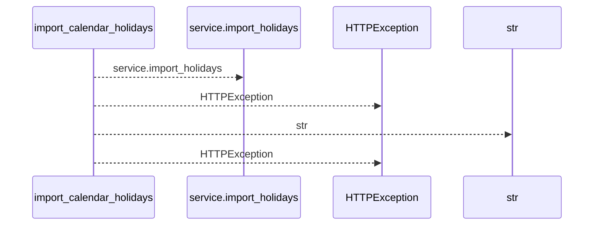
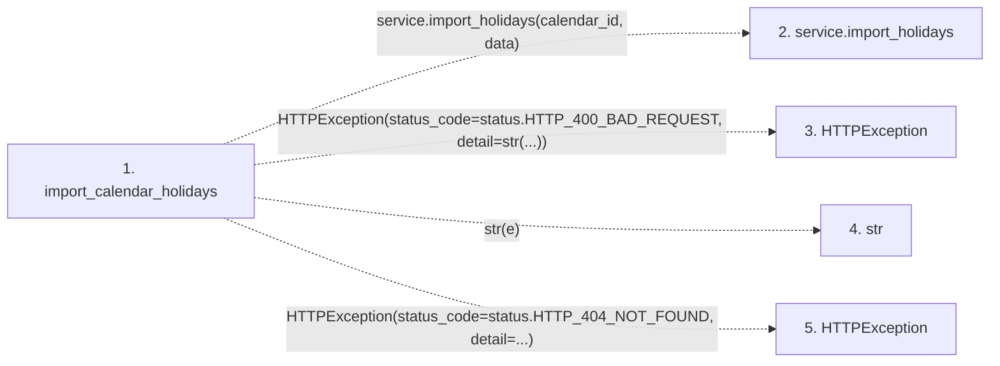

# import_calendar_holidays

**Entry point:** `import_calendar_holidays` (`http`)
**Source:** [calendars](../modules/calendars.md)
**Modules touched:** [calendars](../modules/calendars.md)

## Call sequence

<!-- Auto-generated from static call edges. Dashed arrows are external or unresolved calls. Reviewed runtime conditions and side effects belong in Behavior. -->

## Data flow

<!-- Auto-generated static analysis. Treat values and boundaries as best-effort hints, not runtime proof. -->

### Step data

| Step | Inputs | Reads | Writes | Returns |
|---|---|---|---|---|
| `import_calendar_holidays` | `calendar_id: int`, `data: CalendarImportRequest`, `service: Annotated[CalendarService, Depends(get_calendar_service)]` | `status`, `status` | - | `result` |
| `service.import_holidays` | - | - | - | - |
| `HTTPException` | - | - | - | - |
| `str` | - | - | - | - |
| `HTTPException` | - | - | - | - |

### Call data

| From | To | Line | Call |
|---|---|---:|---|
| import_calendar_holidays | service.import_holidays | 106 | `service.import_holidays(calendar_id, data)` |
| import_calendar_holidays | HTTPException | 108 | `HTTPException(status_code=status.HTTP_400_BAD_REQUEST, detail=str(...))` |
| import_calendar_holidays | str | 110 | `str(e)` |
| import_calendar_holidays | HTTPException | 113 | `HTTPException(status_code=status.HTTP_404_NOT_FOUND, detail=...)` |

### Boundary effects

*No boundary effects detected.*

### Static analysis gaps

| Kind | Step | Target | Line |
|---|---|---|---:|
| unresolved_call | `import_calendar_holidays` | `service.import_holidays` | 106 |
| external_call | `import_calendar_holidays` | `HTTPException` | 108 |
| external_call | `import_calendar_holidays` | `HTTPException` | 113 |

## Behavior

This flow starts at `import_calendar_holidays` and is classified as `http`. The generated call and data-flow sections are bounded static projections; runtime conditions and side effects require source-level confirmation.
