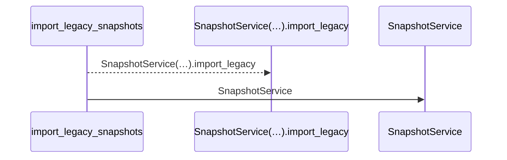
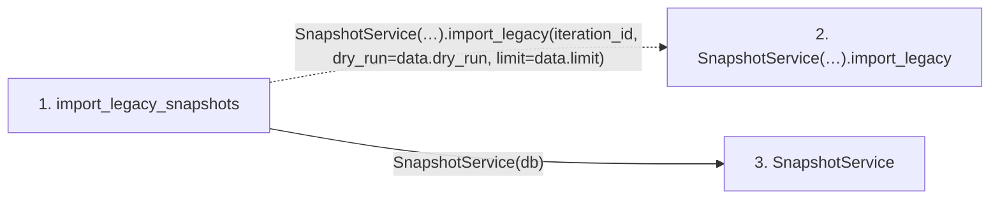

# import_legacy_snapshots

**Entry point:** `import_legacy_snapshots` (`http`)
**Source:** [snapshots](../modules/snapshots.md)
**Modules touched:** [snapshot_service](../modules/snapshot_service.md), [snapshots](../modules/snapshots.md)

## Call sequence

<!-- Auto-generated from static call edges. Dashed arrows are external or unresolved calls. Reviewed runtime conditions and side effects belong in Behavior. -->

## Data flow

<!-- Auto-generated static analysis. Treat values and boundaries as best-effort hints, not runtime proof. -->

### Step data

| Step | Inputs | Reads | Writes | Returns |
|---|---|---|---|---|
| `import_legacy_snapshots` | `iteration_id: int`, `data: LegacySnapshotImportRequest`, `db: Annotated[AsyncSession, Depends(get_db, scope='function')]`, `_operator: Annotated[None, Depends(require_admin_api_key)]` | - | - | `...` |
| `SnapshotService(…).import_legacy` | - | - | - | - |
| `SnapshotService` | - | - | - | - |

### Call data

| From | To | Line | Call |
|---|---|---:|---|
| import_legacy_snapshots | SnapshotService(…).import_legacy | 278 | `SnapshotService(db).import_legacy(iteration_id, dry_run=data.dry_run, limit=data.limit)` |
| import_legacy_snapshots | SnapshotService | 278 | `SnapshotService(db)` |

### Boundary effects

*No boundary effects detected.*

### Static analysis gaps

| Kind | Step | Target | Line |
|---|---|---|---:|
| unresolved_call | `import_legacy_snapshots` | `SnapshotService(db).import_legacy` | 278 |

## Behavior

This flow starts at `import_legacy_snapshots` and is classified as `http`. The generated call and data-flow sections are bounded static projections; runtime conditions and side effects require source-level confirmation.
