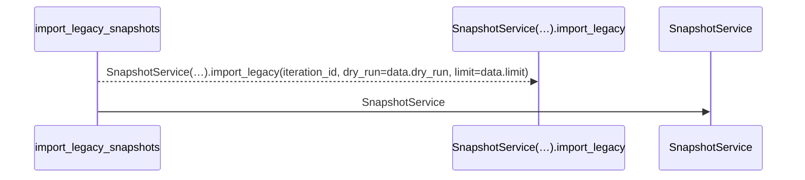
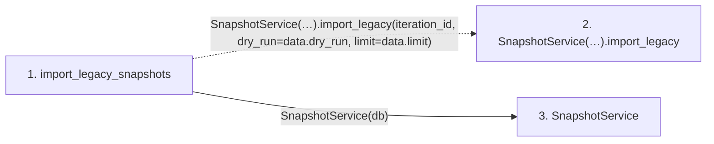

# import_legacy_snapshots

**Entry point:** `import_legacy_snapshots` (`http`)
**Source:** [snapshots](../modules/snapshots.md)
**Modules touched:** [snapshot_service](../modules/snapshot_service.md), [snapshots](../modules/snapshots.md)

## Call sequence

> Static overview in presentation order, not runtime execution order. Arrows retain captured callers; representative internal continuations and boundary examples precede repeated helper detail.

<!-- Auto-generated from static call edges. Dashed arrows are external or unresolved calls. Reviewed runtime conditions and side effects belong in Behavior. -->

```mermaid
sequenceDiagram
    participant p0 as import_legacy_snapshots
    participant p1 as SnapshotService(…).import_legacy
    participant p2 as SnapshotService
    p0-->>p1: SnapshotService(…).import_legacy(iteration_id, dry_run=data.dry_run, limit=data.limit)
    p0->>p2: SnapshotService
```

> Call sequence diagram shows 2 of 2 interactions; 0 omitted to keep the visualization within the 30-interaction and generated-diagram limits, with uncertain identities omitted rather than inferred.

> Captured boundary calls: external 0 of 0 (0 omitted); unresolved 1 of 1 (0 omitted). These counts cover the captured static trace.
> Detailed flow queries retain their own coverage and limits; omitted paths may execute at runtime.

## Data flow

<!-- Auto-generated static analysis. Treat values and boundaries as best-effort hints, not runtime proof. -->

### Analysis coverage

**Effect analysis partially available.** Flow assembly and source effect analysis are separate; empty observations do not prove an empty handler body.

Source steps: 2; effect analysis evaluated: 1, partial: 0, unavailable: 1. Counts include steps omitted from the displayed trace.

Collector observations for 1 source steps with known totals: observed: 5, emitted: 5, omitted: 0. Unavailable totals are excluded.

- Callable record unavailable for one or more source steps; those steps have no represented callable body.
- Effect collector totals unavailable; observed counts cover captured records only.

| Step | Callable record | Effect analysis | Collector totals | Observed | Emitted | Omitted |
|---|---|---|---|---:|---:|---:|
| `import_legacy_snapshots` | `available` | `evaluated` | `available` | `5` | `5` | `0` |
| `SnapshotService(…).import_legacy` | `not_applicable` | `not_applicable` | `not_applicable` | — | — | — |
| `SnapshotService` | `unavailable` | `unavailable` | `unavailable` | — | — | — |

```mermaid
flowchart LR
    s1["1. import_legacy_snapshots"]
    s2["2. SnapshotService(…).import_legacy"]
    s3["3. SnapshotService"]
    s1 -. "SnapshotService(…).import_legacy(iteration_id, dry_run=data.dry_run, limit=data.limit)" .-> s2
    s1 -->|"SnapshotService(db)"| s3
    click s1 "../modules/snapshots.md"
    click s3 "../modules/snapshot_service.md"
```

### Step data

| Step | Inputs | Reads | Writes | Returns |
|---|---|---|---|---|
| `import_legacy_snapshots` | `iteration_id: int`, `data: LegacySnapshotImportRequest`, `db: Annotated[AsyncSession, Depends(get_db, scope='function')]`, `_operator: Annotated[None, Depends(require_admin_api_key)]` | - | - | `...` |
| `SnapshotService(…).import_legacy` | - | - | - | - |
| `SnapshotService` | - | - | - | - |

### Call data

| From | To | Line | Call |
|---|---|---:|---|
| import_legacy_snapshots | SnapshotService(…).import_legacy | 278 | `SnapshotService(db).import_legacy(iteration_id, dry_run=data.dry_run, limit=data.limit)` |
| import_legacy_snapshots | SnapshotService | 278 | `SnapshotService(db)` |

### Boundary effects

*No boundary-effect observations were captured in this static trace.*

### Static analysis gaps

| Kind | Step | Target | Line |
|---|---|---|---:|
| unresolved_call | `import_legacy_snapshots` | `SnapshotService(db).import_legacy` | 278 |

## Behavior

This flow starts at `import_legacy_snapshots` and is classified as `http`. The generated call and data-flow sections are bounded static projections; runtime conditions and side effects require source-level confirmation.
