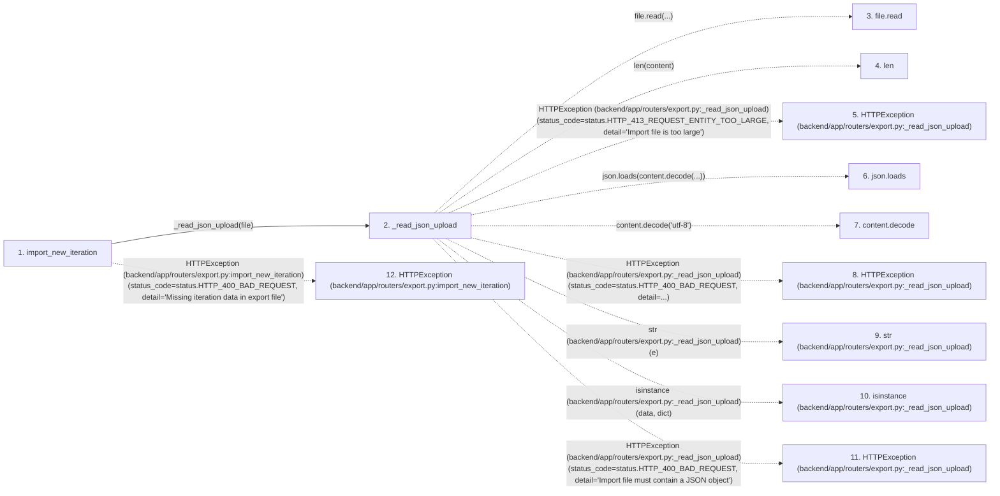

# import_new_iteration

**Entry point:** `import_new_iteration` (`http`)
**Source:** [export](../modules/export.md)
**Modules touched:** [export](../modules/export.md), [iteration_service](../modules/iteration_service.md), [models_task](../modules/models_task.md), [schemas_common](../modules/schemas_common.md), and 5 more

**Complete modules touched:**

- [export](../modules/export.md)
- [iteration_service](../modules/iteration_service.md)
- [models_task](../modules/models_task.md)
- [schemas_common](../modules/schemas_common.md)
- [schemas_iteration](../modules/schemas_iteration.md)
- [schemas_task](../modules/schemas_task.md)
- [schemas_team](../modules/schemas_team.md)
- [task_service](../modules/task_service.md)
- [team_service](../modules/team_service.md)

## Call sequence

```mermaid
sequenceDiagram
    participant p0 as import_new_iteration
    participant p1 as _read_json_upload
    participant p2 as file.read
    participant p3 as len
    participant p4 as HTTPException (backend/app/routers/export.py:_read_json_upload)
    participant p5 as json.loads
    participant p6 as content.decode
    participant p7 as str (backend/app/routers/export.py:_read_json_upload)
    participant p8 as isinstance (backend/app/routers/export.py:_read_json_upload)
    participant p9 as HTTPException (backend/app/routers/export.py:import_new_iteration)
    participant p10 as IterationCreate
    participant p11 as date.fromisoformat (backend/app/routers/export.py:import_new_iteration)
    participant p12 as iter_data.get
    participant p13 as _optional_int
    participant p14 as int (backend/app/routers/export.py:_optional_int)
    participant p15 as ValueError (backend/app/routers/export.py:_optional_int)
    participant p16 as IterationService
    participant p17 as iteration_service.create
    participant p18 as str (backend/app/routers/export.py:import_new_iteration)
    participant p19 as _process_import
    participant p20 as TeamService
    participant p21 as TeamMemberCreate
    participant p22 as member_data.get
    p0->>p1: _read_json_upload
    p1-->>p2: file.read
    p1-->>p3: len
    p1-->>p4: HTTPException (backend/app/routers/export.py:_read_json_upload)
    p1-->>p5: json.loads
    p1-->>p6: content.decode
    p1-->>p4: HTTPException (backend/app/routers/export.py:_read_json_upload)
    p1-->>p7: str (backend/app/routers/export.py:_read_json_upload)
    p1-->>p8: isinstance (backend/app/routers/export.py:_read_json_upload)
    p1-->>p4: HTTPException (backend/app/routers/export.py:_read_json_upload)
    p0-->>p9: HTTPException (backend/app/routers/export.py:import_new_iteration)
    p0->>p10: IterationCreate
    p0-->>p11: date.fromisoformat (backend/app/routers/export.py:import_new_iteration)
    p0-->>p11: date.fromisoformat (backend/app/routers/export.py:import_new_iteration)
    p0-->>p12: iter_data.get
    p0->>p13: _optional_int
    p13-->>p14: int (backend/app/routers/export.py:_optional_int)
    p13-->>p15: ValueError (backend/app/routers/export.py:_optional_int)
    p0-->>p12: iter_data.get
    p0->>p16: IterationService
    p0-->>p17: iteration_service.create
    p0-->>p9: HTTPException (backend/app/routers/export.py:import_new_iteration)
    p0-->>p18: str (backend/app/routers/export.py:import_new_iteration)
    p0->>p19: _process_import
    p19->>p20: TeamService
    p19->>p21: TeamMemberCreate
    p19-->>p22: member_data.get
    p19-->>p22: member_data.get
    p19-->>p22: member_data.get
    p19-->>p22: member_data.get
```

<!-- Auto-generated from static call edges. Dashed arrows are external or unresolved calls. Reviewed runtime conditions and side effects belong in Behavior. -->

> Call sequence diagram shows 30 of 108 interactions; 78 omitted to keep the visualization within the 30-interaction and generated-diagram limits.

## Data flow

<!-- Auto-generated static analysis. Treat values and boundaries as best-effort hints, not runtime proof. -->

### Step data

| Step | Inputs | Reads | Writes | Returns |
|---|---|---|---|---|
| `import_new_iteration` | `file: Annotated[UploadFile, File(...)]`, `db: Annotated[AsyncSession, Depends(get_db)]` | `status`, `status`, `status` | - | `...` |
| `_read_json_upload` | `file: UploadFile` | `MAX_JSON_IMPORT_BYTES`, `MAX_JSON_IMPORT_BYTES`, `status`, `json`, `status`, `status` | - | `data` |
| `file.read` | - | - | - | - |
| `len` | - | - | - | - |
| `HTTPException (backend/app/routers/export.py:_read_json_upload)` | - | - | - | - |
| `json.loads` | - | - | - | - |
| `content.decode` | - | - | - | - |
| `HTTPException (backend/app/routers/export.py:_read_json_upload)` | - | - | - | - |
| `str (backend/app/routers/export.py:_read_json_upload)` | - | - | - | - |
| `isinstance (backend/app/routers/export.py:_read_json_upload)` | - | - | - | - |
| `HTTPException (backend/app/routers/export.py:_read_json_upload)` | - | - | - | - |
| `HTTPException (backend/app/routers/export.py:import_new_iteration)` | - | - | - | - |

### Call data

| From | To | Line | Call |
|---|---|---:|---|
| import_new_iteration | _read_json_upload | 220 | `_read_json_upload(file)` |
| _read_json_upload | file.read | 35 | `file.read(...)` |
| _read_json_upload | len | 36 | `len(content)` |
| _read_json_upload | HTTPException (backend/app/routers/export.py:_read_json_upload) | 37 | `HTTPException(status_code=status.HTTP_413_REQUEST_ENTITY_TOO_LARGE, detail='Import file is too large')` |
| _read_json_upload | json.loads | 42 | `json.loads(content.decode(...))` |
| _read_json_upload | content.decode | 42 | `content.decode('utf-8')` |
| _read_json_upload | HTTPException (backend/app/routers/export.py:_read_json_upload) | 44 | `HTTPException(status_code=status.HTTP_400_BAD_REQUEST, detail=...)` |
| _read_json_upload | str (backend/app/routers/export.py:_read_json_upload) | 46 | `str(e)` |
| _read_json_upload | isinstance (backend/app/routers/export.py:_read_json_upload) | 48 | `isinstance(data, dict)` |
| _read_json_upload | HTTPException (backend/app/routers/export.py:_read_json_upload) | 49 | `HTTPException(status_code=status.HTTP_400_BAD_REQUEST, detail='Import file must contain a JSON object')` |
| import_new_iteration | HTTPException (backend/app/routers/export.py:import_new_iteration) | 224 | `HTTPException(status_code=status.HTTP_400_BAD_REQUEST, detail='Missing iteration data in export file')` |

### Boundary effects

*No boundary effects detected.*

### Static analysis gaps

| Kind | Step | Target | Line |
|---|---|---|---:|
| unresolved_call | `_read_json_upload` | `file.read` | 35 |
| external_call | `_read_json_upload` | `HTTPException` | 37 |
| external_call | `_read_json_upload` | `json.loads` | 42 |
| unresolved_call | `_read_json_upload` | `content.decode` | 42 |
| external_call | `_read_json_upload` | `HTTPException` | 44 |
| external_call | `_read_json_upload` | `isinstance` | 48 |
| external_call | `_read_json_upload` | `HTTPException` | 49 |
| external_call | `import_new_iteration` | `HTTPException` | 224 |
| step_limit | `import_new_iteration` | `first 12 steps` | 0 |

## Behavior

This flow starts at `import_new_iteration` and is classified as `http`. The generated call and data-flow sections are bounded static projections; runtime conditions and side effects require source-level confirmation.
