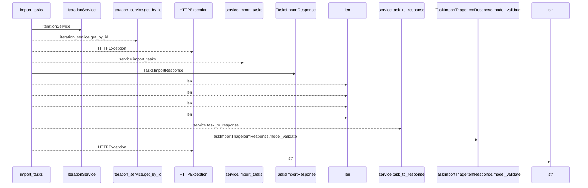
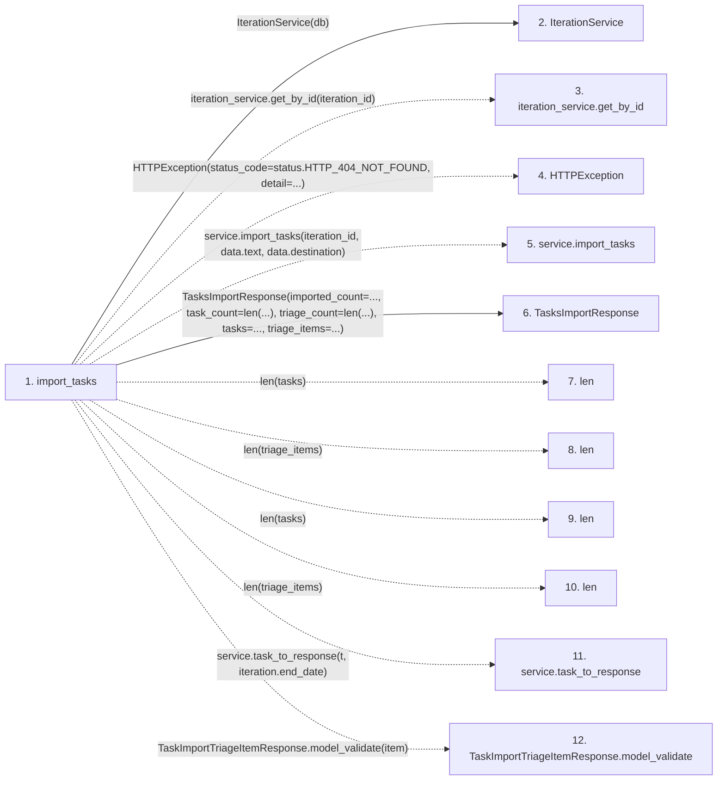

# import_tasks

**Entry point:** `import_tasks` (`http`)
**Source:** [tasks](../modules/tasks.md)
**Modules touched:** [iteration_service](../modules/iteration_service.md), [schemas_task](../modules/schemas_task.md), [tasks](../modules/tasks.md)

## Call sequence

<!-- Auto-generated from static call edges. Dashed arrows are external or unresolved calls. Reviewed runtime conditions and side effects belong in Behavior. -->

## Data flow

<!-- Auto-generated static analysis. Treat values and boundaries as best-effort hints, not runtime proof. -->

### Step data

| Step | Inputs | Reads | Writes | Returns |
|---|---|---|---|---|
| `import_tasks` | `iteration_id: int`, `data: TasksImportRequest`, `service: Annotated[TaskService, Depends(get_task_service)]`, `db: Annotated[AsyncSession, Depends(get_db)]` | `status`, `status` | - | `TasksImportResponse(...)` |
| `IterationService` | - | - | - | - |
| `iteration_service.get_by_id` | - | - | - | - |
| `HTTPException` | - | - | - | - |
| `service.import_tasks` | - | - | - | - |
| `TasksImportResponse` | - | - | - | - |
| `len` | - | - | - | - |
| `len` | - | - | - | - |
| `len` | - | - | - | - |
| `len` | - | - | - | - |
| `service.task_to_response` | - | - | - | - |
| `TaskImportTriageItemResponse.model_validate` | - | - | - | - |

### Call data

| From | To | Line | Call |
|---|---|---:|---|
| import_tasks | IterationService | 770 | `IterationService(db)` |
| import_tasks | iteration_service.get_by_id | 771 | `iteration_service.get_by_id(iteration_id)` |
| import_tasks | HTTPException | 774 | `HTTPException(status_code=status.HTTP_404_NOT_FOUND, detail=...)` |
| import_tasks | service.import_tasks | 780 | `service.import_tasks(iteration_id, data.text, data.destination)` |
| import_tasks | TasksImportResponse | 785 | `TasksImportResponse(imported_count=..., task_count=len(...), triage_count=len(...), tasks=..., triage_items=...)` |
| import_tasks | len | 786 | `len(tasks)` |
| import_tasks | len | 786 | `len(triage_items)` |
| import_tasks | len | 787 | `len(tasks)` |
| import_tasks | len | 788 | `len(triage_items)` |
| import_tasks | service.task_to_response | 789 | `service.task_to_response(t, iteration.end_date)` |
| import_tasks | TaskImportTriageItemResponse.model_validate | 791 | `TaskImportTriageItemResponse.model_validate(item)` |

### Boundary effects

*No boundary effects detected.*

### Static analysis gaps

| Kind | Step | Target | Line |
|---|---|---|---:|
| unresolved_call | `import_tasks` | `iteration_service.get_by_id` | 771 |
| external_call | `import_tasks` | `HTTPException` | 774 |
| unresolved_call | `import_tasks` | `service.import_tasks` | 780 |
| unresolved_call | `import_tasks` | `service.task_to_response` | 789 |
| unresolved_call | `import_tasks` | `TaskImportTriageItemResponse.model_validate` | 791 |
| step_limit | `import_tasks` | `first 12 steps` | 0 |

## Behavior

This flow starts at `import_tasks` and is classified as `http`. The generated call and data-flow sections are bounded static projections; runtime conditions and side effects require source-level confirmation.
