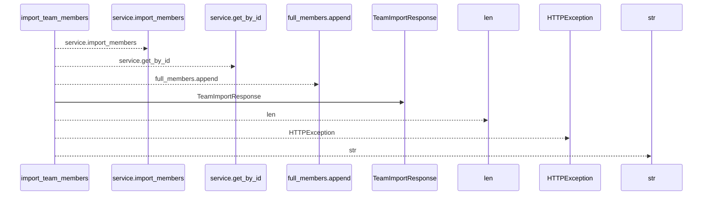
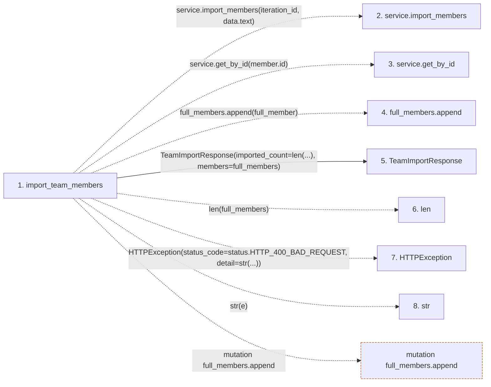

# import_team_members

**Entry point:** `import_team_members` (`http`)
**Source:** [routers_team](../modules/routers_team.md)
**Modules touched:** [routers_team](../modules/routers_team.md), [schemas_team](../modules/schemas_team.md)

## Call sequence

<!-- Auto-generated from static call edges. Dashed arrows are external or unresolved calls. Reviewed runtime conditions and side effects belong in Behavior. -->

## Data flow

<!-- Auto-generated static analysis. Treat values and boundaries as best-effort hints, not runtime proof. -->

### Step data

| Step | Inputs | Reads | Writes | Returns |
|---|---|---|---|---|
| `import_team_members` | `iteration_id: int`, `data: TeamImportRequest`, `service: Annotated[TeamService, Depends(get_team_service)]` | `status` | - | `TeamImportResponse(...)` |
| `service.import_members` | - | - | - | - |
| `service.get_by_id` | - | - | - | - |
| `full_members.append` | - | - | - | - |
| `TeamImportResponse` | - | - | - | - |
| `len` | - | - | - | - |
| `HTTPException` | - | - | - | - |
| `str` | - | - | - | - |

### Call data

| From | To | Line | Call |
|---|---|---:|---|
| import_team_members | service.import_members | 370 | `service.import_members(iteration_id, data.text)` |
| import_team_members | service.get_by_id | 374 | `service.get_by_id(member.id)` |
| import_team_members | full_members.append | 375 | `full_members.append(full_member)` |
| import_team_members | TeamImportResponse | 377 | `TeamImportResponse(imported_count=len(...), members=full_members)` |
| import_team_members | len | 378 | `len(full_members)` |
| import_team_members | HTTPException | 382 | `HTTPException(status_code=status.HTTP_400_BAD_REQUEST, detail=str(...))` |
| import_team_members | str | 384 | `str(e)` |

### Boundary effects

| Kind | Target | Step | Line |
|---|---|---|---:|
| mutation | `full_members.append` | `import_team_members` | 375 |

### Static analysis gaps

| Kind | Step | Target | Line |
|---|---|---|---:|
| unresolved_call | `import_team_members` | `service.import_members` | 370 |
| unresolved_call | `import_team_members` | `service.get_by_id` | 374 |
| external_call | `import_team_members` | `HTTPException` | 382 |

## Behavior

This flow starts at `import_team_members` and is classified as `http`. The generated call and data-flow sections are bounded static projections; runtime conditions and side effects require source-level confirmation.
