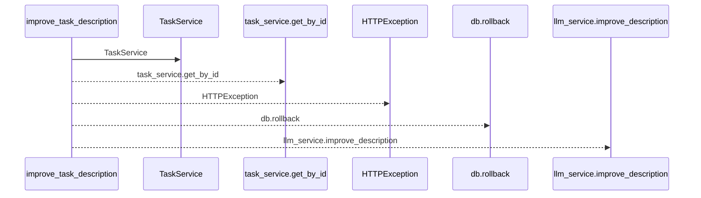
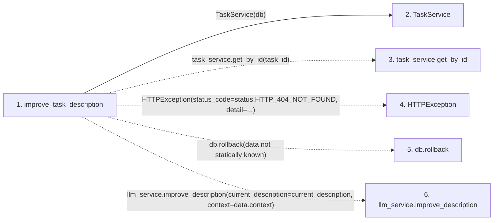

# improve_task_description

**Entry point:** `improve_task_description` (`http`)
**Source:** [routers_llm](../modules/routers_llm.md)
**Modules touched:** [routers_llm](../modules/routers_llm.md), [task_service](../modules/task_service.md)

## Call sequence

<!-- Auto-generated from static call edges. Dashed arrows are external or unresolved calls. Reviewed runtime conditions and side effects belong in Behavior. -->

## Data flow

<!-- Auto-generated static analysis. Treat values and boundaries as best-effort hints, not runtime proof. -->

### Step data

| Step | Inputs | Reads | Writes | Returns |
|---|---|---|---|---|
| `improve_task_description` | `task_id: int`, `data: ImproveDescriptionRequest`, `db: Annotated[AsyncSession, Depends(get_db, scope='function')]`, `llm_service: Annotated[LLMService, Depends(get_llm_service)]` | `status` | - | `...` |
| `TaskService` | - | - | - | - |
| `task_service.get_by_id` | - | - | - | - |
| `HTTPException` | - | - | - | - |
| `db.rollback` | - | - | - | - |
| `llm_service.improve_description` | - | - | - | - |

### Call data

| From | To | Line | Call |
|---|---|---:|---|
| improve_task_description | TaskService | 205 | `TaskService(db)` |
| improve_task_description | task_service.get_by_id | 206 | `task_service.get_by_id(task_id)` |
| improve_task_description | HTTPException | 209 | `HTTPException(status_code=status.HTTP_404_NOT_FOUND, detail=...)` |
| improve_task_description | db.rollback | 215 | `db.rollback(data not statically known)` |
| improve_task_description | llm_service.improve_description | 216 | `llm_service.improve_description(current_description=current_description, context=data.context)` |

### Boundary effects

*No boundary effects detected.*

### Static analysis gaps

| Kind | Step | Target | Line |
|---|---|---|---:|
| unresolved_call | `improve_task_description` | `task_service.get_by_id` | 206 |
| external_call | `improve_task_description` | `HTTPException` | 209 |
| unresolved_call | `improve_task_description` | `db.rollback` | 215 |
| unresolved_call | `improve_task_description` | `llm_service.improve_description` | 216 |

## Behavior

This flow starts at `improve_task_description` and is classified as `http`. The generated call and data-flow sections are bounded static projections; runtime conditions and side effects require source-level confirmation.
