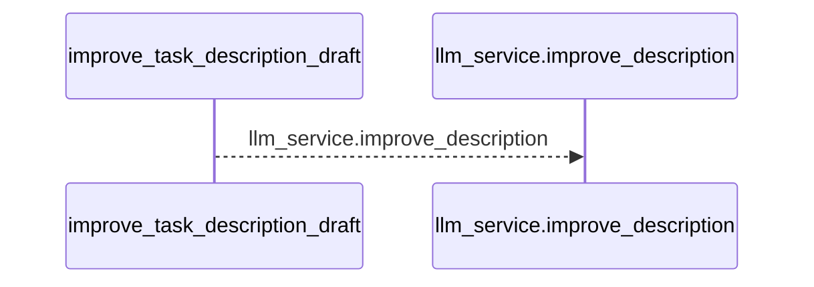
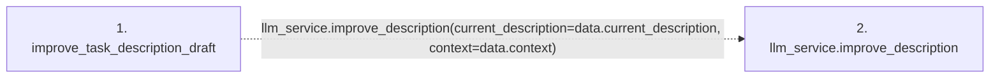

# improve_task_description_draft

**Entry point:** `improve_task_description_draft` (`http`)
**Source:** [routers_llm](../modules/routers_llm.md)
**Modules touched:** [routers_llm](../modules/routers_llm.md)

## Call sequence

<!-- Auto-generated from static call edges. Dashed arrows are external or unresolved calls. Reviewed runtime conditions and side effects belong in Behavior. -->

## Data flow

<!-- Auto-generated static analysis. Treat values and boundaries as best-effort hints, not runtime proof. -->

### Step data

| Step | Inputs | Reads | Writes | Returns |
|---|---|---|---|---|
| `improve_task_description_draft` | `data: ImproveDescriptionRequest`, `llm_service: Annotated[LLMService, Depends(get_llm_service)]` | - | - | `...` |
| `llm_service.improve_description` | - | - | - | - |

### Call data

| From | To | Line | Call |
|---|---|---:|---|
| improve_task_description_draft | llm_service.improve_description | 147 | `llm_service.improve_description(current_description=data.current_description, context=data.context)` |

### Boundary effects

*No boundary effects detected.*

### Static analysis gaps

| Kind | Step | Target | Line |
|---|---|---|---:|
| unresolved_call | `improve_task_description_draft` | `llm_service.improve_description` | 147 |

## Behavior

This flow starts at `improve_task_description_draft` and is classified as `http`. The generated call and data-flow sections are bounded static projections; runtime conditions and side effects require source-level confirmation.
