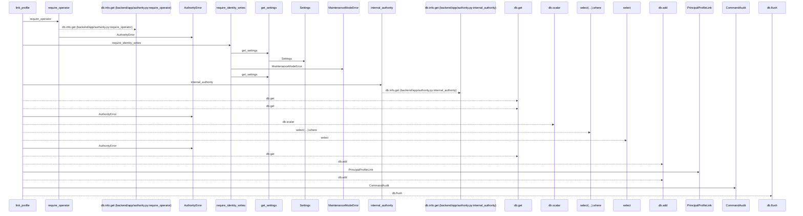
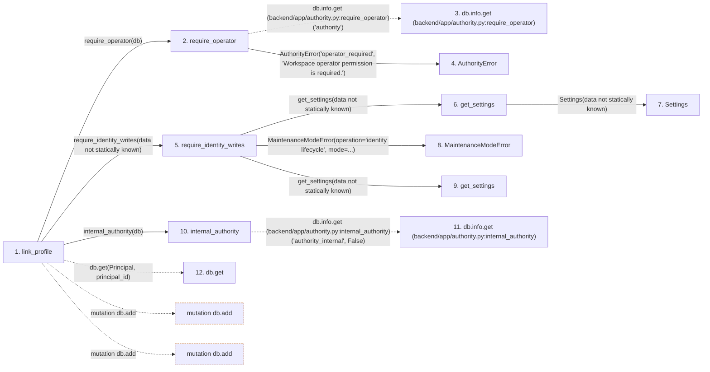

# link_profile

**Entry point:** `link_profile` (`http`)
**Source:** [routers_identity](../modules/routers_identity.md)
**Modules touched:** [authority](../modules/authority.md), [config](../modules/config.md), [identity_service](../modules/identity_service.md), [maintenance](../modules/maintenance.md), and 2 more

**Complete modules touched:**

- [authority](../modules/authority.md)
- [config](../modules/config.md)
- [identity_service](../modules/identity_service.md)
- [maintenance](../modules/maintenance.md)
- [models_identity](../modules/models_identity.md)
- [routers_identity](../modules/routers_identity.md)

## Call sequence

<!-- Auto-generated from static call edges. Dashed arrows are external or unresolved calls. Reviewed runtime conditions and side effects belong in Behavior. -->

## Data flow

<!-- Auto-generated static analysis. Treat values and boundaries as best-effort hints, not runtime proof. -->

### Step data

| Step | Inputs | Reads | Writes | Returns |
|---|---|---|---|---|
| `link_profile` | `principal_id: int`, `data: ProfileLinkRequest`, `db: Database` | `Principal`, `PrincipalProfileLink`, `PrincipalProfileLink` | `link.profile_id`, `link.linked_by_principal_id` | `{...}` |
| `require_operator` | `db` | - | - | - |
| `db.info.get (backend/app/authority.py:require_operator)` | - | - | - | - |
| `AuthorityError` | - | - | - | - |
| `require_identity_writes` | - | - | - | - |
| `get_settings` | - | - | - | `Settings(...)` |
| `Settings` | - | - | - | - |
| `MaintenanceModeError` | - | - | - | - |
| `get_settings` | - | - | - | `Settings(...)` |
| `internal_authority` | `db` | - | `db.info[...]`, `db.info[...]` | - |
| `db.info.get (backend/app/authority.py:internal_authority)` | - | - | - | - |
| `db.get` | - | - | - | - |

### Call data

| From | To | Line | Call |
|---|---|---:|---|
| link_profile | require_operator | 260 | `require_operator(db)` |
| require_operator | db.info.get (backend/app/authority.py:require_operator) | 79 | `db.info.get('authority')` |
| require_operator | AuthorityError | 81 | `AuthorityError('operator_required', 'Workspace operator permission is required.')` |
| link_profile | require_identity_writes | 261 | `require_identity_writes(data not statically known)` |
| require_identity_writes | get_settings | 31 | `get_settings(data not statically known)` |
| get_settings | Settings | 479 | `Settings(data not statically known)` |
| require_identity_writes | MaintenanceModeError | 32 | `MaintenanceModeError(operation='identity lifecycle', mode=...)` |
| require_identity_writes | get_settings | 32 | `get_settings(data not statically known)` |
| link_profile | internal_authority | 263 | `internal_authority(db)` |
| internal_authority | db.info.get (backend/app/authority.py:internal_authority) | 87 | `db.info.get('authority_internal', False)` |
| link_profile | db.get | 264 | `db.get(Principal, principal_id)` |

### Boundary effects

| Kind | Target | Step | Line |
|---|---|---|---:|
| mutation | `db.add` | `link_profile` | 275 |
| mutation | `db.add` | `link_profile` | 277 |

### Static analysis gaps

| Kind | Step | Target | Line |
|---|---|---|---:|
| unresolved_call | `require_operator` | `db.info.get` | 79 |
| unresolved_call | `internal_authority` | `db.info.get` | 87 |
| unresolved_call | `link_profile` | `db.get` | 264 |
| step_limit | `link_profile` | `first 12 steps` | 0 |

## Behavior

This flow starts at `link_profile` and is classified as `http`. The generated call and data-flow sections are bounded static projections; runtime conditions and side effects require source-level confirmation.
